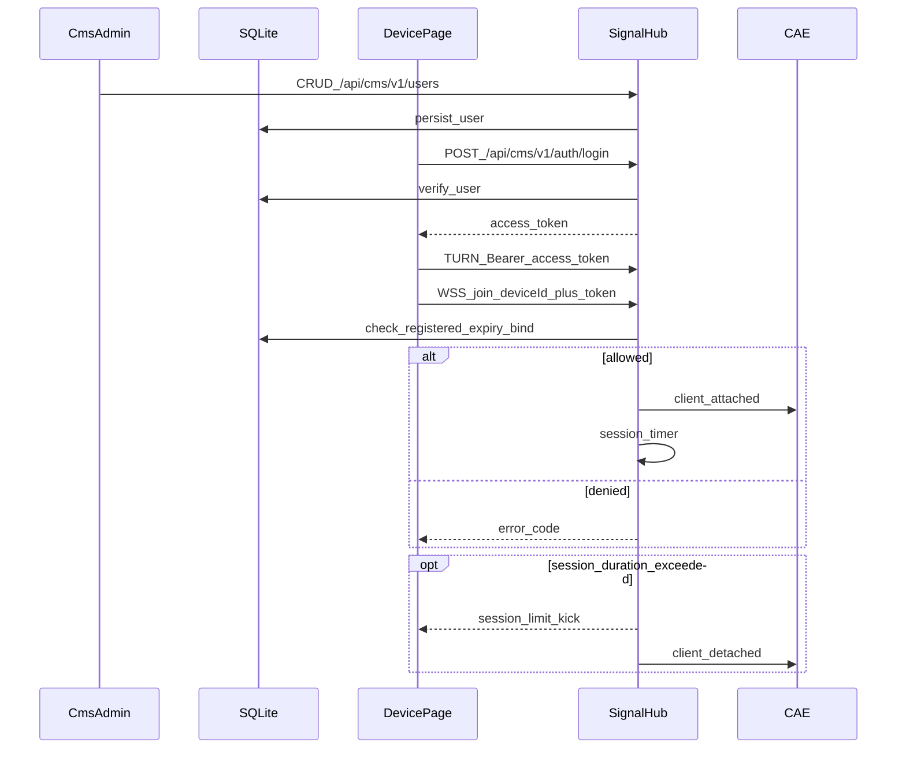

# CMS 用户管理与鉴权系统设计（Phase-0）

> 日期：2026-07-25  
> 状态：已实现（P0，Hub 内嵌；技术栈与 Signal Hub 一致：Node/TS + 原生 https/ws + node:sqlite + scrypt/JWT）  
> 产品名上下文：NexaDesk / nexartc Cloud Phone（Mode A Hub）  
> 上位设计：[UMP 用户管理与鉴权平台](./nexartc-user-auth-management-platform-design.md)  
> 关联：[Mode A 实施](./nexartc-turn-mode-a-implementation.md)、[部署指南](./nexartc-install-deploy-guide.md)  
> 代码：`nexartc-cloudPhoneAccess-web/server/src/cms/`、`server/cms/`、`device/src/cms-auth.ts`

---

## 1. 目标与范围

### 1.1 要解决的问题

当前 Hub 观看端依赖共享 `STREAM_TOKEN`，`/ws` join **不校验用户身份**。运营无法：

- 只允许「已注册用户」进入会话；
- 区分测试用户 / 正式用户；
- 管理注册时间、设备绑定、MAC、账号过期、单次会话时长；
- 对测试用户强制「单次不超过 1 分钟」并踢下线提示。

本 CMS（Content / Customer Management Style 后台）作为 **UMP Phase-0 MVP**：在现有 Signal Hub 进程内扩展，不另起控制面。

### 1.2 默认决策

| 项 | 本方案采用 |
|----|------------|
| 「用户」 | **观看端账号**（Web/客户端连云手机的人），不是 CAE Agent |
| 部署 | 扩展现有 Hub：`/api/cms/v1/*` + `/cms/` 管理页 |
| 数据库 | **SQLite**（`/opt/nexartc/hub/data/cms.db`），表结构可迁 Postgres |
| 与 UMP | 字段对齐 UMP 的 Viewer；后续可平滑并入完整 UMP |

### 1.3 非目标（本 Phase-0）

- 多租户 / 套餐收银台 / 邀请链（见 UMP Phase U2+）；
- 替换 coturn `TURN_SECRET`；
- 替换 CAE `AGENT_TOKEN`（设备侧仍可用现网模式；P1 再交叉校验 MAC）。

---

## 2. 与现网衔接

### 2.1 现状

| 路径 | 行为 |
|------|------|
| `Authorization: Bearer <STREAM_TOKEN>` → `/api/v1/turn-credentials` | 共享 token 即可拿 TURN |
| WSS `/ws` + `join{deviceId}` | 仅检查 Agent 在线 / 忙碌，**不验用户** |
| Agent `/agent` + `AGENT_TOKEN` | 设备注册 |

关键代码：

- [`nexartc-cloudPhoneAccess-web/server/src/auth.ts`](../../../nexartc-cloudPhoneAccess-web/server/src/auth.ts)
- [`nexartc-cloudPhoneAccess-web/server/src/session-router.ts`](../../../nexartc-cloudPhoneAccess-web/server/src/session-router.ts)
- [`nexartc-cloudPhoneAccess-web/server/src/main.ts`](../../../nexartc-cloudPhoneAccess-web/server/src/main.ts)
- Web：[`device/src/wss.ts`](../../../nexartc-cloudPhoneAccess-web/device/src/wss.ts)

### 2.2 目标挂载点



原则：

- **CMS = 用户与策略数据面**（同 Hub 进程读 SQLite）；
- **Hub = 执行面**（join / TURN / 踢线）；
- **CAE** 不直连用户库；收到 `client_detached` 即拆会话。

---

## 3. 角色与用户类型

| 角色 | 说明 |
|------|------|
| **Viewer（cms_users）** | 观看/操控云手机的注册用户 |
| **Admin** | 运营管理员，CRUD 用户；首期可用环境变量账号 |
| **Device / Agent** | CAE；本 Phase 仍用 `AGENT_TOKEN`（不强制用户库） |

| `user_type` | 含义 | 默认 `session_duration_sec` |
|-------------|------|------------------------------|
| `test` | 测试 / 体验 | **60**（硬默认；创建时可改，但产品要求体验路径不超过 1 分钟） |
| `formal` | 正式用户 | `0`（不限制）或管理员配置的正整数秒 |

| `status` | 含义 |
|----------|------|
| `active` | 可登录、可 join |
| `disabled` | 拒绝登录与 join |

---

## 4. 数据模型（SQLite）

路径建议：`CMS_DB_PATH` 或默认 `/opt/nexartc/hub/data/cms.db`。

### 4.1 `cms_users`

```sql
CREATE TABLE IF NOT EXISTS cms_users (
  user_id               TEXT PRIMARY KEY,
  username              TEXT NOT NULL UNIQUE,
  password_hash         TEXT NOT NULL,
  user_type             TEXT NOT NULL CHECK (user_type IN ('test', 'formal')),
  status                TEXT NOT NULL DEFAULT 'active'
                          CHECK (status IN ('active', 'disabled')),
  created_at            INTEGER NOT NULL,
  expires_at            INTEGER,          -- NULL = 永不过期
  session_duration_sec  INTEGER NOT NULL DEFAULT 0,  -- 0 = 不限制
  device_bind_enabled   INTEGER NOT NULL DEFAULT 0,  -- 0/1
  bound_device_id        TEXT,
  bound_device_mac      TEXT,             -- 规范化小写 xx:xx:...
  display_name          TEXT,
  updated_at            INTEGER NOT NULL,
  updated_by            TEXT
);

CREATE INDEX IF NOT EXISTS idx_cms_users_username ON cms_users(username);
CREATE INDEX IF NOT EXISTS idx_cms_users_status ON cms_users(status);
```

字段说明：

| 字段 | 说明 |
|------|------|
| `created_at` | 注册/管理员添加时间（unix **毫秒**） |
| `expires_at` | 账号过期时间；到期拒绝登录与 join |
| `session_duration_sec` | **单次会话**时长上限（秒） |
| `device_bind_enabled` | 1 时 join 的 `deviceId` 必须等于 `bound_device_id` |
| `bound_device_mac` | 云手机 MAC；P1 与 Agent 上报交叉校验 |

**创建规则：**

- `user_type=test` 且请求未显式传 `session_duration_sec` → 写入 **60**；
- `user_type=formal` 且未传 → 写入 **0**；
- 管理员可随时 PATCH 修改上述字段。

### 4.2 管理员

首期不强制表，使用环境变量：

```bash
CMS_ADMIN_USER=admin
CMS_ADMIN_PASSWORD_HASH=...   # scrypt/bcrypt
# 或开发临时：
CMS_ADMIN_PASSWORD=...        # 仅非生产
```

可选后续表 `cms_admins(user_id, username, password_hash, ...)`。

### 4.3 `cms_session_audit`（P0 建议建表，可异步写）

```sql
CREATE TABLE IF NOT EXISTS cms_session_audit (
  session_id   TEXT PRIMARY KEY,
  user_id      TEXT NOT NULL,
  device_id    TEXT NOT NULL,
  started_at   INTEGER NOT NULL,
  ended_at     INTEGER,
  end_reason   TEXT,   -- client_close | test_duration_limit | user_expired | ...
  FOREIGN KEY (user_id) REFERENCES cms_users(user_id)
);
```

---

## 5. 鉴权与策略

### 5.1 用户登录

`POST /api/cms/v1/auth/login`

请求：

```json
{ "username": "demo", "password": "****" }
```

成功：

```json
{
  "access_token": "<jwt>",
  "token_type": "Bearer",
  "expires_in": 86400,
  "user": {
    "user_id": "u_xxx",
    "username": "demo",
    "user_type": "test",
    "session_duration_sec": 60
  }
}
```

JWT（HS256，密钥复用或独立 `CMS_JWT_SECRET` / 现有 `JWT_SECRET`）：

```json
{
  "sub": "u_xxx",
  "username": "demo",
  "typ": "test",
  "iat": 0,
  "exp": 0
}
```

失败：`401` + `code=INVALID_CREDENTIALS` / `USER_DISABLED` / `USER_EXPIRED`。

### 5.2 仅注册用户可被响应

生产默认（`CMS_ENFORCE_USERS=1`）：

1. **TURN**（`authenticate`）：接受 CMS 用户 JWT，并查库确认 `active` 且未过期；  
2. **Join**：必须携带 `accessToken`（join JSON 字段，或 `Authorization` / query）；校验同上。

兼容联调：

```bash
CMS_ALLOW_LEGACY_STREAM_TOKEN=1   # 仍允许旧 STREAM_TOKEN（仅 staging）
```

未注册 / 无效 token → **拒绝** TURN 与 join（「不能被响应」）。

### 5.3 设备绑定

若 `device_bind_enabled=1`：

- `bound_device_id` 为空：首次成功 join（Agent 已在线）自动绑定该 `deviceId` 与 CAE `register.meta.mac`（只绑第一台）；
- 已绑定时：`join.deviceId` 必须等于 `bound_device_id`，否则 `DEVICE_BIND_MISMATCH`；
- 若双方均有 MAC：与 `bound_device_mac` 规范化比较，不符则 `DEVICE_BIND_MAC_MISMATCH`。

### 5.4 账号过期

`expires_at != NULL && expires_at < now` → 登录与 join 均失败，`USER_EXPIRED`。

### 5.5 单次会话时长（测试用户核心）

1. Join 成功后，Hub 读取该用户的 `session_duration_sec`；  
2. 若 `> 0`，启动 timer；  
3. 到期：

```json
{
  "type": "session_limit",
  "code": "TEST_USER_MAX_DURATION",
  "message": "测试体验已结束（单次最长 1 分钟）。请联系开通正式账号。",
  "session_duration_sec": 60
}
```

随后 `WebSocket close(4010, "session_limit")`，并向 Agent 发 `client_detached`（reason=`test_duration_limit`）。

4. Web 展示遮罩提示并回到连接页（不可静默断开）。

正式用户 `session_duration_sec=0` 不启动 timer；若管理员配置了正整数，同样强制执行（文案用通用「会话时长已到」）。

---

## 6. HTTP API

### 6.1 公共 / 用户

| 方法 | 路径 | 说明 |
|------|------|------|
| POST | `/api/cms/v1/auth/login` | 用户登录 |
| GET | `/api/cms/v1/auth/me` | Bearer 用户 JWT → 当前用户资料 |

### 6.2 管理员（Admin Basic/Bearer）

| 方法 | 路径 | 说明 |
|------|------|------|
| GET | `/api/cms/v1/users` | 列表（支持 `?user_type=&status=`） |
| POST | `/api/cms/v1/users` | 添加用户 |
| GET | `/api/cms/v1/users/:user_id` | 详情 |
| PATCH | `/api/cms/v1/users/:user_id` | 修改（类型、状态、过期、时长、绑定、MAC、备注、密码） |
| DELETE | `/api/cms/v1/users/:user_id` | 删除用户 |

#### POST 创建示例

```json
{
  "username": "trial01",
  "password": "****",
  "user_type": "test",
  "expires_at": 1735689600000,
  "session_duration_sec": 60,
  "device_bind_enabled": true,
  "bound_device_id": "device-mi9-002",
  "bound_device_mac": "aa:bb:cc:dd:ee:ff",
  "display_name": "体验账号"
}
```

响应含生成的 `user_id`、`created_at`（不回传 `password_hash`）。

#### PATCH

任意可写字段局部更新；改 `user_type` 为 `test` 时若未带 `session_duration_sec`，建议默认补 60（文档约定，实现可配置）。

### 6.3 错误码

| code | HTTP | 含义 |
|------|------|------|
| `INVALID_CREDENTIALS` | 401 | 用户名或密码错误 |
| `USER_DISABLED` | 403 | 已禁用 |
| `USER_EXPIRED` | 403 | 账号过期 |
| `NOT_REGISTERED` | 401 | 无有效用户票据 |
| `DEVICE_BIND_MISMATCH` | 403 | 设备绑定不符 |
| `DEVICE_BIND_INCOMPLETE` | 403 | 启用绑定但未配置 device_id |
| `DEVICE_BUSY` / `DEVICE_OFFLINE` | 现有 | 保持 Hub 现语义 |
| `TEST_USER_MAX_DURATION` | WS | 测试会话超时踢线 |
| `SESSION_DURATION_LIMIT` | WS | 通用会话时长限制 |

---

## 7. Join 协议扩展

现有：

```json
{ "type": "join", "deviceId": "device-mi9-002", "exclusive": 1 }
```

扩展：

```json
{
  "type": "join",
  "deviceId": "device-mi9-002",
  "exclusive": 1,
  "accessToken": "<cms_user_jwt>"
}
```

亦可在建立 `/ws` 时带 `Authorization: Bearer ...`（实现二选一或都支持，优先 join 字段便于现有客户端改动最小）。

成功仍返回 `{ "type": "joined", "sessionId": "...", ... }`，可附带：

```json
{
  "type": "joined",
  "sessionId": "...",
  "session_duration_sec": 60,
  "user_type": "test"
}
```

---

## 8. 管理 UI（`/cms/`）

静态页由 Hub 托管（与 `/device/` 类似）：

- 管理员登录；
- 用户表格：类型、状态、创建时间、过期时间、会话时长、绑定设备、MAC；
- 操作：添加、编辑、删除、禁用/启用；
- 创建测试用户时 UI 默认勾选「单次 60 秒」。

风格：简洁运维台即可，无需与 NexaDesk 消费端同视觉。

---

## 9. Web 客户端行为

| 事件 | 行为 |
|------|------|
| 连接前 | 登录或粘贴/保存 `access_token`（localStorage 键如 `cloudphone.cms.accessToken`） |
| TURN / join | 一律带用户 Bearer |
| `session_limit` | 遮罩：「测试体验已结束…」；断开后回连接页 |
| `USER_EXPIRED` 等 | 明确中文错误，不重试死循环 |

实现触点：`device/src/wss.ts`、`device/src/main.ts`、`device/src/turn.ts`、连接面板登录区。

---

## 10. 踢线与 CAE

- **权威踢线点：Hub** 关闭客户端 WS + `client_detached`；  
- CAE 现有 `ClearSession` 路径无需改业务帧类型；  
- 审计写入 `end_reason=test_duration_limit`。

---

## 11. 部署与配置

```bash
# Hub 环境变量（示例）
CMS_ENFORCE_USERS=1
CMS_DB_PATH=/opt/nexartc/hub/data/cms.db
CMS_JWT_SECRET=<random>
CMS_ADMIN_USER=admin
CMS_ADMIN_PASSWORD_HASH=<scrypt>
CMS_ALLOW_LEGACY_STREAM_TOKEN=0
```

目录：

```text
/opt/nexartc/hub/
  data/cms.db
  cms/index.html          # 管理页
  device/                 # 现有观看页
```

备份：随 VPS 备份拷贝 `cms.db`；迁移 Postgres 时按同名字段导出即可。

---

## 12. 实现分期

### P0（本设计优先落地）

1. SQLite + `cms_users`；  
2. Admin CRUD API + `/cms/` UI；  
3. 用户登录 JWT；  
4. TURN + join 强制用户校验（可关 legacy）；  
5. `session_duration_sec` timer；测试默认 60s 踢线 + Web 提示。

### P1

1. `cms_session_audit` 完整写入；  
2. CAE Agent register 上报 MAC；绑定交叉校验；  
3. 正式用户可配会话时长运营策略。

### P2

并入完整 UMP（租户、套餐、邀请、设备凭证替换共享 `AGENT_TOKEN`）。

---

## 13. 验收标准（P0）

1. 未注册 / 无 token 用户：**无法** 获取 TURN，**无法** join。  
2. Admin 可添加、修改、删除用户；字段含创建时间、绑定、MAC、过期、会话时长。  
3. 测试用户 join 后约 60s 收到 `session_limit` 并断开，UI 有明确提示。  
4. 正式用户（`session_duration_sec=0`）不被 60s 误踢。  
5. `expires_at` 过期用户无法登录与进房。  
6. 启用设备绑定后，join 其它 `deviceId` 失败。  
7. 数据持久化在 SQLite，重启 Hub 后用户仍在。

---

## 14. 安全注意

- 密码仅存哈希（scrypt 或 bcrypt）；  
- Admin 接口独立鉴权，勿与观看 JWT 混用权限；  
- 生产关闭 `CMS_ALLOW_LEGACY_STREAM_TOKEN`；  
- JWT TTL 建议 ≤ 24h，可后续加 refresh；  
- 管理页仅内网或额外 IP 限制（VPS firewall / nginx allowlist）。

---

## 15. 文档关系

```text
UMP（完整控制面愿景）
  └─ 本文件 CMS Phase-0（Hub 内嵌用户 CRUD + 会话策略）
       └─ 落地代码：nexartc-cloudPhoneAccess-web/server + device
```

实现启动后，在 Mode A 文档「鉴权最小可用方案」处增加「观看端已由 CMS Phase-0 约束」的说明。
