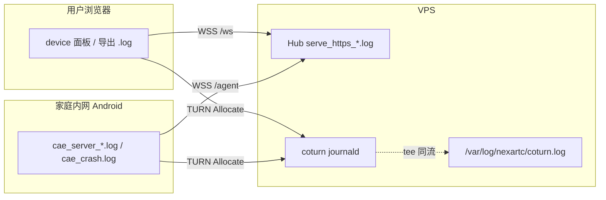

# nexartc 日志路径与分析设计

本文定义 Mode A（coturn + Signal Hub + device + CAE）下 **日志落盘路径、分类前缀、关联分析与排障流程**。  
安装命令与部署细节见 [`nexartc-install-deploy-guide.md`](./nexartc-install-deploy-guide.md) §8；本文是设计真源。

相关实现落点：

| 组件 | 仓库路径 | 配置 / 单元 |
|------|----------|-------------|
| coturn | `coturn-4.13.0/` + `test/turn/vps/` | `turnserver.conf`、`nexartc-coturn.service`、`logrotate-nexartc-coturn.conf` |
| Signal Hub | `nexartc-cloudPhoneAccess-web/server/` | `LOG_DIR`、`serve_https_*.log` |
| device 页 | `nexartc-cloudPhoneAccess-web/device/` | 页内面板 + 复制/导出 |
| CAE | `nexartc-cloud-phone-access-engine/` | `CaeConfig.ini` `[log]`、`CaeFileLogger` |

---

## 1. 目标

1. **可定位**：crash、ICE 失败、远程操作失败、Agent 离线等，必有对应文件或 journal 可查。
2. **可关联**：同一会话可按时间线串起 Hub → CAE → device → coturn。
3. **可 grep**：统一四类前缀 `[FLOW]` / `[FUNC]` / `[STAB]` / `[EXC]`。
4. **不过载**：高频路径（touch MOVE、每帧 RTP）限频；关键失败路径立即 flush。



---

## 2. 各模块日志路径（生产）

### 2.1 总表

| 模块 | 运行位置 | 主路径 | 辅路径 | 轮转 |
|------|----------|--------|--------|------|
| **coturn** | VPS | **journald** `nexartc-coturn` | **文件** `/var/log/nexartc/coturn.log` | logrotate 日切 14 天 / `maxsize 50M` |
| **Signal Hub** | VPS | `/opt/nexartc/hub/server/logs/serve_https_{1..N}.log` | `journalctl -u nexartc-hub` | 约 4×2MB 环形 |
| **device 页** | 浏览器 | 页内 `#logContent` 面板 | DevTools Console；「复制 / 导出」下载 `nexartc-device-*.log` | 内存环约 5000 行 |
| **CAE** | Android | `/data/local/tmp/cae/logs/cae_server_{1..N}.log` | logcat tag `CAE`；crash：`…/logs/cae_crash.log` + `cae_signal.log` | ini 可配，默认 4×2MB |

本地验证临时路径（非生产）：coturn `/tmp/coturn-local/`；Hub `/tmp/hub-local/`（见 `test/turn/start_local_env.sh`）。

### 2.2 coturn 双写设计

- **配置**：`test/turn/vps/turnserver.conf` 开 `verbose`；**不**在 conf 里写 `log-file=`。
  - **勿**对 Ubuntu apt coturn **4.5.x** 启用 `new-log-timestamp`（仅较新 coturn 支持；否则 `Bad configuration format` + systemd 重启循环，STUN 失效导致 CAE host 候选只剩内网 IP）。
- **单元**：`nexartc-coturn.service` 使用 `--log-file=stdout`，管道 `tee -a /var/log/nexartc/coturn.log`（无 `--new-log-timestamp`）。
  - stdout → systemd → **journald**（实时）
  - tee → **文件**（离线 scp / grep）
- **轮转**：`/etc/logrotate.d/nexartc-coturn`（源：`test/turn/vps/logrotate-nexartc-coturn.conf`），`copytruncate`，避免打断 tee。
- **部署**：`./test/turn/deploy_vps.sh` 同步 unit + conf + logrotate，并 `mkdir -p /var/log/nexartc`。

```bash
# 实时
journalctl -u nexartc-coturn -f

# 文件
tail -f /var/log/nexartc/coturn.log
grep -E '\[FLOW\]|\[FUNC\]|\[EXC\]|auth success|ALLOCATE success' /var/log/nexartc/coturn.log | tail -40
```

### 2.3 Hub

| 通道 | 路径 |
|------|------|
| 应用文件 | `$LOG_DIR` → `/opt/nexartc/hub/server/logs/serve_https_*.log` |
| systemd | `journalctl -u nexartc-hub` |
| 行为 | WARN/ERROR **立即 flush**（`flushNow`），避免断连瞬间丢尾部 |

### 2.4 device 页

| 通道 | 说明 |
|------|------|
| 面板 | 默认开启；前缀 `[FLOW]`/`[FUNC]`/`[STAB]`/`[EXC]` |
| 导出 | 工具栏「复制」「导出」→ 本地文本，便于贴 issue |
| 无服务端落盘 | 浏览器端不写 VPS 文件；排障以导出或 Console 为准 |

### 2.5 CAE

| 通道 | 路径 / 说明 |
|------|-------------|
| 轮转文件 | `/data/local/tmp/cae/logs/cae_server_*.log`（`[log] log_dir` 可改） |
| Crash | 同目录 `cae_crash.log`；兼容 `cae_signal.log`；轮转文件内有 `[EXC] CRASH` 标记 |
| logcat | `adb logcat -s CAE`（环缓可能丢历史，**排障优先拉文件**） |
| Flush | `LOGE_FLUSH` / `LOGW_FLUSH` / 关键 FLOW 节点 `ForceFlush` |

```bash
adb pull /data/local/tmp/cae/logs/ ./cae_logs/
adb shell "su -c 'ls -lt /data/local/tmp/cae/logs/'"
```

---

## 3. 四类日志分类设计

| 前缀 | 名称 | 写什么 | 限频 |
|------|------|--------|------|
| `[FLOW]` | 流程性 | 会话里程碑：register → join → verify → Offer/Answer → ICE Connected → OnReady → teardown；coturn `ALLOCATE success` | 状态变化即打 |
| `[FUNC]` | 功能性 | 业务结果：TURN 签发/凭据、媒体 open/close、触控/按键、IME、auth success | 触控 DOWN/UP 限频；MOVE 不打 |
| `[STAB]` | 稳定性 | 心跳超时、发送队列溢出、BWE、track not open、video health、Agent 重连、WSS backpressure | 超时/阈值/周期采样 |
| `[EXC]` | 异常 | 鉴权失败、ICE failed、注入失败、DEVICE_OFFLINE、CRASH、TTL expired | 失败即打 + flush |

**禁止**：日志中打印 `TURN_SECRET` / `agent_token` / TURN `credential` 明文。

---

## 4. 成功会话时间线（分析基准）

按时间对齐四端，期望出现：

```text
[Hub]    [FLOW] agent register deviceId=…
[CAE]    [FLOW] CaeSignalAgent: registered with Hub
[Hub]    [FLOW] client join / [FLOW] client … joined
[CAE]    [FLOW] client_attached
[device] [FLOW] Hub join 成功 → CMD_START
[CAE]    [FLOW] verify … → START_SUCCESS
[CAE]    [FLOW] CreatePeerConnection / onLocalDescription(offer)
[device] [FLOW] SDP Offer / Answer / connectionState=connected
[coturn] [FUNC] auth success …   （仅 hybrid/relay 需要）
[coturn] [FLOW] ALLOCATE success …
[CAE]    [FLOW] PeerConnection … Connected → OnReady
[device] [FLOW] ICE path: … (host|p2p|relay)
[CAE]    [FUNC] Media stream opened / touch …
```

任一环缺失：按 §5 表定位。

---

## 5. 现象 → 日志分析

| 现象 | 先看路径 | grep / 关键字 | 常见根因 |
|------|----------|---------------|----------|
| Agent 不在线 | CAE 文件 + Hub `serve_https_*.log` | `[FLOW] registered` / `[EXC] agent` / `DEVICE_OFFLINE` | `signal_agent_url` / token / TLS |
| Hub join 失败 | device 面板 + Hub | `[EXC] join rejected` / `agent offline` | CAE 未注册或 deviceId 不一致 |
| TURN 401 / 无 relay | Hub + coturn 文件/journal | `[EXC] turn-credentials` / `[EXC] auth failed` / `REST TTL expired` | token≠STREAM_TOKEN；secret 不一致；凭据过期 |
| ICE 一直 Connecting | CAE `cae_server_*.log` + device | `[FLOW] candidate` / `local_ip` / `[EXC] gathering` | `webrtc_local_ip` 错；端口未映射 |
| ICE failed | device 导出 + CAE | `[EXC] ICE` / `path FAILED` / ICE diagnostics dump | p2p hairpin；应用 hybrid/relay |
| Connected 无画面 | device Stats + CAE | `[STAB] video health decoded=0` / `sendFrame` / `PLI` | 丢包/码率；非信令问题 |
| 触控无效 | device + CAE | `[EXC] sendDC SKIP` / `[EXC] HandleTouchMsg` | DC 未 open；注入权限 |
| CAE 进程消失 | `cae_crash.log` | `[EXC] CRASH` + Backtrace | 对照符号 / 断连析构 |
| coturn 中继异常 | `/var/log/nexartc/coturn.log` | `ALLOCATE` / `auth` / usage | `relay-ip`/`external-ip`；安全组 UDP |

### 5.1 推荐排障顺序

```text
1. Hub health + GET /api/v1/agents
2. CAE [FLOW] registered / client_attached
3. device [FLOW] join → Offer → ICE path
4. 若需 TURN：coturn [FUNC] auth success + [FLOW] ALLOCATE success
5. 媒体：CAE sendFrame vs device decoded / [STAB] video health
6. crash：cae_crash.log
```

### 5.2 一键命令包（开发机）

```bash
source /tmp/nexartc-vps-deploy/env
SERIAL=$(adb devices | awk 'NR>1 && $2=="device"{print $1; exit}')

# Hub
curl -sk -H "Authorization: Bearer $STREAM_TOKEN" https://120.79.21.28/api/v1/agents; echo
ssh root@signalling-nexartc.cn \
  'grep -E "\[FLOW\]|\[FUNC\]|\[STAB\]|\[EXC\]" /opt/nexartc/hub/server/logs/serve_https_*.log | tail -40'

# coturn（journal + 文件）
ssh root@signalling-nexartc.cn '
  journalctl -u nexartc-coturn --since "15 min ago" --no-pager | grep -E "\[FLOW\]|\[FUNC\]|\[EXC\]|ALLOCATE|auth" | tail -30
  grep -E "\[FLOW\]|\[FUNC\]|\[EXC\]|ALLOCATE|auth" /var/log/nexartc/coturn.log | tail -30
'

# CAE 文件
adb -s "$SERIAL" shell "su -c '
  LOG=\$(ls -t /data/local/tmp/cae/logs/cae_server_*.log | head -1)
  grep -E \"\\[FLOW\\]|\\[FUNC\\]|\\[STAB\\]|\\[EXC\\]\" \$LOG | tail -60
'"
```

device：打开日志面板，搜 `[FLOW]` / `ICE path` / `[EXC]`，必要时「导出」。

---

## 6. 与其它设计文档的关系

| 文档 | 关系 |
|------|------|
| [`nexartc-install-deploy-guide.md`](./nexartc-install-deploy-guide.md) | 安装步骤 + §8 速查（命令副本）；路径以 **本文 §2** 为准 |
| [`nexartc-turn-mode-a-implementation.md`](./nexartc-turn-mode-a-implementation.md) | Mode A 改造；§8.4 关键字指向本文 |
| [`nexartc-turn-mode-a-vps-deployment.md`](./nexartc-turn-mode-a-vps-deployment.md) | VPS 运维速查链到本文 |
| [`turn-rest-api-signaling.md`](./turn-rest-api-signaling.md) | §13.11 运维排障与日志建议与本文对齐 |
| [`cae-stun-public-ip-discovery.md`](./cae-stun-public-ip-discovery.md) | STUN 公网 IP；联调时对照 CAE candidate / device `ICE path` |
| [`cae-supervisor-remote-admin-design.md`](./cae-supervisor-remote-admin-design.md) | 自愈监控；crash 日志对齐 `cae_crash.log` / `[EXC] CRASH` |

---

## 7. 变更记录

| 日期 | 说明 |
|------|------|
| 2026-07-21 | 首版：路径总表、coturn journald+文件双写、四类前缀、成功时间线与排障矩阵 |
