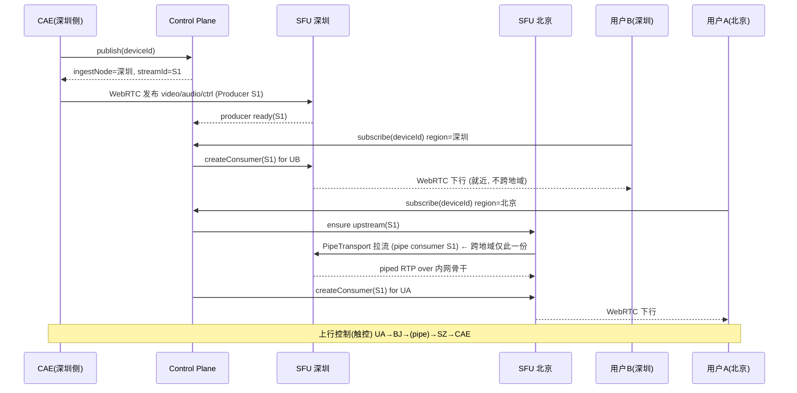

# nexartc 跨地区 / 跨网 媒体级联（Cross-Region Media Cascade）设计

> 日期：2026-08-09
> 状态：**设计稿（待实现）** — 现网仍为 Mode A 单区 P2P/TURN（`turn_site=vps`）；本文提出的分布式 SFU 级联为新增媒体面能力，不影响现有 host/p2p/hybrid/relay 语义。
> 作者视角：低延迟云游戏 / 实时流媒体架构
> 关联：
> - [`nexartc-turn-mode-a-implementation.md`](./nexartc-turn-mode-a-implementation.md)（Mode A 信令拓扑、Hub/Agent、透明转发）
> - [`nexartc-webrtc-ice-modes.md`](./nexartc-webrtc-ice-modes.md)（host/p2p/hybrid/relay）
> - [`nexartc-turn-home-edge-mode-design.md`](./nexartc-turn-home-edge-mode-design.md)（TURN 落点、会话快照、READY 状态机）
> - [`nexartc-low-latency-platform-vision.md`](./nexartc-low-latency-platform-vision.md)（平台愿景，P3「可选 SFU」）
> - `docs/transport_abstraction/06_webrtc_transport_design.md`（CAE `WebRtcServerTransport`、RTP Track + DataChannel）
> - `docs/transport_sdk/nexartc-transport-sdk-design.md`（1:N 本地 fan-out；本文补齐「云端媒体转发」这一显式非目标）
> - 代码触点：`nexartc-cloudPhoneAccess-web/server/`（Hub）、`cae_service/WebRtcServerTransport.*`、`cae_service/CaeSignalAgent.*`、`coturn-4.13.0/`

---

## 1. 背景（Background）

### 1.1 现网架构回顾（已实现，单区 Mode A）

现网媒体面是**端到端 P2P WebRTC**，信令面是 **VPS 单点 Signal Hub**：

```
                       公网 VPS（单地域，如广州 120.79.21.28）
                       ┌───────────────────────────────────────┐
                       │ Signal Hub :443   信令 / join / 会话路由 │
                       │ coturn :3478/5349  可选 TURN 中继        │
                       └───────────────▲───────────▲─────────────┘
             WSS /agent（出站注册）      │           │ WSS /ws + REST turn-credentials
                                        │           │
                 ┌──────────────────────┘           └────────────────────┐
                 │                                                        │
        ┌────────┴─────────┐                                     ┌────────┴────────┐
        │ 云手机 CAE        │  ──────── WebRTC RTP/SRTP ───────►  │ 用户浏览器/客户端 │
        │ (家庭/机房内网)   │  （host 直连 / hybrid / relay 经 coturn）  │                 │
        └──────────────────┘                                     └─────────────────┘
```

关键事实（已对照源码核实）：

| 维度 | 现状 | 依据 |
|------|------|------|
| 信令 | CAE 出站 WSS `/agent` 注册；浏览器 WSS `/ws` join(deviceId)；Hub 按 `sessionId` **透明转发**二进制帧 | `session-router.ts`、`agent-registry.ts` |
| 媒体 | H.264/H.265 + Opus 走 **WebRTC RTP Track**；控制/触控走 **DataChannel**；**Hub 不中继媒体**（`session-router.ts` 显式 DROP `CAE_MSG_VIDEO/AUDIO`） | `session-router.ts:153-177`、`06_webrtc_transport_design.md` |
| NAT | host（50000 DNAT）/ p2p / hybrid / relay；relay 经 **单区 coturn** | `nexartc-webrtc-ice-modes.md` |
| 扇出 | **设备端本地 fan-out**（一台 CAE 单路编码、多 PeerConnection 分发；默认 ≤3） | `nexartc-transport-sdk-design.md` §1.2、UDP mux 逻辑分离 |
| 地域 | **单地域 VPS**；跨地区/跨网只能靠公网直连或单点 coturn relay | 现网部署 |

### 1.2 问题：中国跨地区 + 跨运营商的公网质量

现网模型在**同网 / 近距离**下可用（host/p2p 出画），但目标场景是：

> **用户在北京移动**，CAE 在深圳（或深圳侧接入），需要 CAE → 深圳 VPC 节点 → 北京 VPC 节点 → 用户。

这暴露了三个现网无法覆盖的结构性问题：

1. **跨运营商互联质量差**：中国移动 ↔ 电信/联通 骨干互联点（如京广骨干）在高峰期丢包、抖动、绕行严重。P2P（srflx↔srflx）在跨网下几乎不可用（现网 §16.3 实测：同运营商公网 p2p ~19s ICE failed）。
2. **跨地区物理距离**：深圳↔北京 ~2000km，公网绕行 RTT 常 50–90ms 且抖动大；对**云游戏/云手机交互（目标端到端 <100ms）**是致命的。
3. **单点 coturn 无法解决路由**：现网 relay 只是把媒体丢到**单个** VPS coturn，既不能就近接入用户，也不能利用云厂商**内网骨干（VPC 专线 / 云企业网 CEN）**跨地区加速。现网 §16.3 也已实测：单点 relay 路径「connected 但丢包极高、decoded 长时间为 0」。

**核心洞察**：跨地区/跨网的低延迟，靠的不是「更强的 TURN」，而是
**用云厂商 BGP 多线 + 内网骨干（VPC 对等 / CEN）把「跨网长距离公网」替换成「就近接入 + 内网专线传输」**：

```
用户(北京移动) --短--> 北京节点(BGP,移动线路好) ==云内网骨干==> 深圳节点(近CAE) --短--> CAE
   ↑ 差的公网只剩「最后一公里同城同网」            ↑ 可控、低抖动、低丢包的专线
```

### 1.3 为什么必须引入「媒体级联」而不是继续 P2P

- P2P/单点 relay 无法做**多跳就近路由**，也无法在中间节点做**扇出（fan-out）**。
- 目标出现了**发布/订阅 + 多观看端跨地域**语义（§2 场景二）：一路源要被不同地域的多个用户订阅，中间跨地域链路应**只传一份**。
- 因此需要一个**级联的媒体转发层（SFU cascade）**：每个地域一个媒体节点，节点间用内网骨干互联，构成以「发布源」为根的**转发树**。

---

## 2. 需求（Requirements）

### 2.1 场景

**场景一：跨地区 + 跨网单用户**

```
CAE ──► 深圳 Ingest 节点 ══(云内网骨干)══► 北京 Egress 节点 ──► 用户(北京移动)
        ↑ 媒体在此终止/再发起       ↑ 只跨地域传一份         ↑ 就近同城同网最后一公里
```

**场景二：一北京 + 一深圳，同时访问同一台 CAE**

```
                         ┌──► 深圳 Egress ──► 用户B(深圳)     （不跨地域）
CAE ──► 深圳 Ingest ──────┤
                         └══骨干══► 北京 Egress ──► 用户A(北京)（跨地域仅一份）
```

要点：深圳用户就近直接从 Ingest（或深圳 Egress）拿流，**不绕北京**；北京用户经骨干拿流，且**若北京有第二个用户，复用同一条深圳→北京骨干流**（fan-out，不翻倍带宽）。

### 2.2 功能需求

| 编号 | 需求 |
|------|------|
| F1 | 一路 CAE 源（video+audio+控制 DataChannel）可发布到就近 Ingest 节点 |
| F2 | 任意地域用户可订阅任意源，控制面自动计算**最短级联路径**并按需建立中间跳 |
| F3 | **多跳级联**：Ingest → (transit) → Egress，跳数可 ≥2 |
| F4 | **跨地域链路去重**：同一源到同一目标地域**只传一份**，本地多用户复用 |
| F5 | **双向控制**：用户触控/按键/传感器/虚拟摄像头（上行）经级联链路回到 CAE |
| F6 | **流 ID 全局唯一**，跨节点可路由；节点本地资源 ID 与全局 ID 有映射表 |
| F7 | 用户发布/订阅生命周期管理（加入、离开、断线、抢占、配额） |
| F8 | 与现有 Mode A 信令 / CMS 鉴权 / TURN 语义**兼容并存**（可灰度） |

### 2.3 非功能需求

| 指标 | 目标 |
|------|------|
| 端到端玻璃到玻璃延迟（跨地域） | **< 120ms P50 / < 180ms P95**（编码+级联网络+抖动缓冲+解码） |
| 单跳级联转发新增延迟 | **< 2ms**（纯转发，不转码） |
| 跨地域骨干单向 | 目标 **15–25ms**（云内网 CEN，而非公网 40–70ms） |
| 丢包恢复 | NACK/PLI 逐跳；关键帧请求就近响应 |
| 单 Egress 节点并发 | 数千下行 consumer（见 §9 容量） |
| 可用性 | 节点故障可切换路径 / 重连；控制面无单点媒体依赖 |

---

## 3. 总体架构（Design）

### 3.1 分层：控制面 / 媒体面 / 接入面

沿用现网「**信令与媒体分离**」原则，扩展为三层：

```
┌──────────────────────────────────────────────────────────────────────────┐
│ 控制面 Control Plane（全局，扩展现有 Signal Hub）                            │
│  · 拓扑与路由：节点注册、地域/运营商探测、节点间 cost 图、最短路径计算         │
│  · 流目录 Stream Registry：全局 streamId ↔ {ingestNode, tracks, subscribers} │
│  · 发布/订阅编排：publish / subscribe / unsubscribe / 级联建链               │
│  · 鉴权、会话、CMS、配额（复用现网 join/CMS/TURN 快照机制）                    │
└───────────────▲───────────────────────────────▲───────────────────────────┘
                │ gRPC/WSS 控制信道               │ WSS /ws + join（复用现网）
    ┌───────────┴───────────┐         ┌───────────┴───────────┐
    │ 媒体面 Media Plane      │         │ 接入面 Access          │
    │ 分布式 SFU 级联节点     │         │ CAE（发布者） / 浏览器  │
    │ 深圳/北京/... 每区 1+   │         │ / Android 客户端（订阅者）│
    │ 节点间 PipeTransport    │         └────────────────────────┘
    │ (云内网骨干/CEN)        │
    └────────────────────────┘
```

- **控制面**：从现有 `nexartc-cloudPhoneAccess-web/server/`（Signal Hub）演进——它已经有 Agent 注册、session 路由、CMS、TURN 快照。新增**节点注册 + 路由编排 + 流目录**。
- **媒体面**：新增**分布式 SFU 集群**（选型见 §5，推荐 mediasoup）。每地域部署 1+ SFU 节点，节点间用 **PipeTransport（SFU-to-SFU 转发）** 走云内网骨干。
- **接入面**：CAE 从「直接把 WebRTC 发给浏览器」改为「**发布到就近 Ingest SFU**」；浏览器从「直连 CAE」改为「**从就近 Egress SFU 订阅**」。CAE / 浏览器代码改动最小化（见 §8）。

### 3.2 角色定义

| 角色 | 职责 | 落地 |
|------|------|------|
| **Control Plane（CP）** | 全局路由、流目录、发布/订阅编排、鉴权 | 扩展 `web/server` Hub；可独立进程 |
| **SFU Node** | WebRTC 收发端点 + 节点间 Pipe 转发；无转码 | mediasoup worker(s) + 应用层 |
| **Ingest 角色** | 承接某源 CAE 的上行，登记 Producer | 由「离 CAE 最近的 SFU 节点」担任 |
| **Egress 角色** | 面向某用户的下行，创建 Consumer | 由「离用户最近的 SFU 节点」担任 |
| **Transit 角色** | 纯中间跳转发（Ingest≠Egress 且需经第三节点） | 任意 SFU 节点，按路径计算临时担任 |
| **CAE (Publisher)** | 编码 + 发布 video/audio/上行控制到 Ingest | 复用 `WebRtcServerTransport` |
| **Client (Subscriber)** | 从 Egress 订阅 + 上行控制 | 浏览器 `device/` / Android CAS |
| **coturn** | 仅「用户↔Egress」「CAE↔Ingest」**最后一公里** NAT 兜底 | 复用现网，但**下沉到各地域** |

> 关键：Ingest/Egress/Transit 是**角色**不是**部署形态**。同一物理 SFU 节点，对深圳用户是 Egress，对北京用户则同时是 Ingest 的上游。角色由控制面按路径动态赋予。

### 3.3 级联转发树（Forwarding Tree）

一路发布 = 一棵以 **Ingest 节点上的 Producer** 为根的树；边 = **PipeTransport 上的 pipe consumer/producer 对**；叶 = **Egress 上面向用户的 WebRTC consumer**。

```
                     [深圳 Ingest]  Producer(streamId=S1)
                        /                        \
             本地 WebRTC consumer          Pipe(深圳→北京, 只1份)
                  |                                 |
             用户B(深圳)                     [北京 Egress] piped-Producer(S1)
                                              /            \
                                    WebRTC consumer   WebRTC consumer
                                          |                  |
                                     用户A1(北京)        用户A2(北京)
```

- **去重（F4）**：`深圳→北京` 的 pipe **每个 (源, 目标节点) 只建一次**；北京第 2、3 个用户复用，仅在北京本地新增 WebRTC consumer。骨干带宽 = 源码率 × 骨干边数，**与用户数无关**。
- **就近（F2）**：深圳用户的路径不含北京边。

### 3.4 场景二完整时序



---

## 4. 流 ID 与发布/订阅模型（核心）

### 4.1 结论先行：全局唯一 + 节点本地映射

> **流 ID 全局唯一（由控制面统一分配）；每个 SFU 节点维护「全局 ID → 本地资源 ID」映射表。二者都需要，缺一不可。**

理由（这是本设计最关键的取舍）：

| 方案 | 优点 | 缺点 | 结论 |
|------|------|------|------|
| **纯节点本地 ID**（每节点各命名） | 节点实现简单 | 控制面无法用单一命名空间路由；每跳都要翻译，扇出/环路检测/幂等极易出错 | ✗ 不可取 |
| **纯全局 ID 直接当 SFU 资源 ID** | 无翻译 | SFU（mediasoup 等）的 Producer/Consumer/Transport id 由引擎自生成，无法外部指定；且同一全局流在不同节点是**不同的** transport/consumer 实例 | ✗ 不现实 |
| **全局逻辑 ID + 节点本地映射**（本设计） | 控制面单一路由键；节点保留引擎自有 id；幂等、去重、环路检测在全局层完成 | 需维护映射表 | ✓ **采用** |

### 4.2 ID 体系

```
publicationId   全局唯一，一路发布(=一台 CAE 一次会话)。控制面分配。
  └─ trackId    全局唯一，发布下的一条媒体轨(video/audio/上行vcam...)。
  └─ dataChannelId 全局唯一，控制/触控等 SCTP 流(可选，见 §4.6)

streamId ≡ trackId  （下文「流」默认指一条可订阅的媒体轨）

节点本地(每 SFU 节点私有，引擎生成)：
  routerId / transportId / producerId / consumerId / pipeProducerId / pipeConsumerId
```

推荐编码：

```
publicationId = "pub_" + <deviceId> + "_" + <epoch毫秒或单调计数>   // 稳定、可读、便于配额与审计
trackId       = publicationId + ":" + <"v"|"a"|"vcam"|...>
```

- 用 `deviceId` 做前缀：便于 coturn `user-quota`、CMS 归属、日志排障（与现网 TURN username=`expiry:deviceId` 一致）。
- `epoch`：区分同一设备的重连/换流，避免陈旧订阅串流（呼应 home-edge 设计的 generation 思路）。

### 4.3 全局路由表（控制面）

控制面为每个 `publicationId` 维护：

```ts
interface Publication {
  publicationId: string;
  deviceId: string;
  ingestNodeId: string;              // 承接 CAE 上行的节点
  epoch: number;                     // 换流代数；陈旧订阅按此作废
  tracks: Record<string, TrackInfo>; // trackId → {kind, rtpParameters 摘要}
  // 转发树：每条已建立的节点间边
  edges: Set<`${string}->${string}`>;// e.g. "sfu-sz->sfu-bj"
  // 每个节点上该发布的到达情况
  presence: Map<NodeId, {
    localProducerIds: Record<TrackId, string>; // 该节点上代表此流的(piped)producer
    consumerCount: number;                      // 该节点本地下行 consumer 数
    upstreamNode?: NodeId;                       // 该节点从谁拉的 upstream(null=Ingest 根)
  }>;
  subscribers: Map<SessionId, { nodeId: NodeId; userId: string }>;
}
```

每个 **SFU 节点**维护本地映射（引擎侧）：

```ts
// 节点本地
globalToLocal: Map<TrackId, {
  producerId: string;         // 本节点上此 track 的 producer(源自 WebRTC 或 pipe)
  consumers: Map<SessionId, string>;   // 面向用户的 consumerId
  pipeConsumers: Map<NodeId, string>;  // 输出到下游节点的 pipe consumerId
}>;
```

### 4.4 发布流程（Publish）

```
1) CAE(Agent) → CP: {type:"publish", deviceId, tracks:[video,audio,ctrl]}
2) CP 选 Ingest = nearestNode(CAE.region/ISP)；分配 publicationId + trackId*
3) CP → Ingest SFU: createWebRtcTransport(recv) + 期望的 track 列表
4) CP → CAE: {ingest endpoint 信令(offer/answer via Hub 透明转发或 WHIP), publicationId}
5) CAE 建 WebRTC 到 Ingest；Ingest 收到 RTP → produce() → 引擎生成 producerId
6) Ingest → CP: {producerReady, trackId → producerId}
7) CP 在 Stream Registry 登记 presence[Ingest]，发布进入「可订阅」
```

- Ingest 的选择 = **离 CAE 最近**（同城/同网优先）。若 CAE 在深圳机房，则 Ingest=深圳节点，CAE↔Ingest 多为**内网或同城**，可走 host，很少需要 TURN。

### 4.5 订阅流程（Subscribe，含级联建链）

```
1) 用户浏览器 → CP: {type:"subscribe", deviceId, clientRegionHint} (复用现网 join)
2) CP 解析用户地域/ISP(客户端 IP + GeoIP) → Egress = nearestNode(user)
3) CP 计算路径 path = shortestPath(Ingest → Egress) on 节点 cost 图
4) 对 path 上每条边 (u->d) 若 publication.edges 未含：
     - CP → u: pipeToRouter/createPipeConsumer(trackId)  (u 侧输出)
     - CP → d: 接收该 pipe → 本地 piped-producer(trackId)
     - 记录 edge, presence[d].upstreamNode=u
   已存在则复用(F4 去重)
5) CP → Egress: createConsumer(trackId) for session → consumerId
6) CP → 浏览器: WebRTC 信令(offer/answer/ICE) 建立 Egress↔浏览器
7) presence[Egress].consumerCount++；subscribers[session]=Egress
```

- **就近**：若 user.region == Ingest.region，则 Egress==Ingest，`path` 为空，无骨干边。
- **去重**：`edges` 幂等；北京第 2 用户 step4 命中已存在边，直接 step5。
- **最短路径**：默认 Ingest→Egress 直连一跳；仅当直连质量差或需汇聚时插入 Transit（多跳）。

### 4.6 上行控制（Client → CAE）的路由

用户的触控/按键/传感器/虚拟摄像头是**上行**，必须回到 CAE。两条可选通道：

| 通道 | 说明 | 建议 |
|------|------|------|
| **A. 沿媒体级联反向**（SFU DataProducer/DataConsumer over PipeTransport SCTP） | 与视频同路径、同节点；mediasoup 支持 pipe SCTP | 高带宽上行（虚拟摄像头 H.264）走此路 |
| **B. 走控制面信令回程**（复用现网 Hub WSS 透明转发 CAE↔浏览器 的控制帧） | 低带宽（触控/按键），沿用现网 `session-router` 已验证的路径，**零 SFU 改动** | **触控/按键/心跳走此路（推荐）** |

> **推荐混合**：**高带宽下行媒体 + 高带宽上行（vcam/vmic）走 SFU 级联；低带宽控制（touch/key/sensor/心跳/信令）走 Hub WSS 控制回程。** 这样既拿到媒体级联的低延迟与扇出，又避免为低频控制在每个 SFU 节点上实现可靠 SCTP pipe 的复杂度。控制回程延迟对触控足够（本就是现网路径）。

### 4.7 陈旧与幂等

- 订阅携带 `publicationId + epoch`；CAE 换流（重连/重启）→ CP 递增 epoch，旧 epoch 的 pipe/consumer 作废（对齐 home-edge 的 generation 撤销思想）。
- 边建立幂等：`(publicationId, u->d)` 唯一；并发订阅用节点级锁串行化建边。
- 环路检测：路径计算在 DAG 上做；`presence[d].upstreamNode` 形成反向指针，禁止成环。

---

## 5. 服务器选型（Server Selection）

### 5.1 候选对比

作为低延迟云游戏/流媒体场景（**单源、超低延迟、需 DataChannel、需 SFU-to-SFU 级联、需 pub/sub**），四选一对比：

| 维度 | **mediasoup** | **Janus** | **Licode** | **SRS** |
|------|---------------|-----------|------------|---------|
| 形态 | SFU **库**（Node 控制面 + C++/Rust worker） | WebRTC 网关 + 插件（C） | MCU/SFU（C++/Node，较老） | 实时流媒体服务器（C++） |
| SFU-to-SFU **级联** | **原生 `PipeTransport` / `pipeToRouter`**（就是为跨 worker/跨机转发设计） | 需自建（distributed Janus 较手工；有 videoroom RTP forward） | 弱 / 需改造 | **原生 Edge/Origin 集群**（源站-边缘级联，为直播设计） |
| pub/sub 模型 | **Producer/Consumer** 天然映射发布/订阅 | 房间/feed 模型，可用但偏会议 | 房间模型 | **推流/拉流**（stream url 命名空间） |
| DataChannel | 支持（SctpStream，含 pipe SCTP） | 支持 | 有限 | WebRTC DataChannel 支持较弱/偏单向 |
| 转码 | **不转码（纯转发）**→ 延迟最低 | 不转码（SFU 模式） | 常转码（MCU）→ 延迟高 | 可转码；WebRTC 转发为主 |
| 超低延迟交互适配 | **优**（无缓冲、simulcast/SVC、KeyFrame 请求逐跳） | 良 | 差（MCU 定位） | **偏直播**（WebRTC 交互不如 mediasoup 精细） |
| 单源多观众扇出 | **优**（consumer 扇出 + pipe 去重） | 良 | 一般 | **优**（直播扇出是强项） |
| 与现有栈契合 | Node 控制面与现网 Hub（Node/TS）**同语言**；媒体 C++ 与 CAE libdatachannel 概念一致 | C，需另起控制面 | 维护差 | C++，但语义偏直播 url |
| 社区/活跃度 | **活跃**、生产广泛（云游戏/会议常用） | 活跃 | **基本停滞** | **活跃**（直播/CDN 强） |
| 学习/集成成本 | 中（要写编排逻辑，但文档/示例好） | 中高（插件 + C） | 高（老代码） | 低-中（若按直播用）；交互场景要改造 |

### 5.2 选型结论

**首选：mediasoup 作为 SFU 级联节点。** 理由与本场景强绑定：

1. **`PipeTransport` 就是本设计的级联基元**——它专为把一个 Router（≈一个媒体域）的 Producer 转发到另一个 Router（同机跨 worker 或**跨机**）设计，节点间可用**明文/固定密钥 SRTP**（内网骨干可信，省掉逐跳重加密开销），**转发延迟 <1–2ms**，完美满足 F3/F4。
2. **Producer/Consumer 直接映射 publish/subscribe（F1/F2）**，全局 trackId ↔ producerId/consumerId 的映射表（§4.3）自然落地。
3. **纯转发不转码**——满足「单跳 <2ms、玻璃到玻璃 <120ms」的云游戏级预算；MCU（Licode 转码）在此直接出局。
4. **控制面与现网 Hub 同为 Node/TypeScript**——路由编排、流目录可以**直接长在 `web/server` 里或作为其姊妹服务**，复用 join/CMS/TURN 快照/会话状态机等既有资产，工程连续性最好。
5. **DataChannel/SCTP** 支持完整，为 §4.6「上行 vcam 走级联」保留能力。

**次选 / 备选：SRS（若产品重心转向「一对多直播式观看、弱交互」）。** SRS 的 Edge/Origin 集群是天然的地域级联，扇出与运维成本低；但**交互式云手机（DataChannel 控制 + 超低延迟 + 精细 KeyFrame/NACK）不是它的主场**，且流命名偏 url 而非细粒度 pub/sub。可作为「观看型直播分发」旁路，不作为交互主链路。

**不选：**
- **Licode**：MCU 定位 + 维护停滞，延迟与可维护性双输。
- **Janus**：能做，但级联要大量手工编排、控制面需另起（C 插件），相比 mediasoup 在「与现网 Node Hub 融合 + 原生 pipe」上无优势。

> 备选架构（若不想引入 mediasoup 依赖）：**自研轻量 SRTP 转发器（基于现有 libdatachannel / 裸 UDP + SRTP）** 做节点间 pipe，控制面自研。可行但等于重造 mediasoup 的 PipeTransport + Producer/Consumer 管理，**工作量大且踩坑多，不推荐**，除非有强合规/裁剪诉求。

### 5.3 coturn 的定位（不变但下沉）

coturn **不做级联转发**，只做**最后一公里 NAT 兜底**：`CAE↔Ingest`、`用户↔Egress`。因此应**把 coturn 下沉到各地域节点**（深圳节点带深圳 coturn、北京节点带北京 coturn），沿用现网 `turn_site`/REST 凭据/会话快照机制（[`nexartc-turn-home-edge-mode-design.md`](./nexartc-turn-home-edge-mode-design.md)），只是「落点」从单区扩展为「就近地域」。

### 5.4 mediasoup 连接模型（单端口 mux / sendrecv / BUNDLE）

本节澄清 mediasoup 在「端口复用、上下行同连接、音视频+数据同 transport」三方面的能力，供接入面（CAE 发布 / 客户端订阅）与运维端口规划参考。**结论：三者均支持**，且比现网 libjuice 单端口 mux 更完整、无「mux 开了不能用 TURN」的限制（对比现网 §16.2 #1 坑）。

#### 5.4.1 「mux」的四层含义

mediasoup 里的「mux」不是一件事，分层如下（上行=发布、下行=订阅在每层表现不同）：

| mux 层 | 含义 | 上行(发布) | 下行(订阅) | 节点间 pipe |
|--------|------|-----------|-----------|-------------|
| **单端口 UDP mux**（`WebRtcServer`, v3.9+） | 一个 UDP(+可选 TCP)端口被该 worker 上**所有** `WebRtcTransport` 共享，按 ICE ufrag 解复用 | ✅ | ✅ | 端口+SSRC 复用（**非** ICE mux） |
| **rtcp-mux**（RTP 与 RTCP 同端口） | mediasoup **强制** | ✅ | ✅ | ✅ |
| **BUNDLE**（a/v/data 共用一条 transport 的 ICE+DTLS） | 单 5 元组承载多 m-line | ✅ | ✅ | 不适用（plain RTP） |
| **sendrecv**（同一 transport 同时收发，见 §5.4.3） | 一条 transport 既 produce 又 consume | ✅（同条上 produce+consume） | ✅ | — |

要点：
- `WebRtcServer` 直接替代你们现网「50000 单端口 DNAT + libjuice UDP mux + 逻辑分离生命周期 hack」（`nexartc-webrtc-ice-udp-mux-logical-separation.md`），解复用由 mediasoup 维护，**上行下行同端口一视同仁**。
- TURN allocation 在 mediasoup 侧是独立路径，**不受单端口 mux 影响**（无现网 libjuice 的 mux+TURN 冲突）。
- 节点间 `PipeTransport` 是 **plain RTP + rtcp-mux**，**一对 pipe 端口按 SSRC 复用多路流**（深圳→北京多路走同一对端口），内网可明文或固定密钥 SRTP；它**不是** ICE mux。

#### 5.4.2 端口规划影响

- 每个 SFU worker 建议配 **1 个 `WebRtcServer`（单 UDP + 可选 TCP 443/tcp 兜底）**，承载该 worker 上全部接入面连接（CAE 上行 + 所有订阅下行）。
- 就近 coturn（§5.3）仍各自占标准 TURN 端口；与 `WebRtcServer` 端口相互独立。
- `PipeTransport` 端口在**内网骨干**侧开放，按「节点对 × worker」规划，不对公网暴露。

#### 5.4.3 sendrecv：客户端同一连接「下载音视频 + 上传音视频」

**服务端层面**：`WebRtcTransport` 本身双向、**无方向限制**——同一条 transport 上可同时 `produce()`（客户端上行）与 `consume()`（客户端下行），a/v/data 因 BUNDLE 复用同一 ICE+DTLS。对应 SDP `a=sendrecv`（或 sendonly/recvonly m-line 共存于一条 transport）。

**浏览器层面（唯一注意点）**：`mediasoup-client` 的 `Transport` **创建时定方向**（`createSendTransport` / `createRecvTransport`），每条 Transport = **一个 RTCPeerConnection**，默认得到 **2 个 PC**（一发一收）。这是**客户端库约定，非协议限制**。关键：**2 条 Transport 仍共用同一个 `WebRtcServer` 端口**（§5.4.1），**不产生额外端口 / 额外 NAT 穿透开销**。

若确需**单个 RTCPeerConnection** 做 sendrecv（复用现网「一条 PC 收媒体 + 发 DataChannel」模型）：可用**原生 WebRTC** 自拼 sendrecv offer，映射到服务端**一条** `WebRtcTransport` 上同时 produce+consume；代价是放弃 mediasoup-client 便利、自管 SDP。**一般不建议**，推荐直接用官方 2-Transport 单端口模型。

#### 5.4.4 落到云手机场景

| 客户端行为 | mediasoup 侧 | 通道 |
|-----------|-------------|------|
| 下载云手机 video/audio（下行主流量） | `consume` | recv transport（下行） |
| 上传 触控/按键/传感器（低带宽） | — | **Hub WSS 短回程**（§4.6-B，不占 RTP transport） |
| 上传 vcam/vmic（高带宽 a/v） | 现网走 **DataChannel**；可选改 RTP `produce` | send transport（上行）或 DataChannel |

> vcam 迁移建议：**先保持现网 DataChannel 上传**（与现有 8B 帧格式一致、服务端直接取编码帧注入 VirtualDisplay，见 `06_webrtc_transport_design.md` §8），减少改动；后续如需标准化再改为 RTP track `produce`。

---

## 6. 并发性能与容量规划

### 6.1 转发是「带宽/包率」瓶颈，不是 CPU 瓶颈

SFU 纯转发（不转码）主要吃 **网卡 pps + 带宽 + SRTP 加解密**，CPU 相对轻。以云手机典型 **一路 8–15 Mbps H.264/H.265 + Opus** 估算：

| 资源 | 估算 | 说明 |
|------|------|------|
| 单下行 consumer | ~8–15 Mbps | 与源码率同量级（SFU 不改码率，simulcast 时选层） |
| 单 Egress 节点带宽（C5.2xlarge/8vCPU, 10Gbps 级） | ~数百–上千并发下行 | 受**出网带宽**主导：10Gbps / 10Mbps ≈ 1000 路上限，实际留余量取 60–70% |
| 骨干边带宽 | **源码率 × 边数**（与用户数无关，F4 去重） | 这是级联最大的成本节省点 |
| CPU（SRTP + 转发） | 每核数百 Mbps 量级 | mediasoup 每 worker 绑一核，多 worker 水平扩展 |

**结论**：
- **Egress 节点**按「地域并发观看数 × 码率」估出网带宽，水平加机器。
- **骨干**按「活跃发布数 × 平均订阅地域数 × 码率」估，**扇出去重让它远小于朴素 P2P/单点 relay 方案**。
- mediasoup 多 worker（=多核）+ 多节点水平扩展；单 Router 建议承载有限流数，超限则新开 Router/worker，控制面负载均衡。

### 6.2 与现网单点 relay 的对比

| 方案 | 跨地域带宽（1 源, 北京 N 用户） | 用户体验 |
|------|-------------------------------|----------|
| 现网单点 coturn relay | N × 码率（每用户各一份公网绕行） | 跨网丢包、抖动大（§16.3 实测差） |
| **本设计级联 + 去重** | **1 × 码率**（骨干只一份，北京本地扇出） | 就近接入 + 内网骨干，低抖动 |

### 6.3 节点内多路（fan-out）

单节点内一个 Producer 扇出到 M 个 consumer 是 mediasoup 原生能力（一次 RtpStreamRecv，多份 RtpStreamSend）；配合 **simulcast/SVC**，弱网用户选低层，不影响强网用户——对「北京移动弱网 + 深圳强网」混合尤其有用。

---

## 7. 延迟与体验分析

跨地域端到端延迟预算（北京移动用户看深圳 CAE）：

| 环节 | 目标 | 备注 |
|------|------|------|
| CAE 采集+编码 | 5–16ms | MediaCodec 低延迟档；关键帧策略 |
| CAE → 深圳 Ingest | 1–5ms | 同城/内网，多为 host |
| Ingest 转发处理 | <2ms | 纯转发 |
| 深圳 → 北京 骨干（pipe） | **15–25ms** | 云内网 CEN；对比公网 40–70ms |
| Egress 转发处理 | <2ms | |
| 北京 Egress → 用户 | 5–20ms | 就近同网最后一公里（可能经北京 coturn） |
| 抖动缓冲（jitter buffer） | 15–40ms | 就近后抖动小→可调小，是**体验最大杠杆** |
| 浏览器解码+渲染 | 8–16ms | 原生硬解 |
| **合计（单向，P50）** | **~55–110ms** | 目标 <120ms 可达 |

**体验要点（云游戏专家视角）**：
1. **就近接入把「抖动缓冲」这个最大变量压下来**——公网跨网抖动常逼迫 100ms+ 缓冲，就近后可降到 15–40ms，这是比「省几毫秒转发」重要得多的收益。
2. **KeyFrame/NACK 逐跳就近响应**：Egress 本地缓存最近 IDR，弱网用户丢包时**由就近 Egress 补发/请求关键帧**，避免请求穿越整条骨干回到 CAE（mediasoup consumer 层可 requestKeyFrame）。
3. **上行控制走短回程**（§4.6-B），触控回环 = 用户→Egress→(骨干)→Ingest→CAE，仍受骨干单向约束，但控制包极小、可 FEC/冗余，体感可接受。
4. **simulcast/SVC** 让「同一源、强弱网用户共存」不互相拖累。

---

## 8. 与现有代码的集成（改动映射）

设计目标：**CAE / 浏览器改动最小，控制面复用现网 Hub。**

### 8.1 CAE（`nexartc-cloud-phone-access-engine`）

现状：CAE 是 **Offerer**，`WebRtcServerTransport` 把 video/audio 当 RTP Track、控制当 DataChannel，经 Hub 透明转发发给浏览器（`06_webrtc_transport_design.md`）。

改动：**把「对端」从浏览器换成 Ingest SFU**。两种接法：

| 接法 | 说明 | 工作量 |
|------|------|--------|
| **A. WHIP 发布**（推荐） | CAE 用现有 libdatachannel 生成 Offer，HTTP POST 到 Ingest 的 WHIP 端点；mediasoup 侧 WHIP→produce | 小：CAE 增加一个 WHIP 发布模式；RTP/DataChannel 封装不变 |
| B. 经 Hub 走 mediasoup 信令 | Ingest 充当「Answerer」，Offer/Answer 经 Hub 透明转发（复用现网帧） | 中：需把 mediasoup 的 transport/produce 信令桥到 Hub 帧 |

- 复用 `CaeSignalAgent`（出站 `/agent`）做控制面登记（publish）。
- **`ProtocolSession` 的 RTP-bypass / DataChannel 分流逻辑完全不变**——只是 SRTP 的对端 IP 变成了 Ingest。
- 上行控制（§4.6-B）仍走 Hub WSS 回程，`CaeConnectionAgent` 的 `OnTouchData/OnControlData` 等**零改动**。

### 8.2 控制面 / Hub（`nexartc-cloudPhoneAccess-web/server`）

新增（与现有 `session-router.ts` / `agent-registry.ts` / `turn-snapshot.ts` 并列）：

| 新文件（建议） | 职责 |
|----------------|------|
| `server/src/media/node-registry.ts` | SFU 节点注册、心跳、地域/容量、node cost 图 |
| `server/src/media/stream-registry.ts` | 全局 `Publication`/`trackId` 目录（§4.3） |
| `server/src/media/route-planner.ts` | `shortestPath(Ingest→Egress)`；边去重/环路检测 |
| `server/src/media/sfu-client.ts` | 对 SFU 节点的控制 RPC（create transport/produce/consume/pipe） |
| `server/src/media/orchestrator.ts` | publish/subscribe/unsubscribe 编排状态机 |

复用：`join`/CMS 鉴权、`freezeTurnSiteSnapshot`（TURN 快照按 Egress 地域签发）、会话生命周期与清理（`clearSnapshotForSession` 等）、`[FLOW]/[FUNC]/[STAB]/[EXC]` 日志前缀。

> **GeoIP/地域判定**：现网 `session-router.ts` 已有 `lookupCityForIp(remote)`（CMS 城市统计），可升级为**订阅地域 → Egress 选择**的输入。CAE 侧地域由 Agent 上报（机房/运营商）或 CP 探测。

### 8.3 浏览器 / Android 客户端

- 浏览器 `device/`：从「直连 CAE PeerConnection」改为「与 **Egress SFU** 协商」（mediasoup-client 或 WHEP）。控制/触控发送路径（Hub WSS）**不变**。
- Android CAS：`WebRtcClientTransport` 对端改为 Egress SFU，同理。

### 8.4 兼容与灰度

- **`media_mode = direct | cascade`** 会话级开关（默认 `direct` = 现网 Mode A P2P/TURN，行为完全不变）。
- 仅当用户与 CAE **判定为跨地域/跨网** 时，CP 才把会话切到 `cascade`；同城同网继续走现网直连（更省、更简单）。
- SFU 节点、node-registry 未就绪时 **fail-safe 回落 `direct`**（呼应 home-edge 的 fail-closed/fallback 纪律，但媒体面此处选 fail-**open**到现网直连，因为 direct 仍是安全可用路径）。

---

## 9. 开发工作量（Effort）

分阶段，可独立验收（人日为「熟悉本仓 + 熟悉 mediasoup」的估算）：

| 阶段 | 内容 | 工作量 | 依赖 |
|------|------|--------|------|
| **M0 单节点 SFU 打通** | 部署 mediasoup 单节点；CAE WHIP 发布→produce；浏览器 WHEP/mediasoup-client 订阅；替代一次直连 | 8–12 人日 | mediasoup 环境 |
| **M1 控制面骨架** | node-registry / stream-registry / 全局 ID 分配 / publish-subscribe 编排（单节点） | 8–12 人日 | M0 |
| **M2 两节点级联** | PipeTransport 深圳↔北京；route-planner 单跳；场景一跨地域打通 | 10–15 人日 | M1 |
| **M3 扇出与去重** | 边去重（F4）、场景二（一北京一深圳）、本地多 consumer 复用 | 6–10 人日 | M2 |
| **M4 上行控制回程** | §4.6-B 触控经 Hub 回程 + （可选）§4.6-A vcam 经 pipe | 5–8 人日 | M2 |
| **M5 就近/GeoIP + 灰度开关** | 地域判定、Egress 选择、`media_mode` 灰度、fail-open 回落 | 6–10 人日 | M3 |
| **M6 容量/容错/可观测** | 节点故障切路、重连、simulcast、带宽/pps 指标、审计日志 | 10–15 人日 | M3–M5 |
| **M7 coturn 下沉 + 多地域部署** | 各地域节点 + 就近 coturn；TURN 快照按 Egress 签发 | 5–8 人日 | 复用现网 |
| **合计** | | **约 58–90 人日**（1 人 ~3–4.5 月；2–3 人并行 ~1.5–2 月） | |

CAE C++ 侧改动集中在 M0（WHIP 发布模式）；其余主要是控制面（TypeScript）+ 部署/运维。

---

## 10. 风险与缓解

| 风险 | 影响 | 缓解 |
|------|------|------|
| 跨云/跨地域**内网骨干**质量或成本不达预期 | 骨干延迟/成本失控 | 选云厂商 CEN/云企业网；实测 RTT/丢包再定拓扑；骨干边监控 + 备份路径 |
| mediasoup 运维学习曲线 | 上线慢 | M0 先单节点跑通；用官方 demo 收敛；控制面与 Hub 同语言降低门槛 |
| 级联多跳累积延迟/抖动 | 体验退化 | 默认单跳（Ingest→Egress 直连）；Transit 仅在必要时插入；逐跳就近 KeyFrame/NACK |
| 上行控制回程延迟 | 触控手感 | 低带宽控制走短回程 + 冗余；关键操作端侧预测（可选） |
| 全局 ID / 边并发建链竞态 | 串流/成环/重复边 | 节点级锁串行化建边；`(pub,edge)` 幂等；epoch 作废陈旧；DAG 环检测 |
| 陈旧订阅（CAE 换流） | 看到旧流/黑屏 | epoch 递增 + 撤销旧 consumer/pipe（对齐 home-edge generation） |
| 引入新依赖与现网耦合 | 稳定性回退 | `media_mode` 灰度 + fail-open 回落 direct；同城同网不走级联 |
| SRTP over pipe 明文/密钥管理 | 内网被动嗅探 | 骨干可信区 + PipeTransport SRTP（固定密钥或 mediasoup 内建）；跨云不可信段强制加密 |

---

## 11. 决策摘要（Summary）

1. **问题本质**：跨地区/跨网低延迟靠「**就近 BGP 接入 + 云内网骨干传输**」，不是靠更强 TURN。故引入**分布式 SFU 级联媒体面**。
2. **架构**：控制面（扩展现网 Hub：节点注册 + 流目录 + 路由编排）/ 媒体面（mediasoup SFU 集群 + PipeTransport 级联）/ 接入面（CAE 发布、客户端订阅）三层；**信令与媒体分离**沿用现网。
3. **选型**：**mediasoup**（PipeTransport 原生级联、Producer/Consumer 即 pub/sub、纯转发超低延迟、控制面与 Hub 同语言）。SRS 作直播式旁路备选；Licode/Janus 不选。
4. **流 ID**：**全局唯一（控制面分配）+ 节点本地映射表**；`publicationId`/`trackId` 以 `deviceId`+`epoch` 编码；路由/去重/环检测在全局层。
5. **发布/订阅**：CAE 就近发布到 Ingest；用户就近从 Egress 订阅；控制面按最短路径**按需建 pipe**，`(源,目标节点)` 边**去重**（跨地域仅一份），本地多用户扇出复用。
6. **场景二**：深圳用户不跨地域；北京用户经**单份**骨干；北京第二用户复用同边。
7. **上行控制**：低带宽（触控/按键）走 **Hub WSS 短回程**（零 SFU 改动）；高带宽上行（vcam）可走 SFU pipe SCTP。
8. **延迟**：单跳转发 <2ms、骨干 15–25ms、就近压低抖动缓冲；端到端 P50 ~55–110ms（目标 <120ms 可达）。
9. **兼容**：`media_mode=direct|cascade` 灰度；同城同网仍走现网 direct；SFU 不可用 fail-open 回落。
10. **工作量**：约 **58–90 人日** 分 M0–M7 阶段交付；CAE 改动最小（WHIP 发布），主体在控制面（TypeScript）与多地域部署。

---

## 12. 附：与现网文档的关系

| 文档 | 关系 |
|------|------|
| [`nexartc-turn-mode-a-implementation.md`](./nexartc-turn-mode-a-implementation.md) | 本文复用其 Hub/Agent/透明转发/CMS/会话；`direct` 模式即 Mode A |
| [`nexartc-webrtc-ice-modes.md`](./nexartc-webrtc-ice-modes.md) | host/p2p/hybrid/relay 仍适用于「最后一公里」（CAE↔Ingest、用户↔Egress） |
| [`nexartc-turn-home-edge-mode-design.md`](./nexartc-turn-home-edge-mode-design.md) | coturn 下沉 + 会话快照/generation/fail-closed 纪律，本文 §4.7/§5.3 借用 |
| `docs/transport_abstraction/06_webrtc_transport_design.md` | CAE 发布侧 RTP Track/DataChannel 语义不变，只换对端 |
| `docs/transport_sdk/nexartc-transport-sdk-design.md` | 其显式非目标「不做通用 SFU / 设备本地 fan-out」由本文补齐为「云端媒体转发级联」 |
| [`nexartc-low-latency-platform-vision.md`](./nexartc-low-latency-platform-vision.md) | 落实其 P3「可选 SFU（多观众避免翻倍带宽）」为具体跨地域级联方案 |

> 本文为**设计稿**：在 M0–M2 端到端跨地域 relay E2E（选定候选对属就近节点、骨干仅一份、场景二去重）验收完成前，部署手册不得将「媒体级联」标为「已支持」；现网默认保持 `media_mode=direct`（Mode A）。
