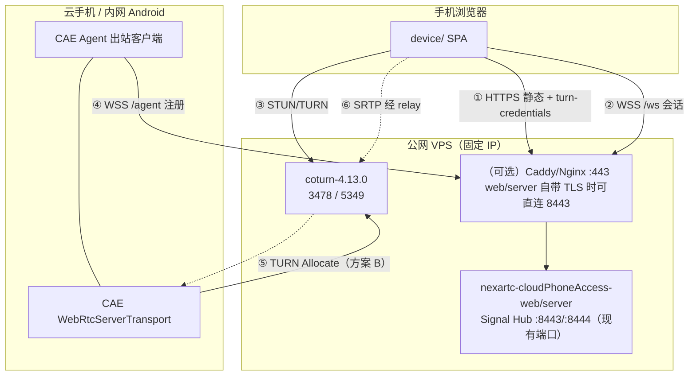
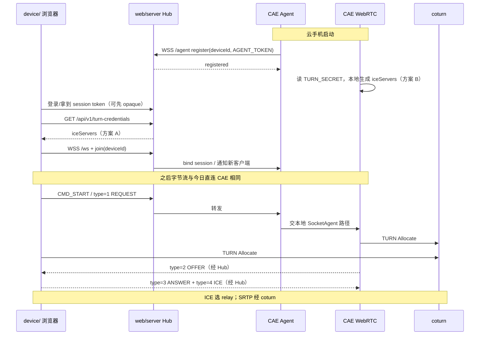

# nexartc 云手机 TURN Mode A 设计落地方案

本文档基于 [`turn-rest-api-signaling.md`](./turn-rest-api-signaling.md)（尤其第 12–13 节 Mode A），对照仓库内现有实现，给出可落地的分阶段改造方案。

| 组件 | 仓库路径 | 目标角色 |
|------|----------|----------|
| coturn | `coturn-4.13.0/` | 公网 VPS 上的 STUN/TURN（本地可先自建验证） |
| 信令 / 静态托管 | `nexartc-cloudPhoneAccess-web/server/` | 升级为 **Signal Hub**（TURN 签发 + Agent 注册 + 信令路由） |
| 浏览器客户端（页面） | `nexartc-cloudPhoneAccess-web/device/` | SPA 静态资源；固定域名连 Hub；REST 取 TURN 凭据；现有 type 1–5 不变 |
| 云手机媒体服务 | `nexartc-cloud-phone-access-engine/` | **始终在家庭内网**；出站注册到 Hub；本地生成 TURN 凭据（方案 B）；双端 relay |

配套理论与算法细节仍以 `turn-rest-api-signaling.md` 为准；本文只写 **与现有代码如何对接、改什么、按什么顺序上线**。  
**日志路径、四类前缀与排障分析**见 [`nexartc-logging-design.md`](./nexartc-logging-design.md)。  
若需要补一层 **CAE 异常自愈 / 远程运维**，请同时参考 [`cae-supervisor-remote-admin-design.md`](./cae-supervisor-remote-admin-design.md)。

**可以先本地验证，再迁到 VPS。** 云手机固定在家庭内网；浏览器页面推荐随 Hub 部署（本地或 VPS），用户用手机/电脑打开该 URL。详见 [§0 部署位置与本地→VPS 验证路径](#0-部署位置与本地vps-验证路径)。

---

## 0. 部署位置与本地→VPS 验证路径

### 0.1 先分清三件事

很多人会把「页面部署在哪」和「浏览器跑在哪」混在一起，Mode A 里要拆开：

| 概念 | 含义 | 本方案结论 |
|------|------|------------|
| **云手机（CAE）部署位置** | Android 实例 / 跑 CAE 的设备 | **始终在家庭内网**（本地验证与 VPS 生产都一样） |
| **浏览器客户端页面部署位置** | `device/` 构建产物由谁 HTTPS 托管 | **跟 Signal Hub 走**：本地验证时在家里/开发机；生产时在 **VPS**（推荐） |
| **浏览器进程运行位置** | 用户真正打开页面的手机/电脑 | **任意网络**：家里 Wi‑Fi、访客网、4G/5G 均可；不「部署」在服务器上 |

一句话：

- **云手机 = 家庭内网（出站连 Hub/TURN）**
- **信令 Hub + coturn +（推荐）device 静态页 = 先本地，后 VPS**
- **用户浏览器 = 访问 Hub 上的页面 URL，可在家也可在外网**

### 0.2 各组件部署矩阵

| 组件 | 本地验证（推荐先做） | VPS 生产（Mode A） |
|------|----------------------|---------------------|
| **云手机 CAE** | 家庭内网 Android / USB 设备 | **仍在家庭内网**（不变） |
| **Signal Hub**（`web/server`） | 开发机或家庭 NAS/小主机 `localhost` / LAN IP | **VPS**（`signal.example.com`） |
| **coturn** | 同机或 LAN 另一台（`127.0.0.1` / 局域网 IP） | **同一 VPS**（`turn.example.com`） |
| **`device/` 静态页** | 由本地 Hub 托管，或 `npm run dev`（Vite） | **由 VPS 上 Hub 托管**（与现网 `WEB_ROOT` 一致） |
| **用户打开页面的浏览器** | 同 LAN 手机/电脑最方便；也可本机 Chrome | 家里或蜂窝网手机浏览器访问 `https://signal.example.com/device/` |
| **家庭网关** | 本地阶段可不做端口映射 | **仍无需**入站 443/媒体映射（Mode A） |

```
【本地验证拓扑】

  家庭内网
  ┌─────────────────────────────────────────────────────────┐
  │  开发机 / 小主机                                          │
  │   ├─ coturn          :3478                               │
  │   └─ web/server Hub  :8443  （含 device/ 静态页）         │
  │                                                          │
  │  云手机 CAE ──出站──► Hub /agent + coturn Allocate        │
  │                                                          │
  │  手机/电脑浏览器 ──► https://<LAN-IP>:8443/device/         │
  └─────────────────────────────────────────────────────────┘
  （全部在内网时，ICE 可能走 host；要测 TURN 请强制 iceTransportPolicy=relay）


【VPS 生产拓扑】

  公网 VPS（固定 IP）              家庭内网
  ┌────────────────────┐          ┌──────────────────────┐
  │ Hub + device 静态页 │◄──WSS───│ 云手机 CAE（出站 Agent）│
  │ coturn              │◄─TURN───│                      │
  └─────────▲──────────┘          └──────────────────────┘
            │
            │ HTTPS / WSS / TURN
            │
     用户手机浏览器（家中 Wi‑Fi 或 4G，任意位置）
     打开 https://signal.example.com/device/
```

### 0.3 浏览器客户端：部署在家庭内网还是 VPS？

| 方案 | 静态页放哪 | 适用 | 说明 |
|------|------------|------|------|
| **A. 跟 Hub 一起放 VPS（生产推荐）** | VPS 上 `web/server` 的 `WEB_ROOT` | 正式对外 | 用户只记一个域名；TLS/证书与信令同源；与 Mode A「固定锚点」一致 |
| **B. 本地 / 家庭内网托管（仅验证）** | 开发机 Vite 或家里 Hub | 联调、改 UI | 外网用户难访问该页；**不是** Mode A 终态 |
| **C. 静态页放家里、信令在 VPS** | 家庭 Web 服务器 | **不推荐** | 页面 URL 又绑动态 IP/内网，失去「只认域名」的好处 |

**结论：**

1. **生产：`device/` 静态资源部署在 VPS（与 Hub 同机）**，不要单独部署在家庭内网。
2. **云手机永远在家庭内网**，不搬到 VPS。
3. **用户浏览器**不部署在任何服务器上；用手机打开 VPS 上的页面即可（在家或在外均可）。
4. 若「浏览器客户端」指 **测试人员在家里用手机打开页面**：本地验证阶段可以；生产阶段应打开 **VPS 域名**，即使人还坐在家里。

### 0.4 是否可以本地验证后再上 VPS？

**可以，而且建议这样做。** 按层递进，避免一上来就依赖公网：

| 阶段 | 环境 | 验证目标 | 通过标准 |
|------|------|----------|----------|
| **L0** | 本机 coturn | REST 凭据算法 | `turnutils_uclient -W` 成功 |
| **L1** | 本机 Hub + coturn | `GET /turn-credentials` | 返回 iceServers；Trickle ICE 出 `typ relay` |
| **L2** | 家庭 LAN：Hub + coturn + CAE + 浏览器 | 完整信令 + 双端 TURN | `iceTransportPolicy=relay` 仍能出画（避免同网 host「假通过」） |
| **L3** | 同上，但浏览器改用蜂窝网（关 Wi‑Fi） | 跨网 ICE | 仅靠 relay 出画（最接近真机） |
| **P0** | 把 Hub + coturn + `device/` 迁到 VPS | 域名 / TLS / 防火墙 | health、uclient、页面可打开 |
| **P1** | 家庭 CAE 改连 `wss://signal.../agent` | Mode A 闭环 | 无端口映射；外网手机可看云手机 |

迁移时保持 **同一套 `TURN_SECRET` / 协议 / 配置键名**，只改：

- DNS / URL：`localhost` → `signal.example.com` / `turn.example.com`
- CAE：`signal_agent_url`、`webrtc_turn_host`
- 浏览器默认 `apiBase` / `signalWs`（或远程配置只改域名）

本地已验证的代码与 ini **原样上 VPS**，不需要为「上云」再改业务逻辑。

### 0.5 本地验证注意点

1. **同局域网容易误判**：浏览器与云手机都在家时，ICE 常选 `typ host`，即使 TURN 配错也可能出画。本地验收务必加一轮 **`iceTransportPolicy: 'relay'`** 或手机切 4G。
2. **TLS**：本机可用现有自签证书（`web/server` 8443）；浏览器需信任一次。VPS 再用 Let's Encrypt。
3. **CAE 出站**：本地阶段 Agent 可连 `wss://192.168.x.x:8443/agent`（自签需 CAE 侧信任或临时关校验，仅限调试）。
4. **不要**在本地验证阶段把家庭 WAN IP 写进 App；从一开始就用「Hub 地址」配置项，上 VPS 只换域名。

### 0.6 推荐操作顺序（本地 → VPS）

```
家里开发机：起 coturn + Hub（含 device 静态页）
    → 云手机仍在家，出站连家里 Hub
    → 家里浏览器 / 本机 Chrome 打开局域网 Hub 页面
    → 强制 relay 验收 TURN
    →（可选）手机 4G 访问家里 Hub：需临时端口映射或仅测 CAE↔本机 TURN，
       完整「外网打开页面」建议直接进入 VPS 阶段

VPS：部署同一套 Hub + coturn + device 构建产物
    → DNS 指向 VPS
    → 云手机改 signal_agent_url / turn host 为公网域名（仍在家庭内网）
    → 任意网络手机打开 https://signal.example.com/device/
```

---

## 1. 现状审查结论

### 1.1 当前拓扑（已实现）

```
手机浏览器
  ├── HTTPS ──► web/server（静态页 + Admin + 可选 WSS 反向代理）
  └── WSS  ──► CAE 入站监听（listen_port_h5，默认 50000）
                 └── WebRTC：CAE 发 Offer，浏览器 Answer
媒体面：依赖 host / coturn-STUN 动态发现的 webrtc_public_ip 候选；客户端仅 Google STUN
```

要点（已对照源码核实）：

| 项 | 现状 | 关键文件 |
|----|------|----------|
| 信令入口 | CAE **入站** WSS（`[server] listen_port_h5=50000`）；`web/server` 仅透明代理到单一 upstream | `server/src/wss-proxy.ts`、`cae_socket/` |
| Hub 进程形态 | 裸 Node `https.createServer`（**无 Express**），固定端口 **8443 / 8444**（`PORTS_AND_CERTS`），自带 TLS 证书管理 | `server/src/main.ts`、`config.ts`、`cert.ts` |
| 房间 / 设备路由 | **无**；一对一连固定 CAE；并发上限 `max_streaming_clients=3` | — |
| TURN 凭据 API | **无** | `server/src/` 无 HMAC / iceServers |
| 浏览器 ICE | 硬编码 `stun:stun.l.google.com:19302`；PC 在收到 Offer 时才创建 | `device/src/webrtc.ts` L211-215 |
| 浏览器 WSS URL | `wss://${host}:${port}` **无 path**（Hub `/ws` 需加 path 支持） | `device/src/wss.ts` L28 |
| CAE ICE | STUN 可选；`turn_*` 结构体有字段但未从 ini 填充；代码里硬编码 `freeturn.net`（死路径） | `WebRtcServerTransport.cpp` L893-896 |
| CAE WebSocket 能力 | 仅 **服务端** 编解码（`cae_3rd/WebSocket.h` 只有 parseHandshake/makeFrame，**无客户端握手/TLS**） | `cae_socket/CaeWebSocket.h` |
| CAE 可用依赖 | libdatachannel 以 `NO_WEBSOCKET=OFF` 构建 → **`rtc::WebSocket` 出站客户端可直接用**；BoringSSL `HMAC()` 头文件已在 `libs/openssl` | `deps/datachannel-native/build_all.sh`、`libs/openssl/include/openssl/hmac.h` |
| NAT 兜底 | host 候选 = 50000 端口映射 + coturn/STUN 动态发现公网 IP | `bug_tracking.md` #9 |
| 认证 | Admin 密码（`proxy_config.json`）；CAE 自身 verify；无用户 JWT / Agent token | `admin-ws.ts` |

### 1.2 与 Mode A 的差距（必须补齐）

| Mode A 能力 | 现状 | 落地方向 |
|-------------|------|----------|
| 固定锚点域名 `signal` / `turn` | 部分硬编码 IP/域名到 CAE | VPS 固定 A 记录 |
| `GET /api/v1/turn-credentials` | 缺失 | 在 `web/server` 新增 |
| `WSS /agent` 出站注册 | 缺失（CAE 只 listen） | CAE 新增 Agent 客户端 |
| `WSS /ws` 房间路由 | 缺失（直连 CAE） | Hub 转发，保留 CAE 二进制帧语义 |
| 双端 TURN relay | 缺失 | 浏览器方案 A + CAE 方案 B |
| 不依赖家庭宽带 WAN IP 静态配置 | 当前依赖 `webrtc_public_ip` 动态发现 / 端口映射 | 媒体改走 coturn |

### 1.3 现有协议资产（应保留，不要推倒重来）

CAE ↔ 浏览器 WebRTC 信令已稳定，**数值 type 1–5** + `CMD_CONTROL`/`command=1005`：

| type | 含义 | 方向 |
|------|------|------|
| 1 | WEBRTC_REQUEST | Client → CAE |
| 2 | OFFER | CAE → Client |
| 3 | ANSWER | Client → CAE |
| 4 | CANDIDATE | 双向 |
| 5 | CLOSE | 双向 |

Hub **不必**把这些改成文档 §13.4 的字符串 `join`/`signal` 信封给 CAE；推荐：

- **Hub ↔ Mobile / Hub ↔ Agent**：可用 Mode A 控制面消息（register / join / ping）。
- **会话媒体协商载荷**：Hub **透明转发**现有 `CMD_START` / `CMD_CONTROL(1005)` 二进制帧（或等价的已封装 WebRTC JSON），避免改 CAE 业务层与 `device` 的编解码。

---

## 2. 目标架构（映射到本仓库）



### 2.1 角色与代码归属

| 角色 | 本地验证部署 | VPS 生产部署 | 代码改动主战场 |
|------|--------------|--------------|----------------|
| TLS 入口 | 本机自签（现有 8443） | 二选一：`web/server` 自带 TLS（8443/8444 + 正式证书，`cert.ts` 已支持）或前置 Caddy :443 | 运维（§13.6） |
| Signal Hub | 开发机 / 家庭小主机 | **VPS** | **扩展** `web/server` |
| coturn | 同机或 LAN | **同一 VPS** | `coturn-4.13.0` 配置 |
| `device/` 静态页 | 本地 Hub / Vite | **VPS Hub 托管（推荐）** | **扩展** `device/`、`sdk/` |
| 用户浏览器 | 家里手机/电脑打开本地 URL | 任意网络打开 VPS URL | 无服务端部署 |
| 云手机 CAE | **家庭内网** | **仍在家庭内网** | **扩展** CAE Agent + TURN |

详见 [§0](#0-部署位置与本地vps-验证路径)：云手机不搬到 VPS；浏览器页面生产放 VPS，不放家庭内网。

### 2.2 选型确认（与设计文档对齐）

| 决策 | 选择 | 理由 |
|------|------|------|
| 信令拓扑 | **Mode A** | 动态 WAN、无 frp/DDNS、手机只认域名 |
| 浏览器 TURN 凭据 | **方案 A**（Hub 签发） | secret 不下发到 JS |
| CAE TURN 凭据 | **方案 B**（本地 HMAC） | 无浏览器暴露；与 coturn 同 secret |
| 媒体策略 | **host（默认）**：仅 host 直连；**hybrid**：host → p2p/srflx → TURN；**relay**：双端仅 TURN | 详见 [`nexartc-install-deploy-guide.md`](./nexartc-install-deploy-guide.md) |
| 兼容策略 | Hub 透明转发现有 WSS 帧 | 最小改动 CAE Offer/Answer 逻辑 |

#### 2.2.1 ICE 模式 `webrtc_ice_mode`

| 模式 | CAE | 浏览器 | 行为 |
|------|-----|--------|------|
| **host**（默认） | 仅发 host；Offer `a=ice-lite`；不挂 TURN；`webrtc_local_ip` 须为真实 wlan0 IP | 默认；`?ice_mode=host` | 依赖局域网或公网 DNAT UDP 50000；详见 [`nexartc-install-deploy-guide.md`](./nexartc-install-deploy-guide.md) |
| **hybrid** | `force_relay=0`；STUN + TURN；`webrtc_local_ip` + `webrtc_port_range_begin/end` 注入 host；`webrtc_public_ip` 运行时通过 coturn/STUN 探测，不再静态填写 | `?ice_mode=hybrid`；Hub 签发 TURN 作 fallback | ICE 优先 host（50000 端口来自配置文件和路由器映射，公网 IP 由 coturn/STUN 动态发现），host 异常后再走 p2p/srflx，最后用 relay |
| **relay** | `force_relay=1`；仅发 relay candidate | `?ice_mode=relay` 或 `?force_relay=1` | 始终经 coturn 中转（旧 Mode A 严格策略） |
| **p2p**（仅调试） | 仍可能 gather relay；浏览器侧会忽略 CAE 的 `typ relay` | `?ice_mode=p2p` 或 `?no_relay=1` | **不拉 TURN 凭据**；仅 STUN + host/srflx；用于验证 NAT 是否允许直连 |

配置项：

```ini
[webrtc]
webrtc_ice_mode=host            ; host | hybrid | p2p | relay（默认 host）
webrtc_force_relay=0            ; 废弃，=1 等价 ice_mode=relay
webrtc_stun_server=stun:120.79.21.28:3478
webrtc_local_ip=192.168.124.103 ; CAE 局域网地址
webrtc_public_ip=                ; 运行时通过 coturn/STUN 发现公网映射 IP
webrtc_port_range_begin=50000    ; 与 listen_port_h5 / UDP mux 统一
webrtc_port_range_end=50000
webrtc_turn_host=120.79.21.28
webrtc_turn_secret=...
```

`listen_port_h5=50000` 与上面的 `webrtc_port_range_*` 使用同一数字端口；TCP/UDP 可共用 50000。

浏览器 URL：

| 参数 | 模式 | 说明 |
|------|------|------|
| （默认） | host | 仅 host 直连；Stats 打印 `ICE path: ... (host\|p2p\|relay)` |
| `?ice_mode=relay` 或 `?force_relay=1` | relay | 强制浏览器仅 relay |
| `?ice_mode=p2p` 或 `?no_relay=1` | p2p | 跳过 TURN 凭据；忽略 CAE relay candidate；**无 relay 兜底** |

**device 页加载建议**：生产调试优先 `https://120.79.21.28/device/`（bundle 最新）；`www.signalling-nexartc.cn/device/` 在部分网络/自动化 curl 下可能超时或缓存旧 JS——以页面日志是否出现 `ICE 模式: p2p` / `mode=hybrid` 为准，并 **Ctrl+Shift+R** 硬刷新。

**注意**：`enableIceUdpMux` 只负责 host candidate 的 50000 单端口绑定；TURN allocation 本身不依赖它。当前实现里，若启用 TURN fallback 且底层路径不支持 mux+TURN，会在 hybrid / relay 场景自动切到独立 TURN socket；host-only 默认仍保持 50000 映射。

**多客户端 + 单端口 DNAT（方案 A）：** Mode A host 下多个 PeerConnection 共用 libjuice ICE UDP Mux。Demux（按 ufrag/五元组分发）留在 libjuice；CAE 会话层做生命周期逻辑分离（全局 RTP 暂停、有同伴时同步 `pc->close()`、有 RUNNING 客户端时不拆编码器/Agent），保证「两台同看 → 一台停 → 另一台继续」。详见专项设计：

- [`nexartc-webrtc-ice-udp-mux-logical-separation.md`](./nexartc-webrtc-ice-udp-mux-logical-separation.md)

---

## 3. 端到端时序（落地版）



---

## 4. 分阶段实施计划

建议严格按阶段交付，每阶段可独立验收。

### Phase 0 — 基线与密钥（0.5–1 天）

**目标**：先在 **本地** 跑通 coturn REST API；确认后再原配置迁到 VPS（只改 listening/relay IP 与域名）。

#### 0a. 本地（优先）

1. 编译/安装 `coturn-4.13.0` 到开发机。
2. 最小配置（本机回环即可）：

```ini
listening-port=3478
listening-ip=127.0.0.1
relay-ip=127.0.0.1
use-auth-secret
static-auth-secret=<TURN_SECRET>
realm=nexartc.com
fingerprint
no-cli
# 本地可暂关 TLS：生产再开 tls-listening-port=5349
```

若 CAE / 手机浏览器在 **同一 LAN 其它设备** 上访问 coturn，把 `listening-ip`/`relay-ip` 改成开发机局域网 IP（如 `192.168.1.10`），并放行 3478。

3. 验收：

```bash
turnutils_uclient -u testuser -W "$TURN_SECRET" 127.0.0.1
```

#### 0b. 迁到 VPS（L0/L1 通过后）

同一 `TURN_SECRET`，仅替换地址：

```ini
listening-ip=<VPS_PUBLIC_IP>
relay-ip=<VPS_PUBLIC_IP>
tls-listening-port=5349
# 其余与本地相同
```

DNS：`turn.example.com` → VPS；防火墙开放 3478/udp+tcp、5349/tcp、49152–65535/udp。

```bash
turnutils_uclient -u testuser -W "$TURN_SECRET" turn.example.com
```

**产出**：本地可复现的 coturn；VPS 上同 secret 的公网实例；密钥不进 Git。

---

### Phase 1 — Signal Hub：TURN REST API（1–2 天）

**目标**：浏览器能拿到动态 `iceServers`；暂不改信令路由。

#### 1.1 在 `web/server` 新增模块

注意：`web/server` 是 **裸 Node `https.createServer`，没有 Express/路由框架**。新路由直接加在 `main.ts` 的请求回调里，模式与现有 `/api/online` 完全相同（`getRequestPathname(req.url)` → `if (pathname === ...)` → JSON + `Access-Control-Allow-Origin: *` → 其余 fall-through 到 `serveStatic`）。

建议文件：

| 文件 | 职责 |
|------|------|
| `server/src/turn-credentials.ts` | HMAC-SHA1 生成、`buildIceServers()`（纯函数，便于单测） |
| `server/src/auth.ts` | Bearer 解析（先 opaque session，后可换 JWT） |
| `server/src/config.ts` | 增加 `TURN_SECRET` / `TURN_HOST` / `TURN_TTL` 等（沿用现有 `process.env` + 默认值风格） |
| `server/src/main.ts` | 在 `/api/online` 旁注册 `GET /api/v1/turn-credentials`、`GET /api/v1/health` |

核心实现（Node 标准库即可，无新依赖）：

```ts
// server/src/turn-credentials.ts
import crypto from 'node:crypto';

export function generateTurnCredentials(userId: string, secret: string, ttl = 3600) {
  const expiry = Math.floor(Date.now() / 1000) + ttl;
  const username = `${expiry}:${userId}`;
  const credential = crypto.createHmac('sha1', secret).update(username).digest('base64');
  return { username, credential, ttl, expiry };
}

export function buildIceServers(turnHost: string, username: string, credential: string,
                                turnPort = 3478, turnsPort = 5349) {
  return [
    { urls: `stun:${turnHost}:${turnPort}` },
    {
      urls: [
        `turn:${turnHost}:${turnPort}?transport=udp`,
        `turn:${turnHost}:${turnPort}?transport=tcp`,
        `turns:${turnHost}:${turnsPort}?transport=tcp`,
      ],
      username,
      credential,
    },
  ];
}
```

响应字段：`iceServers`、`ttl`、`expiry`、顶层 `username`/`credential`（便于调试）。

两条注意：

- Hub 双端口 8443/8444 都会挂同一请求回调，TURN 路由天然在两个口可用；对外只暴露其中一个即可。
- `Phase 3` 的 WSS 分流也在 `main.ts` 的 `upgrade` 处理里做（现状：`/api/ws` → Admin，其余 → proxy），保持同一文件演进。

#### 1.2 鉴权最小可用方案

现网无用户登录体系时，Phase 1 可采用：

| 方案 | 说明 |
|------|------|
| **P1-a 短期** | 固定 `STREAM_TOKEN`（环境变量）；客户端 Header `Authorization: Bearer <STREAM_TOKEN>`；`userId` 用 token hash 前缀或 query `clientId`（仅调试） |
| **P1-b 目标** | 真正登录 JWT，`sub`/`userId` 写入 TURN username（§7.1） |

**禁止**：把 `TURN_SECRET` 下发到 `device/`。

#### 1.3 验收

```bash
curl -s -H "Authorization: Bearer $TOKEN" \
  "https://signal.example.com/api/v1/turn-credentials?roomId=demo" | jq .
# 用返回的 username/credential 在 Trickle ICE 页面测 typ relay
```

---

### Phase 2 — 浏览器接入 TURN 凭据（1 天）

**目标**：`device/` 创建 `RTCPeerConnection` 前使用 Hub 下发的 `iceServers`。

#### 2.1 改动点

现有代码结构给了两个现成挂点：

- `main.ts` 的 `startTest()` 是 Connect 入口（`cleanup()` → `wss.connect(host, port)`），凭据拉取放在这里最合适。
- `handleSdpOffer(offer, videoEl, audioEl, handlers, options)` 已接收 `WebRtcOptions`（`main.ts` 里由 `getWebRtcOptions()` 组装，现含 `lowLatency` 等），**给 `WebRtcOptions` 加 `iceServers?: RTCIceServer[]` 即可**，不需要新的传参通道。
- 端点解析可复用 `getOnlineStatusEndpoint()` 的双模式写法：直连 CAE 模式用 `https://{host}:{port}/api/v1/turn-credentials`，同源（Hub 托管页面）模式用相对路径 `/api/v1/turn-credentials`。

| 文件 | 改动 |
|------|------|
| `device/src/webrtc.ts` | `handleSdpOffer`：`new RTCPeerConnection({ iceServers: options.iceServers ?? [GoogleSTUN] })`；`WebRtcOptions` 增加 `iceServers` |
| `device/src/main.ts` | `startTest()` 内先 `await fetchTurnCredentials()` 并缓存 `{ iceServers, expiry }`；`getWebRtcOptions()` 带出缓存值；拉取失败时降级为仅 STUN 并在日志面板给出警告 |
| `device/src/config.ts`（新建） | `apiBase`、`signalWs` 默认值；支持 query/localStorage 覆盖（与现有 `ip`/`port` 参数同风格） |
| `device/index.html` | 可选：显示「已获取 TURN 凭据 / expiry」调试信息 |
| `sdk/src/WebRtcAppController.js` | 同步：`WebRtcTransportSession` 已支持 `options.iceServers`，把 Controller 硬编码 STUN 改为透传 |

推荐生命周期：

```
Connect 点击（startTest）
  → fetch /api/v1/turn-credentials（带 Bearer）
  → 缓存 { iceServers, expiry }
  → 建立 WSS（Phase 3 前仍可直连 CAE）
  → 收到 type=2 Offer 时 new RTCPeerConnection({ iceServers })
```

时序说明：PC 在收到 Offer 时才创建（现状即如此），所以只要凭据拉取在 `startTest()` 开头发起、在 Offer 到达前 resolve 即可；两者一个是 HTTPS 一个是 WSS 握手 + verify + start，正常网络下凭据先到。稳妥做法是 `handleSdpOffer` 前 `await` 该 Promise。

临近过期：仅在 **重连 / ICE restart / 新建 PC** 时重取（见设计文档 §8.3.6）；`handlePeerDisconnected` → 重连路径里加 `isCredentialNearExpiry()` 检查。

#### 2.2 验收

- 蜂窝网：`onicecandidate` 出现 `typ relay`。
- 临时设 `iceTransportPolicy: 'relay'` 仍能出画（与 CAE 侧 Phase 4 联调后）。

---

### Phase 3 — Hub Agent 注册 + 会话转发（3–5 天，核心）

**目标**：手机与 CAE **都只连 VPS**；内网无 443 入站。

#### 3.1 Hub 侧（`web/server`）

新增 / 扩展：

| 模块 | 职责 |
|------|------|
| `server/src/agent-registry.ts` | `Map<deviceId, AgentWs>`；心跳超时剔除 |
| `server/src/session-router.ts` | `clientWs ↔ agentWs` 绑定；透明转发 |
| `server/src/main.ts` | WSS 按 path 分流：`/api/ws` Admin 保留；`/agent`；`/ws`；其余可 deprecate 旧 proxy |

**WSS 路径**：

| Path | 连接方 | 行为 |
|------|--------|------|
| `/agent` | CAE | register / ping / 收发会话字节 |
| `/ws` | 浏览器 | join(deviceId) 后与 Agent 绑定，透明转发 |
| `/api/ws` | Admin UI | **保持现有** admin 协议，勿破坏 |

**控制面消息（JSON text，仅 Hub↔端）**：

```json
// Agent → Hub
{ "type": "register", "deviceId": "device-001", "token": "<AGENT_TOKEN>", "meta": {} }
{ "type": "ping", "deviceId": "device-001" }

// Hub → Agent
{ "type": "registered", "deviceId": "device-001", "ts": 1735689600 }
{ "type": "pong", "ts": 1735689630 }
{ "type": "client_attached", "sessionId": "uuid", "clientUserId": "user-42" }

// Browser → Hub
{ "type": "join", "deviceId": "device-001", "roomId": "optional" }
```

**数据面**：`join` / `client_attached` 之后，Hub 对 **Binary WebSocket frames** 做双向 pipe（与今日 `wss-proxy.ts` 相同思想），从而兼容：

- `CMD_START` / verify / start success
- `command=1005` WebRTC JSON
- 心跳等现有二进制协议

这样 **CAE 现有 `CaeSocketAgent` 收包路径几乎不改**，Agent 只是把「远端 WSS」换成「连到 Hub 的那条出站连接上的虚拟会话」。

> 实现提示：若一条 Agent 连接上复用多客户端，需在 Hub 帧上加极薄 session 头（如 4 字节 sessionId + payload），或限制 Phase 3 先做 **单客户端/设备**（一对一 pipe），多路复用放 Phase 5。

**建议 Phase 3 MVP**：每设备同时仅 1 个 streaming 会话（与现网 `max_streaming_clients` 可对齐），Hub 上 `deviceId → 单一 clientWs`，避免改 CAE 多路 demux。

#### 3.2 CAE 侧 — Agent 出站客户端

**关键实现选型（已核实）**：CAE 现有 WebSocket 代码（`cae_3rd/WebSocket.h` + `CaeWebSocket`）只是 **服务端帧编解码器**（`parseHandshake`/`makeFrame`），没有客户端握手、没有 TLS 出站能力，**不要**在它上面造 WSS 客户端。而 CAE 已链接的 libdatachannel 以 `NO_WEBSOCKET=OFF` 构建（`RTC_ENABLE_WEBSOCKET=1`），自带完整的 **`rtc::WebSocket` 出站客户端**（TLS、ping/pong、`connectionTimeout`，见 `rtc/websocket.hpp`）——Agent 直接用它，零新增依赖：

```cpp
rtc::WebSocketConfiguration wsConf;
wsConf.pingInterval = std::chrono::seconds(30);
wsConf.connectionTimeout = std::chrono::seconds(10);
// 仅本地自签调试：wsConf.disableTlsVerification = true;（生产禁止）
auto ws = std::make_shared<rtc::WebSocket>(wsConf);
ws->onOpen([...] { /* 发送 register JSON */ });
ws->onMessage([...] { /* 文本=控制面 JSON；二进制=会话字节 */ });
ws->onClosed([...] { /* 指数退避重连 1s→2s→…→60s */ });
ws->open("wss://signal.example.com/agent");
```

建议新增：

| 文件 | 职责 |
|------|------|
| `cae_service/CaeSignalAgent.h/.cpp` | 基于 `rtc::WebSocket` 出站到 `/agent`；register；心跳；指数退避重连 |
| `cae_common/CaeConfigManage` | 新增 `[signal]` 节 getter：`signal_agent_url`、`device_id`、`agent_token` |
| `CaeConnectionAgent` 或 socket 层 | 将 Agent 上收到的会话字节注入现有「新连接」处理路径（等价于一条已完成 WS 握手的 `CaeSocketAgent`） |

注入方式提示：现有入站路径是 `CaeTcpServerSocket accept → CaeWebSocket 升级 → CaeSocketAgent`。Agent 模式下这条链的前两步被 `rtc::WebSocket` 替代，需要一个「虚拟 socket」适配层，把 `rtc::WebSocket` 的二进制消息喂给 `CaeSocketAgent` 的收包入口、并把 `SendWebSocketText`/二进制发送改走 `ws->send()`。这是 Phase 3 CAE 侧工作量的主体。

配置（`CaeConfig.ini` 新增节建议）：

```ini
[signal]
; Mode A：出站注册；为空则保持旧入站 listen 行为（兼容）
signal_agent_url=wss://signal.example.com/agent
device_id=device-001
agent_token=<AGENT_TOKEN>
```

行为开关：

| `signal_agent_url` | 行为 |
|--------------------|------|
| 空 | **兼容模式**：继续 `listen_port_h5` 入站（现网） |
| 非空 | Mode A：启动 Agent；可选择关闭对外 WSS listen 或仅保留内网调试端口 |

TLS：Android 出站需信任公网 CA（Let's Encrypt）；自签需额外 pin（生产不推荐）。

#### 3.3 浏览器侧 — 改连 Hub

`device/src/wss.ts` / `main.ts`：

- `wss.ts` 现在拼 `wss://${host}:${port}`（无 path），需要支持带 path 的 URL（`/ws`）；同源部署时可直接 `wss://${location.host}/ws`。
- 默认 `wss://signal.example.com/ws`（或同域相对路径升级）。
- 连接后先发 `join`（JSON text 帧），收到确认后再发 `CMD_START` 二进制帧（Hub 以「首帧必须是 join」做门禁）。现有协议全部是二进制帧，text 帧天然可作控制面通道，不会与 CAE 帧混淆。
- UI：由「填 CAE IP:50000」改为「选设备 / 填 deviceId」（Admin 可列出 online agents）。

#### 3.4 与旧 `wss-proxy` 的关系

| 模式 | 用途 |
|------|------|
| 旧 `handleWssProxy` | 过渡期：开发机仍直连某一台 CAE |
| 新 `/ws` + `/agent` | 生产 Mode A |

可用配置开关 `SIGNAL_MODE=proxy|hub` 共存，避免一次切死。

#### 3.5 验收

1. CAE 日志：`registered`；Hub 日志：agent online。
2. 浏览器只配域名，join 后仍能完成 type 1–4，出画。
3. 模拟网关重拨：Agent 自动重连，浏览器无需改配置。

---

### Phase 4 — CAE 双端 TURN（方案 B）（2–3 天）

**目标**：CAE PeerConnection 使用公网 coturn；与浏览器双端 relay。

#### 4.1 凭据生成（C++）

新增工具（可放 `cae_common/CaeTurnCredentials.cpp`），算法同设计文档 §2.5/§2.6：

- `username = expiry + ":" + deviceId`（稳定 ID，便于 coturn `user-quota`）
- `credential = Base64(HMAC-SHA1(TURN_SECRET, username))`
- TTL 建议 3600；在 `CreatePeerConnection` 时生成（或缓存至 expiry−300s）

CAE 的 `libs/openssl`（BoringSSL）已提供一次性 `HMAC()`（`openssl/hmac.h`），无需新依赖；Base64 可用 BoringSSL `EVP_EncodeBlock`：

```cpp
#include <openssl/hmac.h>
#include <openssl/base64.h>

std::string MakeTurnCredential(const std::string& secret, const std::string& username) {
    uint8_t digest[EVP_MAX_MD_SIZE] = {0};
    unsigned int len = 0;
    HMAC(EVP_sha1(), secret.data(), secret.size(),
         reinterpret_cast<const uint8_t*>(username.data()), username.size(), digest, &len);
    uint8_t b64[64] = {0};
    size_t n = EVP_EncodeBlock(b64, digest, len);
    return std::string(reinterpret_cast<char*>(b64), n);
}
```

**跨语言一致性测试向量**（Node / C++ / coturn 三方必须得到同一结果）：

```
secret   = "logen"
username = "1735693200:device-001"
credential = "oYioY802yIs6tGTrYmT3V45JjQc="
```

**Secret 来源**：仅 ini / 环境变量 / 安全存储；**不要**写进 APK 明文仓库。云手机若可被 root，评估泄露风险（设计文档 §3.7）；配额与 `denied-peer-ip` 作缓解。

#### 4.2 修复并接通 ICE 配置

现状问题（必须修）：

```cpp
// WebRtcServerTransport.cpp 现状：turn 字段未从 ini 填充，且 host 写死 freeturn.net
config.iceServers.emplace_back("freeturn.net", (uint16_t)3478,
    m_config.turn_user, m_config.turn_pass);
```

改为：

1. `CaeConfigManage` 读取（新键沿用现有 `[webrtc]` 节命名风格）：

```ini
[webrtc]
webrtc_stun_server=stun:turn.example.com:3478
webrtc_turn_host=turn.example.com
webrtc_turn_port=3478
webrtc_turns_port=5349
webrtc_turn_secret=<与 Hub / coturn 相同>   ; 或仅环境变量注入
webrtc_turn_ttl=3600
webrtc_ice_transport_policy=all   ; 调试可 relay
; Mode A 生产建议：不再依赖公网 host 注入
webrtc_public_ip=
webrtc_server_ip=
```

同时扩展 `WebRtcServerConfig`（`WebRtcServerTransport.h`）：现有 `turn_server/turn_user/turn_pass` 三个字段从未被填充，改为 `turn_host/turn_port/turns_port/turn_secret/turn_ttl`（凭据运行时生成，不再存静态 user/pass），并在 `CaeConnectionAgent.cpp` 组装 `webrtcConfig` 处（现有 L520 附近读 stun/local_ip/public_ip 的位置）接入新 getter。

2. `CreatePeerConnection`：用 libdatachannel `rtc::IceServer` 的 TURN 构造函数（已核实签名，见 `rtc/configuration.hpp`）：

```cpp
// WebRtcServerTransport::CreatePeerConnection 内，替换 freeturn.net 死代码
if (!m_config.turn_host.empty()) {
    auto cred = CaeTurnCredentials::Generate(m_config.turn_secret,
                                             m_config.device_id,
                                             m_config.turn_ttl);
    // UDP 优先 + TCP 兜底；TurnTls 视 5349 证书情况可选
    config.iceServers.emplace_back(m_config.turn_host, m_config.turn_port,
        cred.username, cred.credential, rtc::IceServer::RelayType::TurnUdp);
    config.iceServers.emplace_back(m_config.turn_host, m_config.turn_port,
        cred.username, cred.credential, rtc::IceServer::RelayType::TurnTcp);
}
// 调试强制 relay（等价浏览器 iceTransportPolicy: 'relay'）：
// config.iceTransportPolicy = rtc::TransportPolicy::Relay;
```

3. 删除 / 禁用 `freeturn.net` 硬编码（`WebRtcServerTransport.cpp` L893-896）。
4. Mode A 下 **不再手工静态配置** `webrtc_public_ip`；改为启动时通过 coturn/STUN 发现公网映射 IP，仅在 LAN 调试时允许手工覆盖。
5. **UDP mux 与 TURN 的关系**：`enableIceUdpMux` 只负责 host candidate 的本地 50000 端口绑定；TURN allocation 走独立 socket，不依赖 mux。若当前 libjuice 路径在 hybrid / relay 下不支持 mux+TURN，则实现层自动关闭 mux，但 `50000` 的 host 映射仍保留。

#### 4.3 验收

- CAE log：Allocate / `typ relay` 本地候选。
- `iceTransportPolicy=relay` 两端仍通。
- 50000 端口映射 + coturn/STUN 动态公网 IP 下，host 优先可直接出画；必要时仍可回退 p2p / relay。

---

### Phase 5 — 加固与产品化（持续）

| 项 | 内容 |
|----|------|
| 多客户端 / 设备 | Agent 连接上 session 复用；对齐 `max_streaming_clients` |
| JWT 登录 | 替换 STREAM_TOKEN；TURN username 用真实 userId |
| Secret 轮换 | 当前示例按单 `TURN_SECRET` 部署；轮换时先保证 coturn 接受新旧 secret，再同步更新 Hub / CAE |
| 可观测性 | Hub：register/join/签发审计；CAE：`iceConnectionState`；coturn 带宽 |
| Admin UI | 展示 online agents、强制下线、下发 `device_id` |
| SDK | `sdk/` 与 `device/` 同一套 iceServers / Hub URL |
| 配额 | coturn `user-quota` / `total-quota`；双端 relay 容量规划 |

---

## 5. 接口与配置清单（落地规格）

### 5.1 Hub HTTP

| 方法 | 路径 | 鉴权 | 响应 |
|------|------|------|------|
| GET | `/api/v1/health` | 无 | `{ "ok": true }` |
| GET | `/api/v1/turn-credentials?roomId=` | Bearer | `{ iceServers, ttl, expiry, username, credential }` |
| GET | `/api/online` | 无 | **保留**；语义可扩展为 Hub 会话数 |
| GET | `/api/v1/agents` | Admin | 在线 `deviceId` 列表（可选） |

### 5.2 环境变量（Hub）

现网端口固定在代码里（`PORTS_AND_CERTS`：8443 `cae-server`、8444 `cae-server-ext`），不由 `PORT` 环境变量控制；TURN 相关按现有 `config.ts` 的 `process.env` + 默认值风格新增：

```bash
TURN_SECRET=...          # 与 coturn static-auth-secret 一致；必填，缺失时禁用 turn-credentials 路由
TURN_HOST=turn.example.com
TURN_PORT=3478
TURNS_PORT=5349
TURN_TTL=3600
JWT_SECRET=...           # 或 STREAM_TOKEN=（Phase 1 最小鉴权）
AGENT_TOKEN=...
ALLOWED_DEVICES=device-001,device-002
SIGNAL_MODE=hub          # hub | proxy（过渡期共存开关）
```

秘密注入建议：systemd `EnvironmentFile=/etc/signal-hub/env`（权限 600），或沿用 `proxy_config.json` 的热加载机制扩展一节 `turn`（注意该文件当前含 `admin_password`，同样不进 Git）。

### 5.3 浏览器配置

```ts
// device/src/main.ts — URL 查询参数
// ?device_id=device-mi9-001
// ?turn_token=<STREAM_TOKEN>     Hub REST 鉴权
// ?ice_mode=hybrid|relay|p2p     ICE 策略（见 §2.2.1）
// ?force_relay=1                 等价 ice_mode=relay
// ?no_relay=1                    等价 ice_mode=p2p

export const RTC_CONFIG = {
  signalWs: 'wss://120.79.21.28/ws',   // 或 wss://www.signalling-nexartc.cn/ws
  apiBase: 'https://120.79.21.28/api/v1',
  // 禁止下发 TURN_SECRET / WAN IP
};
```

构建与部署：`nexartc-cloudPhoneAccess-web/build_all.sh` → 产物在 `out/device/`；VPS 同步脚本 `test/turn/deploy_vps.sh` **只 rsync `out/device/`**，改完 `device/dist/` 后须先 `build_all.sh --skip-server`。

### 5.4 CAE 配置

见 Phase 4.2；另加 `[signal]` 出站参数（Phase 3.2）。

### 5.5 DNS / 防火墙

| 记录 | 目标 |
|------|------|
| `signal.example.com` A | VPS（**不要** DDNS 到家庭宽带） |
| `turn.example.com` A | 同 VPS（可同 IP） |

VPS 开放：80/443（TLS）、3478、5349、49152–65535/udp。  
云手机：**仅出站** 443 与 TURN 端口；**无需** 入站 443/50000（Mode A 生产）。

---

## 6. 协议兼容策略（关键设计决策）

### 6.1 为什么不直接采用文档 §13.9 的纯 JSON `signal` 信封？

文档示例是通用 SFU 风格。本仓库已有：

- 二进制 `StreamMsgHead`
- `command=1005&webrtc_json=...`
- CAE 作为 **Offer 方** 的完整状态机

若强制改成字符串 `kind: offer|answer`，需同时改 CAE、`device`、`sdk`、测试页，风险高。

**落地策略**：Mode A 的 **控制面**（register/join）用 JSON；**媒体协商面**透明转发现有帧。文档 §13 的 `signal` JSON 仅作备选，或用于未来非 CAE 媒体节点。

### 6.2 信令与媒体分离（不变）

即使 WSS 经 Hub，RTP/RTCP/TURN 仍是端到 coturn 的直连；Hub **不中继媒体**。这与现网「wss-proxy 不带 UDP」一致，只是信令锚点从「家庭公网 IP」换成了 VPS。

### 6.3 过渡期双模

| 环境 | 信令 | ICE |
|------|------|-----|
| 内网开发 | 直连 CAE `:50000` | Google STUN / LAN host |
| 预发 | Hub + Agent | coturn REST |
| 生产 Mode A | Hub + Agent | 双端 TURN；无 public_ip 注入 |

用 ini / 环境变量切换，避免分叉两套 APK 长期维护。

---

## 7. 代码改动映射表（按仓库）

### 7.1 `nexartc-cloudPhoneAccess-web/server`

| 优先级 | 改动 |
|--------|------|
| P0 | `turn-credentials.ts` + HTTP 路由 |
| P0 | env：`TURN_*` / `AGENT_TOKEN` |
| P1 | `/agent` WebSocket + registry |
| P1 | `/ws` join + 透明转发（复用 `wss-proxy` 背压/ping 经验） |
| P2 | Admin 展示 agents；`SIGNAL_MODE` |
| 保留 | `/api/ws` Admin、ADB、静态托管、`/api/online` |

### 7.2 `nexartc-cloudPhoneAccess-web/device`

| 优先级 | 改动 |
|--------|------|
| P0 | `fetchTurnCredentials` + `RTCPeerConnection({ iceServers })` |
| P1 | 默认连 Hub `/ws` + `join` |
| P2 | deviceId UI；凭据 expiry 重连逻辑 |
| 文档 | 更新 `WEB_ENVIRONMENT_AND_TEST.md`（删除「手写 turn user/pass」为主路径） |

### 7.3 `nexartc-cloudPhoneAccess-web/sdk`

| 优先级 | 改动 |
|--------|------|
| P0 | `WebRtcAppController` / `WebRtcTransportSession` 支持外部 `iceServers` |
| P1 | 与 device 相同的凭据拉取辅助函数 |

### 7.4 `nexartc-cloud-phone-access-engine`

| 优先级 | 改动 |
|--------|------|
| P0 | 修复 TURN iceServers 接线；去掉 `freeturn.net` |
| P0 | `CaeTurnCredentials` HMAC 实现 |
| P0 | `CaeConfig.ini` `[webrtc]` TURN 配置项 + `CaeConfigManage` getter |
| P1 | `CaeSignalAgent` 出站注册；会话注入 |
| P1 | `[signal]` 配置；兼容空 URL = 旧入站 |
| P2 | Mode A 下关闭 public host 注入；ICE 状态日志 |

### 7.5 `coturn-4.13.0`

| 优先级 | 改动 |
|--------|------|
| P0 | 部署配置 / systemd / 防火墙（代码可不改） |
| 可选 | 在本目录 `docs/design/` 保留运维附录；生产 secret 不进仓库 |

---

## 8. 测试计划

### 8.1 单元 / 组件

| 用例 | 方法 |
|------|------|
| HMAC 向量 | 固定向量（见 §Phase 4.1）：`("logen", "1735693200:device-001") → "oYioY802yIs6tGTrYmT3V45JjQc="`；Node 与 C++ 输出必须一致 |
| coturn 认证 | `turnutils_uclient -W` 与外部生成的 `-u`/`-w` 均成功 |
| Hub API | 无 token → 401；错误 secret → 无 relay |

### 8.2 集成

| 步骤 | 期望 |
|------|------|
| 1. 仅 coturn + Trickle ICE | 浏览器有 `typ relay` |
| 2. Hub turn-credentials + device 硬编码直连 CAE | 浏览器有 relay；CAE 仍用 public_ip 时可能非双端 relay |
| 3. CAE 方案 B 接通 | 双端 `typ relay`；强制 `relay` policy 出画 |
| 4. Agent 出站 | 无端口映射；手机只访问 `signal.example.com` |
| 5. 断网 / 重拨 | Agent 重连；浏览器指数退避；重取凭据后 ICE restart |

### 8.3 回归

- Admin ADB 启停 CAE
- 多浏览器（若未做多路，应明确拒绝第二个 join）
- H.264 profile / 低延迟路径不因 iceServers 改动而破坏

### 8.4 日志关键字

> **路径、双写、四类前缀与排障矩阵（设计真源）：** [`nexartc-logging-design.md`](./nexartc-logging-design.md)

统一前缀：`[FLOW]` 流程 / `[FUNC]` 功能 / `[STAB]` 稳定性 / `[EXC]` 异常。

```
Hub:     [FLOW] agent register / client join | [EXC] DEVICE_OFFLINE / join rejected
         [FUNC] turn-credentials issued userId=…   （不含 secret）
         文件: /opt/nexartc/hub/server/logs/serve_https_*.log
CAE:     [FLOW] registered / client_attached / verify / Connected / OnReady
         [FUNC] Media stream / touch / key | [STAB] heartbeat / queue overflow
         [EXC] ICE FAILED / inject fail / CRASH
         文件: /data/local/tmp/cae/logs/cae_server_*.log ；crash: cae_crash.log
device:  [FLOW] connect / Hub join / ICE path: … (host|p2p|relay)
         [FUNC] TURN 凭据已获取 | [STAB] heartbeat / video health
         [EXC] sendDC SKIP / Hub join 失败 / ICE diagnostics
         面板 + 复制/导出（无 VPS 落盘）
coturn:  [FUNC] auth success | [FLOW] ALLOCATE success
         [EXC] auth failed / REST TTL expired / REST HMAC mismatch
         journald: journalctl -u nexartc-coturn
         文件: /var/log/nexartc/coturn.log （tee 双写；logrotate 日切）
```

**ICE path 判读**（Stats 每 5s）：

| 日志片段 | 含义 |
|----------|------|
| `srflx@A <-> srflx@B (p2p)` | 双端 server-reflexive 直连 |
| `relay@VPS <-> srflx@... (relay)` | 浏览器经 TURN；CAE 从 srflx 发包 |
| `srflx@... <-> relay@VPS (relay)` | 浏览器 srflx；CAE 经 TURN（或非对称组合） |
| 无 `ICE path` 且 `connectionState=failed` | 常见：p2p 模式 + 同 NAT hairpin 失败 |

---

## 9. 风险与缓解

| 风险 | 影响 | 缓解 |
|------|------|------|
| Agent 多路复用未做 | 多手机同时看一台云机失败 | Phase 3 MVP 单会话；Phase 5 加 session 头 |
| TURN_SECRET 进 APK | 凭据可被伪造 | 缩短 TTL；配额；优先 Hub 下发临时凭据给 CAE（可选演进：CAE 也走短时下发） |
| 双端 relay 带宽翻倍 | VPS 成本 | 监控 `total-quota`/`max-bps`；同大网时可回退 host |
| ICE 同时有 public host 与 relay | 收敛慢 / 错选 | Mode A 关闭 host 注入 |
| 国内 UDP 3478 封锁 | 无 relay | 必须提供 `turns:...:5349?transport=tcp` |
| 旧客户端仍填 CAE IP | 运维混乱 | UI 默认域名；文档标明废弃直连 |

---

## 10. 里程碑与验收 Checklist

部署位置约定见 [§0](#0-部署位置与本地vps-验证路径)：**云手机始终家庭内网**；**Hub/coturn/device 页先本地后 VPS**。

### M1 — TURN 可用（可先全部在本地完成）

- [ ] **本地** coturn `use-auth-secret` + `turnutils_uclient -W` 通过
- [ ] **本地** Hub `GET /api/v1/turn-credentials` 返回合法 iceServers
- [ ] `device`（本地 Hub 或 Vite）使用动态凭据；强制 `relay` 时出现 `typ relay`
- [ ] （随后）同一配置迁 VPS，域名验收再做一遍

### M2 — 双端媒体（家庭 CAE + 本地或 VPS coturn）

- [ ] CAE（家庭内网）HMAC 凭据 + 正确 iceServers
- [ ] 修复 `freeturn.net` 死路径
- [ ] `iceTransportPolicy=relay` 双端出画
- [ ] 可禁止 `webrtc_public_ip` 手工静态填写
- [ ] （加分）手机 4G 打开页面仍出画

### M3 — Mode A 信令（Hub 已在 VPS，或本地模拟）

- [x] 家庭 CAE `/agent` 出站注册成功（2026-07-12 起，`test/turn/test_hub_phase3.mjs`）
- [x] 浏览器打开 Hub `/device/` 完成 START + WebRTC（Hub `/ws` 透明转发）
- [x] 家庭网关无 443 映射、无 frp、无 DDNS
- [ ] 页面/配置只使用域名（生产）；当前部分网络仍建议 IP 加载 device 页
- [ ] hybrid 下 relay 路径丢包 / 卡顿问题收敛（见 §16）

### M4 — 生产加固

- [ ] JWT / 设备白名单
- [ ] 密钥轮换演练
- [ ] Admin 可见 agents
- [ ] 容量与配额文档
- [ ] 确认 `device/` **未**单独部署在家庭内网作为对外入口

---

## 11. 建议实施顺序（摘要）

```
【本地】
Phase 0a  本机 coturn
Phase 1   本机 Hub TURN REST API（含托管 device 页）
Phase 2   device 拉凭据
Phase 4   家庭 CAE 接本地/可达 coturn（方案 B）；强制 relay 验收
Phase 3'  （可选）本机 Hub 上先跑 /agent + /ws，全家在 LAN 内模拟 Mode A

【迁 VPS】
Phase 0b  coturn → VPS
          Hub + device 静态页 → VPS
          CAE 只改 URL：signal_agent_url / turn host → 公网域名
Phase 3   正式 Mode A 闭环（外网手机打开 VPS 页面）
Phase 5   多会话 / JWT / 运维
```

说明：

- **云手机始终留在家庭内网**，从不部署到 VPS。
- **浏览器页面生产部署在 VPS**；本地阶段可放家里开发机，仅用于验证。
- Phase 4 可在「仍直连 CAE WSS」时先测双端 TURN；**外网用户只认域名、家庭 IP 无感** 必须等 Hub 在 VPS + Phase 3。

---

## 12. 相关文档与源码索引

| 路径 | 用途 |
|------|------|
| [`turn-rest-api-signaling.md`](./turn-rest-api-signaling.md) | TURN REST 算法、Mode A 理论、部署手册 |
| [`cae-stun-public-ip-discovery.md`](./cae-stun-public-ip-discovery.md) | CAE 通过 coturn/STUN 动态发现公网 IP 的独立设计 |
| `docs/transport_abstraction/06_webrtc_transport_design.md` | CAE WebRTC 传输设计 |
| `docs/webrtc_server_implementation.md` | 服务端实现笔记（TURN 部分已过时） |
| `nexartc-cloud-phone-access-engine/docs/bug_tracking.md` #9 | public host 注入背景（Mode A 后应降级） |
| `nexartc-cloudPhoneAccess-web/server/src/wss-proxy.ts` | 可复用的透明转发实现 |
| `nexartc-cloudPhoneAccess-web/device/src/webrtc.ts` | 浏览器 PeerConnection 入口 |
| `cae_service/WebRtcServerTransport.cpp` | CAE ICE / PeerConnection |
| `deps/datachannel-native/libdatachannel/include/rtc/configuration.hpp` | `IceServer`（TURN 构造）/ `TransportPolicy::Relay` |
| `deps/datachannel-native/libdatachannel/include/rtc/websocket.hpp` | `rtc::WebSocket` 出站客户端（Agent 实现基础） |
| `libs/openssl/include/openssl/{hmac,base64}.h` | CAE 侧 HMAC-SHA1 / Base64（BoringSSL） |
| `coturn` `src/apps/relay/userdb.c` | `get_user_key` / REST 时间戳校验 |
| [`nexartc-turn-mode-a-vps-deployment.md`](./nexartc-turn-mode-a-vps-deployment.md) | VPS 部署步骤、ICP 注意、P0 验收记录、§9 快速排障 |
| [`nexartc-webrtc-ice-udp-mux-logical-separation.md`](./nexartc-webrtc-ice-udp-mux-logical-separation.md) | Mode A host / 单端口 DNAT：ICE UDP Mux **逻辑分离（多观看端）** |
| [`nexartc-install-deploy-guide.md`](./nexartc-install-deploy-guide.md) | 安装部署与 `webrtc_*` 配置速查 |
| `test/turn/deploy_vps.sh` | VPS 一键部署 / `--verify-only` |

---

## 13. 文档审查摘要（对 `turn-rest-api-signaling.md`）

设计文档本身技术结论正确，可直接作为算法与运维依据。对照本仓库落地时需注意：

1. **§13 示例 Hub 是绿场 Node 服务**；本仓库应 **演进现有 `web/server`**（保留 Admin/静态/ADB），而不是另起无关进程（除非刻意拆分）。
2. **§13.4 字符串 signal 信封**与现网 **type 1–5 + 二进制帧**不一致；落地应采用本文 §6 的「控制面 JSON + 数据面透明转发」。
3. **CAE 当前是入站 Offer 方**；Mode A 不改变 Offer/Answer 方向，只改变 WSS 承载路径（经 Agent）。
4. **现网若手工静态填写 `webrtc_public_ip`** 会与 Mode A「动态发现公网 IP + host 优先」目标冲突；生产应改为 coturn/STUN 动态发现并完成 Phase 4。
5. **方案 A（浏览器）+ 方案 B（CAE）** 在本场景是正确组合；两端 secret 相同、算法相同即可，无需 CAE 再调 turn-credentials（除非未来不想在设备存 secret）。

完成本方案 M1–M3 后，运行形态与设计文档 §13.13 一致：**手机与云手机均只连 VPS 固定域名；家庭/机房 WAN IP 对客户端透明；复杂 NAT 下媒体经 coturn 双端中继。**

---

## 14. 本地验证记录（2026-07-12，开发机 Linux x86_64）

Phase 0a / 1 / 2 / 4 已实施并在本地全部验证通过。统一测试参数：`TURN_SECRET=logen`、realm `nexartc.com`、coturn 监听 `127.0.0.1:3478`。

### 14.1 Phase 0a：coturn 本地编译与运行 ✅

- CMake 构建（libevent-dev 无 sudo 权限，用 `apt-get download` 解包到 `/tmp/libevent-local` 后以 `CMAKE_PREFIX_PATH` 注入）：
  `cmake -S coturn-4.13.0 -B coturn-4.13.0/build-local -DCMAKE_PREFIX_PATH=/tmp/libevent-local/usr -DOPENSSL_ROOT_DIR=/usr`
- 启动参数：`--use-auth-secret --static-auth-secret=logen --realm=nexartc.com -L 127.0.0.1 -E 127.0.0.1 --allow-loopback-peers --no-tls --no-dtls`
  （`--allow-loopback-peers` 仅本机回环测试需要，VPS 部署不要开）
- 验收：`turnutils_uclient -u ninefingers -W logen -e 127.0.0.1 -r 3480 -n 10 -m 1 -c --no-even-port 127.0.0.1`
  → `tot_send_msgs=10, tot_recv_msgs=10`，丢包 0%（peer 用 `turnutils_peer -L 127.0.0.1 -p 3480`）。

### 14.2 Phase 1：Hub TURN REST API ✅

- 新增 `server/src/turn-credentials.ts`（HMAC-SHA1 + iceServers 拼装）、`server/src/auth.ts`（Bearer STREAM_TOKEN 校验 + clientId 提取）；`main.ts` 挂载 `GET /api/v1/turn-credentials`、`GET /api/v1/health`；`config.ts` 增加 `TURN_SECRET/TURN_HOST/TURN_PORT/TURNS_PORT/TURN_TTL/ENABLE_TURNS/STREAM_TOKEN` 与 `HUB_PORTS` 端口覆盖（供本地验证实例避开 8443 现网进程）。
- 启动：`TURN_SECRET=logen TURN_HOST=127.0.0.1 STREAM_TOKEN=devtoken123 HUB_PORTS="9443:cae-server-local" tsx server/src/main.ts`
- 验收：health 返回 `{"ok":true}`；无/错 token 返回 401；带 token 返回 iceServers JSON；**API 签发的 username/credential 直接喂给 `turnutils_uclient -u/-w` 打通 coturn 中继（10/10 包往返）**。

### 14.3 Phase 2：device 客户端接入 ✅

- 新增 `device/src/turn.ts`（拉取/缓存凭据，`?turn_api=`/`?turn_token=` 覆盖，失败降级仅 STUN）；`webrtc.ts` 的 `WebRtcOptions` 增加 `iceServers`/`forceRelay`（`?force_relay=1` 调试）；`main.ts` Connect 时并行拉取、Offer 到达前 await。
- 验收：`npm run build`（tsc + vite）通过；Puppeteer 端到端脚本 `test/test_turn_credentials_local.mjs`：
  浏览器同源 fetch 凭据 → `RTCPeerConnection(iceTransportPolicy:'relay')` → **收集到 2 个 `typ relay` 候选**（coturn Allocate 成功）。

### 14.4 Phase 4：CAE 本地 HMAC（方案 B）✅

- 新增 `cae_service/CaeTurnCredentials.{h,cpp}`（`openssl/hmac.h` 一次性 HMAC + 手写 base64，BoringSSL/OpenSSL 双头文件兼容）；`WebRtcServerConfig` 增加 `turn_host/turn_port/turn_secret/turn_ttl/turn_user_id/force_relay`；`CreatePeerConnection` 替换 freeturn.net 死代码为 TurnUdp+TurnTcp 双 IceServer + 可选 `rtc::TransportPolicy::Relay`；`CaeConfigManage` 新增 6 个 getter；`CaeConnectionAgent` 填充配置（secret 只打印 `<set>/<unset>`）；`CaeConfig.ini` 增加 `[webrtc]` 下 6 个键。
- 验收：
  - 跨语言 HMAC 向量一致（node / openssl CLI / C++ 实现均为 `HMAC-SHA1("logen","1735693200:device-001") = oYioY802yIs6tGTrYmT3V45JjQc=`）；
  - 宿主机 g++ 编译该实现生成的实时凭据直接通过 coturn 认证并完成 10/10 中继往返；
  - `./scripts/build_cae.sh --native-only`（ENABLE_WEBRTC=ON, arm64）编译通过，`CaeTurnCredentials.cpp.o` 已链入 `libcae_native.so`。

### 14.5 尚未验证 / 后续（2026-07-13 更新）

- [x] Phase 3 出站 Agent 与 Hub `/agent`、`/ws` 路由（`deploy_vps.sh` Phase3 脚本）
- [x] 浏览器↔CAE **hybrid** ICE 建联（relay / 非对称 relay 可 connected）
- [x] **p2p-only** 对照实验：同公网 IP 下 srflx↔srflx **失败**（~19s ICE failed），证明当前网络 **必须 TURN**
- [ ] hybrid 下 relay 路径 **高丢包 / 视频卡顿** 根因收敛（见 §16.6）
- [ ] 域名 `https://www.signalling-nexartc.cn/device/` 与 IP 静态页版本一致、无 ICP 导致的 stale bundle
- [ ] CAE WebRTC 断开后 Agent 自动重注册（当前需手动 `am start-foreground-service`）

### 14.6 VPS 部署验证（2026-07-12）✅（P0，IP 路径）

详见独立运维文档：[`nexartc-turn-mode-a-vps-deployment.md`](./nexartc-turn-mode-a-vps-deployment.md)。

| 项 | 结果 |
|----|------|
| 主机 | `www.signalling-nexartc.cn` → `120.79.21.28`，root 免登录 |
| Hub | `nexartc-hub.service`，`:443`+`:9443`，域名证书，`/opt/nexartc/hub` |
| coturn | `nexartc-coturn.service`，`use-auth-secret`，`external-ip=120.79.21.28/172.18.141.122` |
| health / turn-credentials | 经 `https://120.79.21.28` 通过（域名 SNI 被未备案拦截） |
| uclient 公网中继 | 10/10；relay addr=`120.79.21.28` |
| 浏览器 typ relay | 3 个候选 |
| CAE（MI 9） | APK 启动；`webrtc_turn_*` + `force_relay=1` 已写入 |

一键脚本：`test/turn/deploy_vps.sh`；单元与示例：`test/turn/vps/`。

---

## 15. 各模块编译 / 产物 / 部署 / 测试验证手册

所有独立测试脚本位于 **`test/turn/`**，每个模块一个验收脚本，可单独运行，也可一键全跑。公共参数（secret、端口、路径）集中在 `test/turn/env_local.sh`，用环境变量覆盖，如 `TURN_SECRET=xxx HUB_PORT=9444 ./test_hub_api.sh`。

```
test/turn/
├── env_local.sh            # 公共配置（被其他脚本 source）
├── build_coturn_local.sh   # 模块 1 编译（含 libevent-dev 免 sudo 处理）
├── start_local_env.sh      # 本地部署: coturn + peer + Hub（幂等）
├── stop_local_env.sh       # 停止本地环境
├── test_coturn.sh          # 模块 1 验收（Phase 0a）
├── test_hub_api.sh         # 模块 2 验收（Phase 1）
├── test_device_e2e.sh      # 模块 3 验收（Phase 2，含无头浏览器 E2E）
├── test_cae_hmac.sh        # 模块 4 验收（Phase 4，宿主机可跑部分）
├── run_all_tests.sh        # 一键全跑（2026-07-12 实测 4/4 通过）
├── deploy_vps.sh           # VPS 一键部署 / --verify-only（P0）
└── vps/                    # systemd 单元、turnserver.conf、hub.env.example
```

### 15.1 模块 1：coturn（TURN 服务器）

| 项 | 内容 |
|---|---|
| 编译 | `test/turn/build_coturn_local.sh`；等价手工命令：`cmake -S coturn-4.13.0 -B coturn-4.13.0/build-local -DCMAKE_BUILD_TYPE=Release -DOPENSSL_ROOT_DIR=/usr [-DCMAKE_PREFIX_PATH=/tmp/libevent-local/usr]` + `cmake --build ... --target turnserver turnutils_uclient turnutils_peer` |
| 依赖处理 | 开发机无 sudo 时脚本自动 `apt-get download libevent-dev libevent-*-2.1-7` 并 `dpkg-deb -x` 解包到 `/tmp/libevent-local`；运行时需 `LD_LIBRARY_PATH=/tmp/libevent-local/usr/lib/x86_64-linux-gnu`（`env_local.sh` 已处理） |
| 产物 | `coturn-4.13.0/build-local/bin/turnserver`、`turnutils_uclient`、`turnutils_peer` |
| 本地部署 | `test/turn/start_local_env.sh`（第 1、2 步）：`turnserver --use-auth-secret --static-auth-secret=$TURN_SECRET --realm=nexartc.com -L 127.0.0.1 -E 127.0.0.1 --allow-loopback-peers --no-tls --no-dtls`；PID/日志在 `/tmp/coturn-local/` |
| VPS 部署差异 | 见 [`nexartc-turn-mode-a-vps-deployment.md`](./nexartc-turn-mode-a-vps-deployment.md) 与 `test/turn/deploy_vps.sh`：`external-ip=公网/内网`、TLS 5349、systemd `nexartc-coturn`；**勿**开 loopback-peers |
| 测试验证 | `test/turn/test_coturn.sh`：T1 = `uclient -u tester -W $TURN_SECRET` 中继 10/10 包；T2 = 用 `openssl dgst -sha1 -hmac` 手工按 REST 算法生成 `-u/-w` 凭据再中继 10/10 包 |

### 15.2 模块 2：Signal Hub（`nexartc-cloudPhoneAccess-web/server`）

| 项 | 内容 |
|---|---|
| 编译 | `cd nexartc-cloudPhoneAccess-web/server && npm install && npm run build`（tsc 类型检查 + vite SSR 打包）；开发态可 `npx tsx src/main.ts` 免编译直跑 |
| 产物 | `server/dist/main.js`（生产入口 `node dist/main.js`）；自签证书运行时生成于进程 cwd |
| 部署（本地验证） | `test/turn/start_local_env.sh`（第 3 步）：环境变量 `TURN_SECRET`、`TURN_HOST`、`TURN_PORT`、`STREAM_TOKEN`、`HUB_PORTS="9443:cae-server-local"`（避开 8443 现网实例）；PID/日志在 `/tmp/hub-local/` |
| 部署（生产） | VPS：`test/turn/deploy_vps.sh` → `/opt/nexartc/hub` + `nexartc-hub.service`；`HUB_PORTS=443:cae-server,9443:cae-server` + `/etc/nexartc/hub.env`；域名未备案时用 IP 访问 |
| 新增接口 | `GET /api/v1/health`；`GET /api/v1/turn-credentials?clientId=<id>`（`Authorization: Bearer $STREAM_TOKEN`，未配 TURN 时 503，token 错误 401） |
| 测试验证 | `test/turn/test_hub_api.sh`：H1 health / H2 无 token 401 / H3 错 token 401 / H4 签发 iceServers+username+credential / H5 用 API 签发的凭据直接 `uclient -u/-w` 打通 coturn 中继 |

### 15.3 模块 3：device 网页客户端（`nexartc-cloudPhoneAccess-web/device`）

| 项 | 内容 |
|---|---|
| 编译 | `cd nexartc-cloudPhoneAccess-web/device && npm install && npm run build`（tsc + vite）；混淆版 `npm run build:release` |
| 产物 | `device/dist/index.html` + `device/dist/assets/*`（约 42 KB JS） |
| 部署 | 把 `device/dist/` 内容放到 Hub 的 `<WEB_ROOT>/device/` 下（Hub 静态服务托管，页面地址 `https://<hub>:<port>/device/`）；`WEB_ROOT` 可用环境变量覆盖 |
| 运行时参数 | TURN API 默认同源；`?turn_token=` / `?device_id=`；ICE 默认 host，显式切换用 `?ice_mode=hybrid\|relay\|p2p`（见 §2.2.1、§16）；调试 relay：`?force_relay=1` |
| 测试验证 | `test/turn/test_device_e2e.sh`：D1 = `npm run build`；D2 = 无头 Chrome（puppeteer-core，复用 `test/node_modules`）跑 `test/test_turn_credentials_local.mjs`——同源 fetch 凭据 → `RTCPeerConnection(iceTransportPolicy:'relay')` → 断言收集到 `typ relay` 候选 |

### 15.4 模块 4：CAE 媒体服务器（`nexartc-cloud-phone-access-engine`）

| 项 | 内容 |
|---|---|
| 编译 | `cd nexartc-cloud-phone-access-engine && ./scripts/build_cae.sh --native-only`（脚本内已 `-DENABLE_WEBRTC=ON`，arm64；需 Android NDK）。若换过仓库路径报 CMakeCache 错误，先 `rm -rf build/native` |
| 产物 | `output/server/lib/libcae_native.so`（含 `CaeTurnCredentials.cpp.o`）、`lib/libnexartc.so`（libdatachannel）、`cae-server.jar`、`config/CaeConfig.ini`、`CaeServer-root-debug.apk` / `CaeServer-nonroot-debug.apk`、`deploy.sh`、`start_cae.sh` |
| 部署 | 方式 1：`adb install -r output/server/CaeServer-*-debug.apk`；方式 2：`cd output/server && ./deploy.sh --start`（app_process）。TURN 配置写入设备 `/data/data/com.nexartc.cloudapp/files/cae/config/CaeConfig.ini` 的 `[webrtc]`：`webrtc_turn_host`、`webrtc_turn_port`、`webrtc_turn_secret`（=coturn static-auth-secret）、`webrtc_turn_ttl`、`webrtc_turn_user_id`、`webrtc_force_relay` |
| 测试验证（宿主机） | `test/turn/test_cae_hmac.sh`：宿主机 g++ 直接编译 `CaeTurnCredentials.cpp`；C1 = 跨语言 HMAC 向量（C++/node/openssl 三方一致）；C2 = C++ 生成的实时凭据直连本地 coturn 完成 10/10 中继 |
| 测试验证（真机） | 部署后 `adb logcat -s CAE-Server` 观察：`WebRTC config: ... turn_host='<host>' turn_secret=<set>` 与 `WebRTC: TURN REST credentials for conn_id=... username=<expiry>:<id>`；双端强制 relay（ini `webrtc_force_relay=1` + 浏览器 `?force_relay=1`）后 `chrome://webrtc-internals` 中选中候选对两端均为 `relay` |

### 15.5 一键验收与实测结果

```bash
cd test/turn
./build_coturn_local.sh    # 首次一次即可
./start_local_env.sh       # coturn + peer + Hub(9443)
./run_all_tests.sh         # 顺序跑 4 个模块验收
./stop_local_env.sh        # 收尾
```

2026-07-12 开发机实测 `run_all_tests.sh` 输出摘要：**4/4 通过**（T1/T2、H1–H5、D1/D2、C1/C2 全部 PASS；D2 收集到 2 个 `typ relay` 候选；H5/C2 均完成 10/10 包 TURN 中继往返）。

---

## 16. 联调会话记录、排障手册与演进方向（2026-07-12 ~ 2026-07-13）

本节汇总 **VPS Mode A + MI 9 真机** 一轮完整联调：Hub Phase 3、hybrid ICE、TURN relay 质量、p2p 对照实验。供后续同学 **对照日志、复现问题、排障** 时使用。

### 16.1 环境快照

| 项 | 值 |
|----|-----|
| VPS | `120.79.21.28` / `www.signalling-nexartc.cn` |
| Hub | `nexartc-hub.service`，WSS `/ws` + Agent `/agent` |
| coturn | `nexartc-coturn.service`，`:3478` UDP/TCP，`:5349` TLS |
| 云手机 | MI 9，adb `9898d727`，**root APK**（`CaeServer-root-debug.apk`） |
| device_id | `device-mi9-001` |
| CAE 配置路径 | `/data/user/0/com.nexartc.cloudapp/files/cae/config/CaeConfig.ini` |
| 浏览器 | Linux x86_64 Chrome；与 CAE **不同内网**，srflx 常同公网段 |

**推荐联调 URL（2026-07-13）：**

```
https://120.79.21.28/device/?turn_token=<STREAM_TOKEN>&device_id=device-mi9-001
# host（默认，可省略 ice_mode）
# 强制 relay：&ice_mode=relay
# 禁止 relay 对照：&ice_mode=p2p
```

Hub WSS 可用 `wss://120.79.21.28/ws` 或域名（用户侧域名 WSS 通常可用；**device 静态页** 建议 IP 加载最新 bundle）。

### 16.2 已修复问题与代码变更

| # | 现象 | 根因 | 修复 | 涉及文件 |
|---|------|------|------|----------|
| 1 | ICE 失败，浏览器 0 candidate / 无视频 | `webrtc_enable_udp_mux=1` + TURN 时 libjuice MUX **不支持 TURN allocate**；`force_relay=1` 时 host 被滤掉 → CAE **零候选** | TURN 配置存在时 **自动关闭 udp_mux** | `CaeConnectionAgent.cpp`, `WebRtcServerTransport.cpp` |
| 2 | 重连间歇 TURN 失败 | 关闭 mux 后端口范围 `50000-50000` 单端口 **TIME_WAIT** | TURN 启用时自动扩端口 **49152–65535** | `CaeConnectionAgent.cpp` |
| 3 | nonroot 无 VirtualDisplay | MediaProjection 权限不足 | 使用 **root APK**，`app_process` uid=0 | 部署流程 |
| 4 | 仅 relay 策略延迟高 | 同 NAT 下本可走 srflx，但 hairpin 常失败 | 新增 **`webrtc_ice_mode=hybrid`**（P2P 优先 + TURN fallback） | `CaeConfigManage`, `CaeConnectionAgent`, `device/` |
| 5 | Stats 无法区分路径 | 浏览器无 ICE 选中对日志 | `logSelectedIcePath()` 打印 `ICE path: ... (p2p\|relay)` | `device/src/main.ts` |
| 6 | p2p 对照实验 | 需禁用浏览器 TURN + 忽略 CAE relay | `?ice_mode=p2p`：`stripRelayFromIceServers` + 过滤远端 `typ relay` | `device/src/turn.ts`, `main.ts`, `webrtc.ts` |
| 7 | VPS device 页仍是旧 JS | `deploy_vps.sh` 同步 **`out/device/`**，非 `device/dist/` | 改代码后须 `build_all.sh`；**deploy 默认强制 `build_all.sh`**（`--skip-build` 可跳过） | `build_all.sh`, `deploy_vps.sh` |
| 8 | 静态 `webrtc_public_ip` 易过期 | 家庭 WAN IP 变化 | STUN Binding 动态发现；端口固定 50000；映射端口不一致则不注入公网 host | `PublicIpResolver.*`, `WebRtcServerTransport::Init` |
| 9 | relay 路径高丢包 / 双通道抢带宽 | Hub WSS 与 WebRTC RTP 并行送视频；初始 BWE≈5Mbps | WebRTC ready 后抑制 Hub A/V；`remb_initial_bitrate=1Mbps`；Hub 模式会话结束不拆 Signal Agent | `CaeSignalAgent`, `CaeConnectionAgent`, `CaeConfigManage` |

**CAE 当前推荐 `[webrtc]` / `[signal]` 片段：**

```ini
[webrtc]
webrtc_ice_mode=host
webrtc_force_relay=0
webrtc_stun_server=stun:120.79.21.28:3478
webrtc_turn_host=120.79.21.28
webrtc_turn_secret=<与 Hub/coturn 相同>
webrtc_turn_user_id=device-mi9-001
webrtc_local_ip=192.168.124.103
webrtc_public_ip=
webrtc_port_range_begin=50000
webrtc_port_range_end=50000

# listen_port_h5=50000，与 [webrtc] 的 UDP mux 共用同一数字端口
# 公网 IP：STUN 动态发现（cae-stun-public-ip-discovery.md）；勿再手工填 webrtc_public_ip
# remb_initial_bitrate=1000000（WebRTC BWE 开局，避免 relay 大 IDR）

[signal]
signal_agent_url=wss://120.79.21.28/agent
device_id=device-mi9-001
agent_token=<AGENT_TOKEN>
signal_disable_tls_verify=1
```

### 16.3 ICE 路径实测结论（MI 9 + 同运营商公网）

| 模式 | 浏览器配置 | 典型选中对（Stats） | 结果 |
|------|------------|-------------------|------|
| **hybrid** | TURN=ON | `relay@120.79.21.28 ↔ srflx@183.23.x.x` 或 `srflx ↔ relay@120.79.21.28` | ICE **connected**；视频可出但 **丢包极高**（lost 1e4+）、`decoded` 长时间为 0、jbDelay 秒级 |
| **p2p** | TURN=OFF，忽略 CAE relay | 仅交换 host/srflx；两端 srflx **同公网 IP** 不同端口 | ~**19s ICE failed**；`connectionState=failed`；**证明当前网络不能纯 P2P** |
| **hybrid（早期）** | 同网 srflx 疑似 P2P | `srflx ↔ srflx` 同 IP | 曾短暂出画后 **stall**（fps=0），疑 NAT/UDP 不稳定 |

**结论（产品策略）：**

1. **生产默认 host**：先尝试 host 直连；host 不可用时再显式切到 hybrid / relay 走 TURN fallback。
2. **当前瓶颈不是「要不要 relay」**，而是 **relay 路径 RTP 质量差**（非对称 relay、初始码率高、Hub WSS 与 WebRTC 并行送视频等）。
3. `?ice_mode=p2p` 仅作 **网络诊断**，不可作为生产默认。

### 16.4 典型日志时间线（读懂 client 面板）

> 生产路径与四类前缀总表见 [`nexartc-logging-design.md`](./nexartc-logging-design.md)。

**A. hybrid 成功建联但视频差**

```
ICE 配置: mode=hybrid ... TURN=ON, P2P 优先
WebRTC: iceState=connected
--- Stats @ 7s ---
  RTP video: decoded=0 lost=4378 nack=... pli=5 0x0
  ICE path: relay@120.79.21.28:61178 <-> srflx@183.23.135.114:60016 (relay)
--- Stats @ 22s ---
  RTP video: fps=2.8 decoded=14 ... lost=12766 jbDelay=1004ms
```

解读：ICE 已通，**IDR/ RTP 大量丢失**；CAE logcat 仍 `sendFrame` + 持续 `PLI` → 发送端正常，**链路/congestion** 问题。

**B. p2p 对照失败**

```
ICE 模式: p2p（禁止 relay...）
P2P 模式: 跳过 TURN 凭据
ICE 配置: mode=p2p ... TURN=OFF
P2P 模式: 忽略 CAE relay candidate
WebRTC: iceState=disconnected → connectionState=failed  (~19s)
```

**C. Hub join 失败**

```
Hub join 失败: agent offline
```

CAE **未向 Hub 注册**。查 `GET /api/v1/agents` 是否含 `device-mi9-001`；若无，启动 CAE 服务：

```bash
adb shell am start-foreground-service \
  -n com.nexartc.cloudapp/com.nexartc.cae.service.CaeServerService
# 等待 ~10s，logcat 应出现：CaeSignalAgent: registered with Hub
```

**D. 误以为启用 p2p**

若仍见 `TURN 凭据已获取` + `mode=hybrid` → URL 未带 `ice_mode=p2p` 或 **未硬刷新** / 加载了旧 bundle。

### 16.5 排障 Checklist（按顺序）

```
□ 1. Hub 健康
     curl -sk https://120.79.21.28/api/v1/health

□ 2. Agent 在线
     curl -sk -H "Authorization: Bearer $STREAM_TOKEN" \
       https://120.79.21.28/api/v1/agents
     → count≥1 且含目标 deviceId

□ 3. CAE 进程与 Signal Agent
     adb logcat -s CAE | grep -E 'CaeSignalAgent|ice_mode|udp_mux|sendFrame|PLI'

□ 4. device 页 bundle 版本
     curl -sk https://120.79.21.28/device/ | grep index-
     与本地 out/device/assets/index-*.js 哈希一致；浏览器硬刷新

□ 5. ICE 模式是否符合预期
     面板首屏：ICE 模式 / ICE 配置 / ICE path 三行

□ 6. TURN 中继（独立于 WebRTC）
     test/turn/deploy_vps.sh --verify-only

□ 7. WebRTC internals
     chrome://webrtc-internals → selected candidate pair / inbound-rtp packetsLost
```

| 症状 | 优先怀疑 | 动作 |
|------|----------|------|
| `agent offline` | CAE 服务未跑 / Agent WS 断 | 启动 `CaeServerService`；查 `[signal]` URL/token |
| ICE checking 后 failed（p2p） | 同 NAT hairpin | 改 hybrid；预期需 relay |
| connected 但 decoded=0 | relay 丢包 / 首帧 IDR 过大 | 查 §16.6；降初始码率；coturn 日志 |
| WSS V=20+ 且 RTP 差 | Hub pipe 与 WebRTC **双通道**抢上行 | WebRTC connected 后停 Hub 二进制视频 |
| 域名 device 页行为异常 | stale JS / ICP | 改用 IP `/device/` |

### 16.6 未来演进方向（优先级建议）

#### P0 — 稳定性（1–2 周）

1. **Relay 路径媒体质量** — ✅（2026-07-20）
   - WebRTC `OnReady` 后 **抑制 Hub WSS VIDEO/AUDIO**（`CaeSignalAgent::SetSuppressAvMedia`）。
   - `remb_initial_bitrate` 默认 **1 Mbps**（不再用编码器 3.5–5 Mbps 作 BWE 初值）。
   - 固定 ICE 端口 **50000**（取消 TURN 启用时扩到 49152–65535），配合 STUN 公网 host。
   - VPS coturn：`max-bps`、relay 端口段监控仍建议运维侧跟进。

2. **Agent 生命周期** — ✅（部分，2026-07-20）
   - Hub 模式：WebRTC 会话结束 **不** `DeinitTransport` / **不**空 `PostDisconnect`；Signal Agent 保持注册。
   - Signal Agent 断线仍由 `RunLoop` 自动重连 + 重注册（已有）。
   - Admin / health `agents[].lastPing` 告警 UI：待做。

3. **静态页发布** — ✅（2026-07-20）
   - `deploy_vps.sh` **默认执行** `build_all.sh`（`--skip-build` 可跳过）。
   - HTML 已 `Cache-Control: no-cache`（`server/src/static.ts`）。
   - 域名 ICP 备案后统一入口：待运维。

#### P1 — ICE 策略智能化（2–4 周）

4. **自适应 ICE**：默认 host；**host 异常 / 丢包 / jbDelay 超阈值** → 再切 hybrid 或短时 `ice_mode=relay`，必要时 ICE restart。
5. **CAE 侧 p2p 调试开关**：`webrtc_ice_mode=p2p` 时不 gather/send relay（与浏览器 p2p 对照一致）。
6. **ICE path 可观测性**：Stats 增加 `packetsLost` 增量、选中对 RTT；可选上报 Hub 审计。

#### P2 — 产品化（1–2 月）

7. **JWT 替代固定 `STREAM_TOKEN` / `AGENT_TOKEN`**（Phase 5）。
8. **多会话 / 多设备** Agent 路由与配额。
9. **TURNS TCP 443 兜底**（UDP 3478 被拦网络）。
10. **同运营商优化**：若检测到 srflx 同 IP，直接 **跳过 P2P 探测** 选 relay，减少 19s 失败等待（可配置）。

#### P3 — 架构

11. **Hub 与媒体分离监控**：信令 WSS 带宽 vs RTP 分离仪表盘。
12. **可选 SFU**：多观众时避免 CAE 多路 relay 翻倍带宽。
13. **CAE 监控进程 / 远控面**：独立 Supervisor 常驻，负责 CAE 异常重启、Admin 远控、公网 IP 上报（见 `cae-supervisor-remote-admin-design.md`）。

### 16.7 相关源码速查（联调改动集中处）

| 路径 | 说明 |
|------|------|
| `nexartc-cloudPhoneAccess-web/device/src/main.ts` | `getIceMode()`、`logSelectedIcePath()`、Hub connect |
| `nexartc-cloudPhoneAccess-web/device/src/turn.ts` | TURN REST、`stripRelayFromIceServers()` |
| `nexartc-cloudPhoneAccess-web/device/src/webrtc.ts` | PeerConnection、SDP munging、本地 relay 过滤 |
| `nexartc-cloud-phone-access-engine/.../CaeConnectionAgent.cpp` | ice_mode、udp_mux、port range |
| `nexartc-cloud-phone-access-engine/.../WebRtcServerTransport.cpp` | TURN credentials、candidate 注入、BWE |
| `nexartc-cloud-phone-access-engine/.../CaeSignalAgent.cpp` | Hub `/agent` 出站 |
| `test/turn/deploy_vps.sh` | VPS 部署 + P0/P3 验收 |
| `test/turn/test_hub_phase3.mjs` | Hub `/ws` ↔ `/agent` 路由测试 |

### 16.8 文档维护说明

- **VPS 运维步骤**（证书、密钥、systemd）：[`nexartc-turn-mode-a-vps-deployment.md`](./nexartc-turn-mode-a-vps-deployment.md)
- 每次 **ICE/TURN/Hub 相关联调** 后，请在本节追加一行到 **§16.3 实测表** 或 **§16.2 修复表**，并更新 **§14.5** checklist。
- `STREAM_TOKEN` / `AGENT_TOKEN` / `TURN_SECRET` **勿写入 Git**；示例 token 轮换见 VPS 文档 §8.5。
- 若要做 CAE 异常自愈 / 远程重启 / 公网 IP 上报，先读 `cae-supervisor-remote-admin-design.md` 再动代码。
