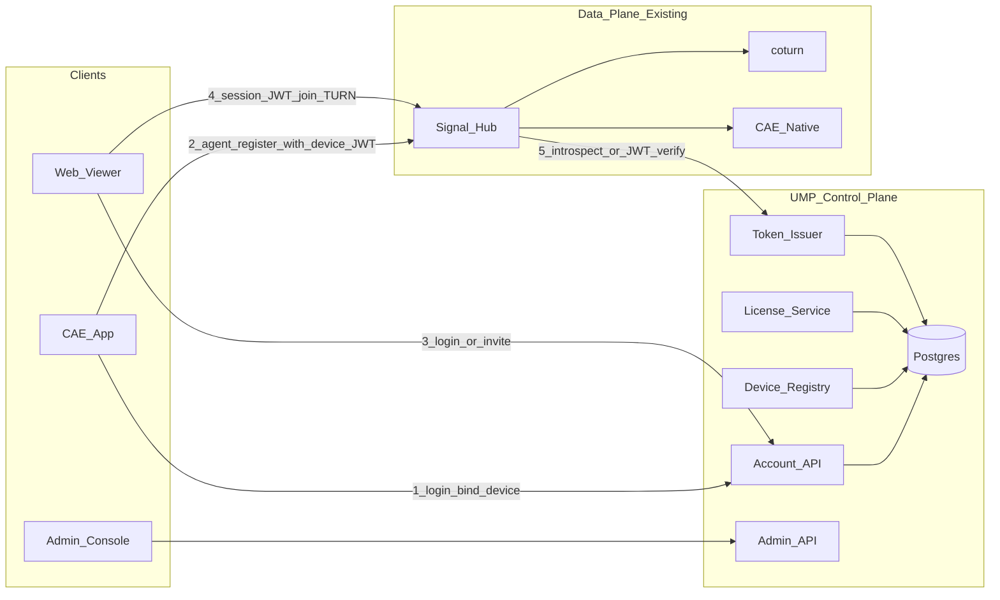
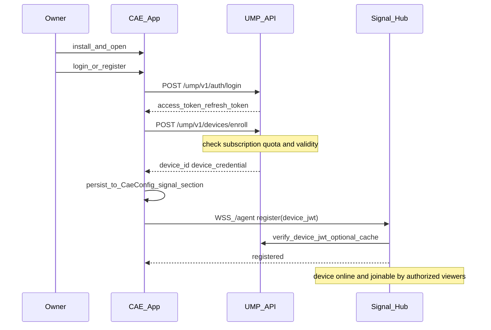
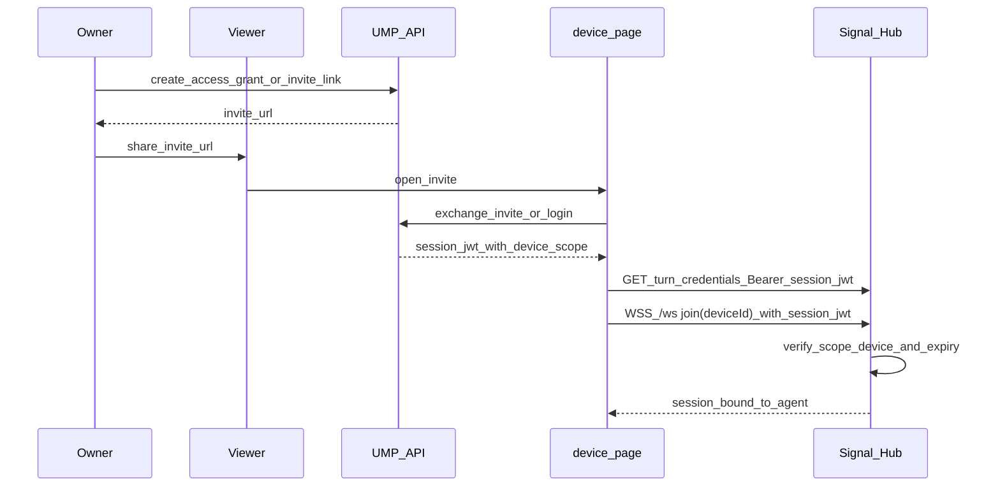

# nexartc 用户管理与鉴权平台设计

> 日期：2026-07-24  
> 状态：设计稿（待评审落地）  
> 关联：[`nexartc-turn-mode-a-implementation.md`](./nexartc-turn-mode-a-implementation.md)、[`cae-supervisor-remote-admin-design.md`](./cae-supervisor-remote-admin-design.md)、[`nexartc-install-deploy-guide.md`](./nexartc-install-deploy-guide.md)  
> **Phase-0 CMS（Hub 内嵌用户 CRUD / 测试用户 60s 踢线）**：[`nexartc-cms-user-management-design.md`](./nexartc-cms-user-management-design.md)  
> 现状基线：Hub 使用共享 `STREAM_TOKEN` / `AGENT_TOKEN`；尚无多租户账号、设备归属与订阅有效期。

---

## 1. 目标与问题

### 1.1 产品目标

用户使用 nexartc 云访问服务的标准路径：

1. **安装** CAE App（root / non-root）到被控设备。  
2. 在平台完成 **合法身份注册**（账号 + 设备绑定）。  
3. 平台校验 **有效期 / 套餐 / 权限**。  
4. 通过后，设备才可被授权访客 **访问**（Web / 客户端经 Hub 进会话）。

需要建设统一的 **用户管理与鉴权平台（UMP: User Management & Auth Platform）**，替代当前「全环境共享一个 Agent/Stream Token」的联调模式。

**落地次序：** 先实现 [`nexartc-cms-user-management-design.md`](./nexartc-cms-user-management-design.md) 所述 **CMS Phase-0**（观看端注册用户、测试/正式、会话时长、SQLite、Admin CRUD，挂在现有 Hub），再演进到本文的完整 UMP（租户 / 套餐 / 设备凭证）。

### 1.2 现状缺口

| 能力 | 现状 | 目标 |
|------|------|------|
| 观看端鉴权 | 全局 `STREAM_TOKEN` 或可选 JWT | 每用户 / 每会话短期票据 |
| 设备注册 | 全局 `AGENT_TOKEN` + 自填 `device_id` | 账号归属设备 + 每设备凭证 |
| 有效期 | 无 | 订阅 / 试用 / 设备 license 到期拒绝 |
| 多租户 | 无 | 组织（租户）→ 成员 → 设备 |
| 审计 | Hub 应用日志 | 登录 / 绑机 / 进房 / 拒绝原因可追溯 |
| 管理台 | 简易 admin / 运维脚本 | 运营后台：用户、设备、套餐、封禁 |

### 1.3 非目标（本设计首期不做）

- 支付收银台完整对接（可预留订单接口，首期可手工开通套餐）。  
- 端到端加密内容 DRM。  
- 替换 coturn `TURN_SECRET` 根密钥模型（仍由 Hub 代签临时 TURN 凭据）。  
- 把 CAE 业务信令迁出现有 Hub（UMP 与 Hub 解耦，Hub 变「执行面」）。

---

## 2. 角色与核心概念

### 2.1 角色

| 角色 | 说明 | 典型动作 |
|------|------|----------|
| **Owner（设备主）** | 安装 CAE 的用户 / 租户管理员 | 注册、登录、绑定设备、查看在线、授权访客 |
| **Viewer（访客）** | 被授权观看/操控的人 | 登录或持邀请链，加入指定 `deviceId` 会话 |
| **Operator（平台运营）** | nexartc 运营人员 | 开通套餐、延期、封禁、审计查询 |
| **Device（CAE）** | 被控端 App + native | 持设备凭证向 Hub 注册 Agent |
| **Hub** | 现网信令 / TURN 签发 | 校验平台签发的票据后再放行 |

### 2.2 核心对象

```text
Tenant (租户/组织)
  └─ UserAccount (用户账号)
       ├─ Membership (角色: owner/admin/viewer)
       └─ Device
            ├─ device_id (对外稳定 ID，如 device-mi9-001)
            ├─ device_credential (注册/刷新用)
            ├─ license_binding (套餐/有效期)
            └─ runtime_status (online via Hub, 不入库为主)
```

| 对象 | 关键字段 |
|------|----------|
| `UserAccount` | `user_id`, `phone/email`, `password_hash` 或 OAuth `sub`, `status`, `created_at` |
| `Tenant` | `tenant_id`, `name`, `plan_id`, `status` |
| `Device` | `device_id`, `tenant_id`, `owner_user_id`, `display_name`, `privilege_mode(root/nonroot)`, `status` |
| `DeviceCredential` | `device_id`, `client_id`, `client_secret_hash`, `rotated_at`, `revoked` |
| `Subscription` / `License` | `tenant_id` 或 `device_id`, `plan`, `valid_from`, `valid_to`, `max_devices`, `max_concurrent_viewers` |
| `AccessGrant` | 谁可访问哪台设备：`viewer_user_id` / `invite_token`, `device_id`, `scope`, `expires_at` |
| `SessionTicket` | 短期 JWT：进房 / TURN / Agent 注册 |

---

## 3. 总体架构



原则：

- **UMP = 控制面**：账号、设备、套餐、发票。  
- **Hub = 执行面**：校验票后做 Agent 路由、TURN 签发、会话转发（沿用现有实现）。  
- CAE / Web **不直连数据库**；只持平台签发的短期凭证。

部署建议：与现网 Hub 同 VPS 或独立小集群；首期可同机不同进程（`ump` + `nexartc-hub`），共用对外域名不同 path：`/api/ump/*` vs `/api/v1/*`。

---

## 4. 端到端主流程

### 4.1 设备主：安装 → 注册身份 → 绑机 → 可被访问



要点：

1. **未登录 / 无有效套餐 / 设备超额**：`enroll` 失败，CAE 不得使用全局共享 `AGENT_TOKEN` 上线（生产关闭共享 token）。  
2. App 将平台下发的 `device_id` + **设备凭证** 写入本地配置（或 Android Keystore 存 secret，ini 只存 id）。  
3. Agent 注册改用 **设备 JWT**（见 §5），替代全局 `AGENT_TOKEN`。

### 4.2 访客：授权后访问



要点：

- 无 `AccessGrant` 或 grant 过期 → Hub **拒绝 join**（即使知道 `deviceId`）。  
- TURN 凭据仅对持有效 `session_jwt` 的主体签发；username 建议带 `user_id`/`tenant_id` 便于审计与配额。

### 4.3 有效期与续期

| 校验点 | 行为 |
|--------|------|
| `enroll` / `credential rotate` | License `valid_to < now` → 403 `LICENSE_EXPIRED` |
| Agent `register` / `ping` | JWT `exp` 或 introspect 发现吊销/过期 → 断开并提示 App 重新登录续期 |
| Viewer `join` | Grant / Subscription 过期 → 403；已在房会话可设宽限（如 5 min）后踢出 |
| 运营延期 | Admin 改 `valid_to`；设备下次 refresh token 自动恢复 |

---

## 5. 凭证与鉴权模型

### 5.1 凭证分层

| 层级 | 名称 | 寿命 | 持有者 | 用途 |
|------|------|------|--------|------|
| L0 | 用户密码 / OAuth / 短信码 | — | 人 | 换取用户 token |
| L1 | `user_access_token` / `refresh_token` | 小时 / 天 | App / Web | 调 UMP API |
| L2 | `device_credential`（client_id+secret） | 月级可轮换 | 仅 CAE 设备 | 换取 device_jwt |
| L3 | `device_jwt` | 分钟～小时 | CAE → Hub `/agent` | Agent 注册与心跳 |
| L4 | `session_jwt` | 分钟级 | Viewer → Hub | join + turn-credentials |
| L5 | TURN REST username/credential | ≤1h | Browser PC | 仅 ICE relay |

**禁止**：浏览器持有 `TURN_SECRET`、`device_credential`、用户 `refresh_token` 明文长期存放在 localStorage（refresh 应用 HttpOnly / 安全存储）。

### 5.2 JWT 声明（建议）

**device_jwt**

```json
{
  "typ": "device",
  "sub": "device-mi9-001",
  "tid": "tenant_xxx",
  "uid": "user_owner",
  "priv": "root",
  "scope": ["agent:register", "agent:ping"],
  "exp": 1784900000,
  "jti": "..."
}
```

**session_jwt**

```json
{
  "typ": "session",
  "sub": "user_viewer",
  "tid": "tenant_xxx",
  "did": "device-mi9-001",
  "scope": ["session:join", "turn:issue"],
  "role": "viewer",
  "exp": 1784890000,
  "jti": "..."
}
```

Hub 校验方式（二选一，可并存）：

1. **本地验签**：UMP 与 Hub 共享 `JWT_SECRET` / JWKS（现网 `auth.ts` 已支持 HS256 JWT 雏形）。  
2. **Introspection**：Hub `POST UMP /ump/v1/oauth/introspect`（适合需即时吊销）；需缓存与超时降级策略。

### 5.3 从现网 Token 迁移

| 阶段 | Hub 行为 |
|------|----------|
| Phase A（兼容） | 仍接受环境变量 `AGENT_TOKEN` / `STREAM_TOKEN`（联调）；同时接受 JWT |
| Phase B（灰度） | 生产租户强制 JWT；内部测试租户可共享 token |
| Phase C（收紧） | 关闭共享 token；仅 JWT + 可选 mTLS（运维面） |

CAE 配置演进：

```ini
[signal]
signal_agent_url=wss://120.79.21.28/agent
device_id=device-mi9-001
; 废弃长期明文 agent_token=...
; 改为由 App 注入短期 device_jwt，或本地用 device_credential 向 UMP 刷新
agent_token=          ; 空则走 platform credential 刷新路径
ump_token_url=https://120.79.21.28/ump/v1/device/token
```

---

## 6. UMP API 草案（控制面）

基路径：`https://<host>/ump/v1`  
统一错误：`{ "error": "CODE", "message": "...", "details": {} }`

### 6.1 认证

| 方法 | 路径 | 说明 |
|------|------|------|
| POST | `/auth/register` | 手机号/邮箱注册（可加邀请码） |
| POST | `/auth/login` | 登录 → access + refresh |
| POST | `/auth/refresh` | 刷新 access |
| POST | `/auth/logout` | 吊销 refresh / session |
| GET | `/me` | 当前用户与租户、套餐摘要 |

### 6.2 设备

| 方法 | 路径 | 说明 |
|------|------|------|
| POST | `/devices/enroll` | 绑机；校验套餐设备数与有效期 |
| GET | `/devices` | 当前租户设备列表 + 在线态（可回源 Hub） |
| POST | `/devices/{id}/rotate-credential` | 轮换设备密钥 |
| POST | `/devices/{id}/revoke` | 吊销，Hub 侧踢下线 |
| PATCH | `/devices/{id}` | 显示名、备注 |

`enroll` 请求示例：

```json
{
  "display_name": "客厅 MI9",
  "privilege_mode": "root",
  "hardware": { "model": "MI 9", "android": 11 },
  "client_instance_id": "uuid-per-install"
}
```

响应：

```json
{
  "device_id": "device-mi9-001",
  "client_id": "dev_xxx",
  "client_secret": "only-once",
  "license": { "plan": "pro", "valid_to": "2026-12-31T15:59:59Z" }
}
```

### 6.3 访问授权

| 方法 | 路径 | 说明 |
|------|------|------|
| POST | `/devices/{id}/grants` | Owner 授权某用户或生成邀请 |
| GET | `/devices/{id}/grants` | 列表 |
| DELETE | `/grants/{grant_id}` | 撤销 |
| POST | `/invites/exchange` | 访客用邀请码换 `session_jwt` |

### 6.4 票据

| 方法 | 路径 | 说明 |
|------|------|------|
| POST | `/device/token` | device_credential → `device_jwt` |
| POST | `/session/token` | 用户 access + device_id → `session_jwt`（需 grant） |
| POST | `/oauth/introspect` | Hub 可选即时校验 |

### 6.5 运营 Admin

| 方法 | 路径 | 说明 |
|------|------|------|
| GET/POST | `/admin/tenants` | 租户 |
| POST | `/admin/tenants/{id}/license` | 开通/延期/改配额 |
| POST | `/admin/users/{id}/ban` | 封禁 |
| GET | `/admin/audit` | 审计日志查询 |

Admin 使用独立 `OPERATOR_TOKEN` 或 SSO，与普通用户 token 分离。

---

## 7. Hub / CAE / Web 改造点（执行面）

### 7.1 Hub（`nexartc-cloudPhoneAccess-web/server`）

| 模块 | 改动 |
|------|------|
| `auth.ts` | 扩展：校验 `session_jwt` scope 含 `turn:issue`；拒绝过期/错 typ |
| `session-router.ts` | `/agent` register：校验 `device_jwt`（`typ=device` 且 `sub=deviceId`）；废弃仅共享 AGENT_TOKEN |
| `/ws` join | 要求 `session_jwt`，且 `did` 与 join.deviceId 一致；校验 grant 未撤销（JWT 内嵌或 introspect） |
| `/api/v1/agents` | 按租户过滤；Viewer 仅见被授权设备 |
| 配置 | `UMP_JWKS_URL` / `JWT_SECRET`、`AUTH_MODE=shared|jwt|hybrid` |

### 7.2 CAE App（root / non-root）

| 模块 | 改动 |
|------|------|
| 首次启动向导 | 登录 UMP → enroll → 写配置 → 再 Start 引擎 |
| `CaeConfig.ini [signal]` | 由平台写入 `device_id`；token 刷新守护线程 |
| Signal Agent | register 使用刷新后的 `device_jwt` |
| non-root | 在现有 MediaProjection/IME 流程**之前或并行**完成账号登录（登录失败不得上线 Agent） |
| 到期 UX | 通知栏 / UI：「订阅已过期，请续费」；Supervisor 停止对外 register |

### 7.3 Web device 页

| 模块 | 改动 |
|------|------|
| 连接前 | 登录或兑换邀请，拿到 `session_jwt` |
| TURN | `Authorization: Bearer <session_jwt>`（替换 `?turn_token=STREAM_TOKEN`） |
| join | 附带同一 JWT；无授权明确报错 |
| 设备列表 | 调 UMP `/devices` 或 Hub 过滤列表，禁止任意猜 `deviceId` |

---

## 8. 套餐、配额与策略

### 8.1 套餐模型（示例）

| Plan | 设备数 | 并发访客 | 有效期 | 备注 |
|------|--------|----------|--------|------|
| trial | 1 | 1 | 7 天 | 注册赠送 |
| basic | 1 | 2 | 按月/年 | |
| pro | 5 | 5 | 按月/年 | |
| enterprise | 自定义 | 自定义 | 合同 | 独立租户 |

### 8.2 强制策略

1. **未绑定设备**不得 Agent online。  
2. **License 过期**：拒绝 enroll / refresh device_jwt；已在线 Agent 在 JWT 到期后自然掉线（或 Hub 主动踢）。  
3. **并发访客**：Hub 在 join 时计数，超限返回 `429 ROOM_FULL`（可与 CAE `max_streaming_clients` 双检）。  
4. **封禁**：`User/Tenant/Device.status=banned` → 所有票种刷新失败 + Hub introspect 拒绝。  
5. **审计必记**：login、enroll、grant、join、deny、revoke、license_change。

---

## 9. 数据存储与安全

### 9.1 存储

- 主库：PostgreSQL（账号、设备、授权、套餐、审计）。  
- 缓存：Redis（可选）— refresh jti 黑名单、invite 一次性码、在线态缓存。  
- 密钥：`JWT_SECRET` / 非对称私钥仅在 UMP（或 KMS）；Hub 只持验签公钥或共享 HMAC。

### 9.2 安全要求

- 传输全程 TLS；生产关闭 `signal_disable_tls_verify`。  
- `client_secret` 仅 enroll/rotate 时返回一次，DB 存哈希。  
- 邀请链接单次或短时有效 + 可绑定接收方账号。  
- 管理台操作二次认证；全量审计不可由租户删除。  
- 速率限制：login / enroll / token 刷新防刷。  
- 合规：手机号脱敏展示；支持账号注销与设备解绑。

### 9.3 威胁与对策（摘要）

| 威胁 | 对策 |
|------|------|
| 泄露旧 STREAM_TOKEN | 迁移 JWT + 吊销；短寿命 session |
| 伪造 deviceId 抢注 | enroll 需 credential；device_id 由平台分配 |
| 邀请链接转发滥用 | 一次性、绑定登录用户、IP/次数限制 |
| Hub 被绕过直连 CAE | 生产可关直连或 CAE 侧同样校验平台会话（二期） |

---

## 10. 管理台（运营 / 租户）

### 10.1 租户自助（Owner）

- 登录、套餐与到期日、设备列表（在线/离线）。  
- 绑机二维码 / 配对码（App 扫码 enroll）。  
- 访客授权、撤销、查看当前会话。  

### 10.2 平台运营（Operator）

- 租户检索、开通/延期、调配额。  
- 强制下线、封禁设备/用户。  
- 审计与用量报表（进房次数、TURN 签发次数）。  

首期可用内网 Web（与现 `admin.html` 分离），二期再做完整控制台。

---

## 11. 与 non-root / root 安装体验的关系

| 步骤 | root | non-root |
|------|------|----------|
| 安装 APK | 是 | 是 + CloudPhoneIME |
| 平台注册/登录 | **新增必做** | **新增必做** |
| 系统权限（投屏/IME/无障碍） | 通常较少 | 仍需（见部署指南 §8） |
| 可被访问 | 登录+绑机+有效套餐+Agent online | 同上，且 Projection 等已授权 |

UMP **不替代** non-root 的系统授权；它解决的是 **「谁有权上线、谁有权观看、能用多久」**。

---

## 12. 分期落地

### Phase U0 — 文档与契约（当前）

- 本设计评审；冻结 JWT claims 与错误码表。  

### Phase U1 — UMP MVP（2～3 周）

- 注册/登录、租户、设备 enroll、license 有效期。  
- 签发 `device_jwt` / `session_jwt`。  
- 简易 Admin：手工开通套餐。  
- Hub `AUTH_MODE=hybrid`。  

### Phase U2 — 客户端接入（2 周）

- CAE App 登录绑机向导；定时刷新 device_jwt。  
- Web 登录/邀请进房；去掉页面长期暴露 `STREAM_TOKEN`。  

### Phase U3 — 授权与配额（1～2 周）

- AccessGrant / 邀请链；并发访客限制；到期踢出。  
- 审计导出。  

### Phase U4 — 收紧生产（1 周）

- 关闭共享 AGENT/STREAM token。  
- 监控：鉴权失败率、过期拒绝、异常注册。  

---

## 13. 验收标准（摘要）

1. 未注册用户安装 App 后 **无法** 使设备出现在 Hub `/api/v1/agents`。  
2. 注册并 enroll 且套餐有效 → Agent 可注册；Web 持 session_jwt 可 join。  
3. 套餐过期后 → 新 join 失败；device_jwt 刷新失败；UI 提示续费。  
4. 无 grant 的第三方即使用正确 `deviceId` 也无法 join。  
5. 运营封禁设备后，Agent 与 Viewer 均在短时间（≤ JWT TTL 或 introspect）失效。  
6. 审计可查：谁在何时绑机 / 授权 / 进房 / 被拒绝。  

---

## 14. 开放问题（评审时拍板）

1. 账号体系：手机号短信 vs 邮箱密码 vs 企业 SSO（可并行）。  
2. `device_id` 是否允许用户自定义（建议平台分配 + 可选 alias）。  
3. Viewer 是否必须注册，或允许纯邀请码匿名（匿名仍发短寿 session_jwt）。  
4. Hub 与 UMP 同机还是分拆；多区域时 JWT 用 JWKS 还是统一 HMAC。  
5. 直连 CAE（不经 Hub）是否在生产保留；若保留需否同样验 session。  

---

## 15. 文档维护

- **Phase-0 CMS：** 观看端用户注册 / 测试用户时长等先见 [`nexartc-cms-user-management-design.md`](./nexartc-cms-user-management-design.md)；实现目录建议 `nexartc-cloudPhoneAccess-web/server/src/cms/`。  
- 实现启动后，在 Mode A 实施文档 §1.2「鉴权最小可用方案」增加指向本文的「已由 UMP 替代」说明；CMS 落地期间注明「观看端鉴权由 CMS Phase-0 约束」。  
- API 若有 OpenAPI，放置于 `nexartc-cloudPhoneAccess-web/ump/openapi.yaml`（落地时新建，不在本设计强制）。  
- 密钥与样例环境变量写入 `test/turn/vps/ump.env.example`（落地时新建，**勿提交真实密钥**）。
