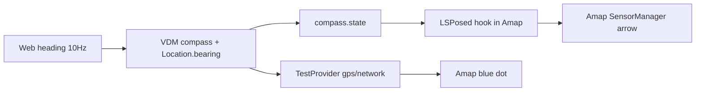

# Web 朝向 + Location.bearing + LSPosed 虚拟罗盘

> 状态：**已实施**（2026-07-24）  
> 设备前提：MI9 root + Magisk + LSPosed（`zygisk_lsposed`）

## 背景结论

- 位置链路（Web GPS → CAE TestProvider → 高德蓝点）已通。
- 箭头不跟手：高德导航箭头主要读 **SensorManager**（orientation / magnetic_field / rotation_vector），不是 mock `Location.bearing`。
- MI9 上 mag/orientation 的 HAL **flags 无 DATA_INJECTION**；官方 SensorService DATA_INJECTION 模式会关掉真传感器，不适合云机常驻。
- 设备已有 LSPosed，因此虚拟罗盘路径为：CAE 写共享朝向状态 → LSPosed 在 `com.autonavi.minimap` 内 hook `dispatchSensorEvent`。



## ① Web：朝向持续上报 + GPS 带 bearing

文件：`nexartc-cloudPhoneAccess-web/device/src/main.ts`

- 维护 `lastDeviceHeading`（来自 `getDeviceHeading`）。
- Orientation：即使未超 SENSOR_EPSILON 也按 keepalive（约 200ms）重发 type=3。
- 额外发送 type=2 magnetic_field（由 heading 合成约 45 µT 水平磁场）。
- `onGpsPosition`：若 `coords.heading` 无效且已有设备朝向，GPS 帧 bearing 填设备朝向。
- BUILD_VERSION：`20260724D`（已部署 VPS `/opt/nexartc/hub/device/`）。

## ①′ CAE：强制 Location.bearing

文件：`nexartc-cloud-phone-access-engine/app/src/main/java/com/nexartc/cae/media/VirtualDeviceManager.java`

- 客户端 compass 新鲜时始终用 `mCompassBearing` 覆盖注入 bearing（含移动场景）。
- `injectLocationToProvider`：compass 新鲜或有效 bearing 时一律 `setBearing`。
- `injectLatestLocationForCompass`：朝向变化立即刷新 Location（仍受 1 Hz 限流）。
- 接受日志带 `bear=` / `compass=`。
- 默认配置：`force_gps_bearing=1`（assets + 设备 ini）。

## ② LSPosed 虚拟罗盘

### CAE 共享状态

- 类：`VirtualCompassBridge.java`
- 路径：`/data/local/tmp/cae/run/compass.state`（原子写：tmp + rename，world-readable）。
- 字段：`valid`、`heading`、`pitch`、`roll`、`mag_x/y/z`、`ts_ms`。
- 每次 compass 更新后写入；会话 reset 写 `valid=0`。

### LSPosed 模块

目录：`nexartc-cloud-phone-access-engine/tools/lsposed-virtual-compass/`

```bash
cd nexartc-cloud-phone-access-engine/tools/lsposed-virtual-compass
./build.sh --install   # 或 su pm install -r out/virtual-compass-debug.apk
```

- Scope：`com.autonavi.minimap`（+ 模块自身）。
- Hook：`SystemSensorManager$SensorEventQueue.dispatchSensorEvent`。
- 改写 type：ORIENTATION(3)、MAGNETIC_FIELD(2)、ROTATION_VECTOR(11)、GEOMAGNETIC_ROTATION_VECTOR(20)。
- `compass.state` 超过约 1s 未更新则透传真机传感器。

启用：LSPosed Manager 打开 **NexaRTC Virtual**，或写入 `modules_config.db`（`enabled=1` + scope）。然后 `am force-stop com.autonavi.minimap`。改模块后建议重启一次再开高德。

注意：首版 APK 缺 `versionCode/minSdk` 会导致 Manager 不识别；请使用 `./build.sh` 产出的 **1.0.2 (versionCode=3)** 及以上（带桌面入口 `MainActivity`）。模块本身无图标时，桌面应用列表看不到，属预期。

### 打开 LSPosed Manager（通用）

通知栏 / 隐藏寄生入口不通用。推荐把 Manager 装成普通 App：

```bash
su -c 'pm install -r /data/adb/modules/zygisk_lsposed/manager.apk'
```

装完后桌面出现 **LSPosed**（`org.lsposed.manager`）。备选：拨号盘 `*#*#5776733#*#*`（模块 `action.sh` 秘密代码，机型不一定都支持）。

## 验证清单

1. Web：`BUILD_VERSION=20260724D`，有 orientation keepalive，`>>> GPS update ... bear=`。
2. CAE：`sensor type=3` 持续；`GPS #N accepted ... bear=... compass=...`。
3. `cat /data/local/tmp/cae/run/compass.state` 显示 `valid=1` 且 `heading=` 随浏览器手机转。
4. 启用 LSPosed 后：高德箭头随**浏览器手机**朝向转。
5. 关闭模块后：箭头回到跟云机磁罗盘。

## 方案对比（箭头 vs 手机朝向）

根因：高德导航箭头主要读 **SensorManager**，不是 mock GPS 的 `Location.bearing`。因此「不改高德传感器」时，只能绕开或降低期望。

| 方案 | 思路 | 优点 | 缺点 | 适合 |
|------|------|------|------|------|
| **A. 只靠 Location.bearing** | Web 朝向 → CAE `setBearing`（①′，已落地） | 无 LSPosed | 静止时高德箭头常仍跟云机罗盘 | 移动中、或认 bearing 的地图 |
| **B. LSPosed 改传感器** | CAE `compass.state` → hook 高德传感器（②，当前主路径） | 对高德最对症 | 依赖 Manager / 模块 / 重启 | 要高德箭头跟浏览器手机 |
| **C. Magisk 改 SensorService / HAL** | 系统级伪造 mag / orientation | 不挑 App、可多地图 | 开发重、机型差异大、风险高 | 产品级多 App |
| **D. Frida 常驻 hook** | 同 B，换注入方式 | 调试快 | 不稳定、难常驻 | 临时验证 |
| **E. 换地图 / 自研导航 UI** | 用认 bearing 的客户端，或自画箭头 | 不碰传感器 | 产品改动大 | 可换壳时 |
| **F. 云机屏幕叠箭头** | 不改高德，外层按朝向画箭头 | 实现可控 | 与真导航 UI 两套、体验差 | 演示用 |

### 选型结论

1. **还要高德里那个箭头跟手机转** → 本质仍是 **B 或 C**；B 已实施，运维上用「桌面安装 Manager」即可，不必依赖通知栏。
2. **不想碰 LSPosed** → 先看 **A**：行走/驾车且 GPS 带正确 bearing 时箭头有时会跟航向；**停着转手机** 高德多半仍读罗盘，A 不够。
3. **要多 App、少人工** → 中长期评估 **C**（比 LSPosed 重一个数量级）。
4. **D** 只适合排查，不适合正式方案；**E** 在产品允许换壳时最干净；**F** 仅演示。

### 当前范围

- 主路径：**A（bearing）+ B（LSPosed）**。
- 首版 B 的 scope 仅高德；其他地图可后续扩展。
- **C / D / E / F** 文档备选，暂不实施（不做 Frida 常驻；不替换 `/vendor` sensors HAL，除非单独立项 C）。
