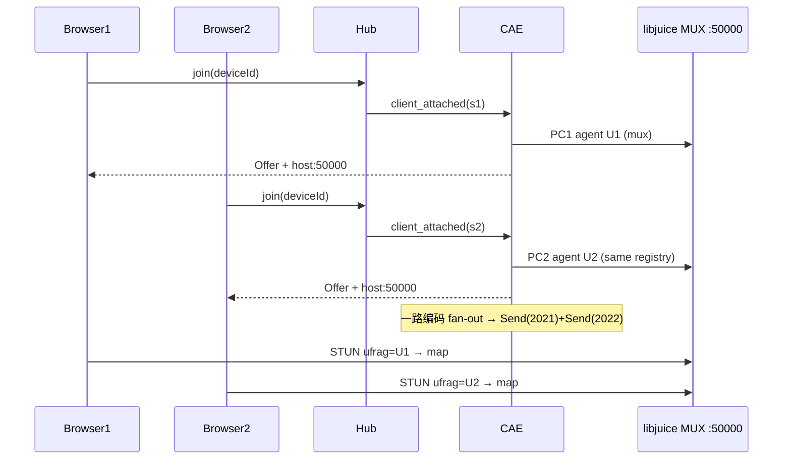

# Mode A：ICE UDP Mux 逻辑分离（方案 A）设计

> 日期：2026-07-22  
> 状态：已落地（CAE `WebRtcServerTransport` / `CaeConnectionAgent`）  
> 适用范围：`nexartc-cloud-phone-access-engine` WebRTC server，Mode A **host** + 路由器单端口 DNAT（默认 UDP **50000**）  
> 关联文档：  
> - [`nexartc-turn-mode-a-implementation.md`](./nexartc-turn-mode-a-implementation.md) §2.2.1 ICE 模式  
> - [`cae-stun-public-ip-discovery.md`](./cae-stun-public-ip-discovery.md) 公网 IP + 固定端口  
> - [`nexartc-turn-mode-a-vps-deployment.md`](./nexartc-turn-mode-a-vps-deployment.md) VPS / 联调  
> - [`nexartc-install-deploy-guide.md`](./nexartc-install-deploy-guide.md) §5.4 配置  
> - [`nexartc-logging-design.md`](./nexartc-logging-design.md) 日志前缀  
>
> **命名区分：** 本文「方案 A」指 **ICE UDP Mux 会话生命周期逻辑分离**（单端口多 PC）。  
> 同仓库另有「TURN 凭据方案 A」（Hub 签发 `turn-credentials`），见 `turn-rest-api-signaling.md` / Mode A 实现文档；二者无关。

---

## 1. 背景与问题

### 1.1 Mode A host 网络约束

Mode A 默认媒体路径为 **host 直连**：

| 项 | 要求 |
|----|------|
| 本地绑定 | `webrtc_port_range_begin = webrtc_port_range_end = 50000` |
| ICE UDP Mux | `webrtc_enable_udp_mux=1`（libdatachannel → libjuice `JUICE_CONCURRENCY_MODE_MUX`） |
| 路由器 | 仅 DNAT **一个** UDP 端口：`WAN:50000 → CAE:50000` |
| 公网候选 | STUN 发现公网 IP，注入 `typ host`（端口必须仍为 50000） |

多浏览器同时观看同一云机时，CAE 侧会创建 **多个 PeerConnection**，但只能共用 **同一个 UDP 端口**。

### 1.2 libjuice MUX 本身提供的是「包 demux」，不是「会话生命周期隔离」

共享端口下，libjuice 在一个 registry/socket 上对多 `juice_agent` 做 demux：

1. 入站包先按 `srcIP:port → agent` 查表；
2. 未命中且为 STUN Binding Request 时，解析 `USERNAME=local_ufrag:remote_ufrag`，按 **local_ufrag** 匹配 agent，再写入地址表；
3. 之后该五元组的 RTP/STUN 走快路径。

因此：

- **Demux（包分发）**：由 libjuice 完成，应用层不必再拆端口；
- **生命周期（谁何时 close）**：由 CAE 负责。若在 peer B 仍 `Track::sendFrame` 时 `pc->close()` peer A，共享 mux / MediaHandler 可能触发 **pure virtual / Track is not open**，整进程退出 → Hub Agent WSS **1006** → 所有观看端被踢（`agent offline`）。

历史故障日志特征：

```
StopAction: DisconnectClient conn_id=2021   # 仍有 active_count=2
Pure virtual function called!
agent disconnected (close code=1006)
client ... detached ... (agent offline)
```

### 1.3 方案对比（为何选 A）

| 方案 | 做法 | 优点 | 缺点 |
|------|------|------|------|
| **A. 逻辑分离（本文）** | 保持单端口 MUX；会话 close 与 RTP 发送和 demux 解耦 | 只需 DNAT 50000；多端共享编码 fan-out | 关一端时短暂全局暂停 A/V；实现要求严格 |
| B. 物理分离 | `udp_mux=0` + 端口段（如 50000–50031） | 一端 close 天然不伤另一端 | 路由器须映射整段；与「只映射 50000」冲突 |
| C. 应用层 IceUdpMuxListener | 未知 ufrag 回调再建 PC | 适合被叫入站 | 不符合 Hub 主动 Offer 模型 |

**结论：** Mode A host / 单端口 DNAT 采用 **方案 A**。

---

## 2. 目标与非目标

### 2.1 目标

1. **单端口多 PeerConnection**：`enableIceUdpMux=1` + `50000-50000` 下支持 `max_streaming_clients`（默认 3）同时观看。
2. **一端离开、其余继续**：客户端 A 断开后，B 的 WSS 会话、WebRTC PC、共享编码器 fan-out 均保持；Hub Agent 不掉线。
3. **Demux 与会话生命周期逻辑分离**：
   - Demux/registry：随「首个 PC 创建 → 最后一个 PC 销毁」存活；
   - 每个 PC：独立 agent / ufrag / Track；`DisconnectClient` 只移除本 agent 的 map 项；
   - 关 PC 期间禁止任何 peer 的 `sendFrame` 与 `pc->close()` 并发。
4. **与现有业务模型兼容**：一路编码、`SendVideoDataHook` 按 `GetActiveConnIds()` fan-out；`exclusive_mode=0`。

### 2.2 非目标

- 不在本方案内实现 TURN + MUX 同 socket（libjuice 限制；hybrid 另走方案 B 或关 mux）。
- 不把公网映射端口改成动态端口（仍要求映射端口 = `webrtc_port_range_begin`）。
- 不引入应用层 `IceUdpMuxListener` 接听模型。
- 不修改 libjuice / libdatachannel 源码（除非后续验证发现 registry 过早销毁的上游 bug）。

---

## 3. 总体架构

### 3.1 分层

```text
┌─────────────────────────────────────────────────────────────┐
│ 业务层 CaeConnectionAgent                                     │
│  · 多 WSS/Hub session（CaeSignalAgent pipes）                │
│  · 共享 MediaCodec；SendVideoDataHook → N × conn_id          │
│  · StopAction / CloseConnector：有 RUNNING 则不拆编码器/传输 │
└───────────────────────────┬─────────────────────────────────┘
                            │ ITransport / DisconnectClient(conn_id)
┌───────────────────────────▼─────────────────────────────────┐
│ 会话生命周期层 WebRtcServerTransport（方案 A 核心）           │
│  · m_sessions[conn_id] → PeerConnection + Tracks + SendGate │
│  · m_disconnectMutex：串行化 teardown                         │
│  · m_disconnectCv：等待任一 in-flight 归零的唤醒点             │
│  · m_rtpTeardownPause：关任一 PC 时暂停全部 A/V Send         │
│  · peersRemain → 同步 pc->close；否则异步 close              │
└───────────────────────────┬─────────────────────────────────┘
                            │ enableIceUdpMux + port 50000
┌───────────────────────────▼─────────────────────────────────┐
│ ICE Demux 层（libdatachannel / libjuice，只读依赖）           │
│  · 单 UDP socket + registry + 收包线程                        │
│  · ufrag / 五元组 → juice_agent                               │
│  · 应用层不实现第二套 demux                                   │
└─────────────────────────────────────────────────────────────┘
```

**「逻辑分离」含义：** 不拆掉底层共享 demux，而是把 **「何时允许 sendFrame / 何时允许 close」** 从 demux 包路径中抽到 CAE 会话层，用屏障与串行化保证正确性。

### 3.2 对象寿命

| 对象 | 创建 | 销毁 |
|------|------|------|
| libjuice mux registry / UDP:50000 | 第一个启用 mux 的 PC 创建时（库内） | 最后一个挂到该 registry 的 agent 销毁后（库内） |
| `PeerSession` / `rtc::PeerConnection` | `OnWebRtcRequest` → `CreatePeerConnection` | `DisconnectClient(conn_id)` |
| `SendGate` | 随 `PeerSession` 创建；`inflight` 归零前由 `shared_ptr` 持有 | 无 inflight 且 teardown 结束 |
| 共享编码器 | 首个 streamer `OpenMediaStream` | 最后一个 streamer `CloseMediaStream` / `ForceCloseMediaStream` |
| Hub Agent WSS | CAE 启动注册 | 进程退出或主动注销；**单客户端离开不注销** |

---

## 4. 详细设计

### 4.1 配置（Mode A host 推荐值）

```ini
[webrtc]
webrtc_ice_mode=host
webrtc_enable_udp_mux=1
webrtc_port_range_begin=50000
webrtc_port_range_end=50000
webrtc_stun_server=stun:<hub-or-coturn>:3478
webrtc_public_ip=                    ; 运行时 STUN 发现
webrtc_turn_host=                    ; host 模式可不配；配了也不挂 TURN 到 PC

[server]
listen_port_h5=50000                 ; 与 ICE 端口数字统一（信令 TCP/WSS）

[cloud_phone]                         ; 名称以实际 ini 段为准
exclusive_mode=0
max_streaming_clients=3
```

约束（`CaeConnectionAgent::InitTransport`）：

- `udp_mux=1` 时若 begin≠end，**收敛为单端口** begin；
- **禁止**在 host 模式下为「多客户端」把 `50000-50000` 扩成 `50000-50031`（会破坏 DNAT）；
- `hybrid` + TURN REST 时关闭 mux（见实现文档）；host 保持 mux。

浏览器：`?ice_mode=host`（device 页默认 host）。

### 4.2 Send 路径：SendGate + 全局 RTP 暂停

每个 `PeerSession` 持有：

```cpp
struct SendGate {
    std::atomic<bool> closing{false};
    std::atomic<int> inflight{0};
};
```

**Send(VIDEO/AUDIO) 契约：**

```text
if (m_rtpTeardownPause > 0) return ERR_NOT_CONNECTED;   // 全局暂停

lock m_mutex
  sendGate = session->sendGate
  inflight++                         // 必须先于 closing 检查（防 TOCTOU）
  if (closing || pause) { return }   // InflightGuard 会 --
  copy Track shared_ptr
unlock

sendFrame(...)                       // 在锁外；异常捕获
```

**Disconnect 契约：**

```text
closing = true
erase session（新 Send 查不到）
wait until 本 session 及（可选）其余 session 的 inflight == 0
resetCallbacks
pc->close()
```

说明：仅对本 session 设 `closing` 不足以防止 **mux 串扰**（B 的 sendFrame 仍可能与 A 的 close 并发）。因此引入：

```cpp
std::atomic<int> m_rtpTeardownPause{0};
std::mutex m_disconnectMutex;   // 串行化 DisconnectClient
std::condition_variable m_disconnectCv;  // 任一 gate 归零时唤醒 drain
```

`DisconnectClient` 全程：`pause++` → … → `pause--`（RAII）。暂停期间所有 conn 的 A/V Send 直接丢弃（短暂卡顿可接受；结束后对剩余 conn 请求 IDR）。

### 4.3 DisconnectClient（会话层 teardown）

伪代码：

```text
DisconnectClient(conn_id):
  lock m_disconnectMutex
  m_rtpTeardownPause++
  try:
    lock m_mutex
      if session missing: return          # 幂等（STOP 与 ICE Closed 双触发）
      sendGate.closing = true
      take pc / tracks / DCs shared_ptr
      erase session; peersRemain = !m_sessions.empty()
      collect drainGates = [thisGate] + remaining gates
    unlock

    wait on cv until all drainGates.inflight == 0

    resetCallbacks(dc/track/pc)

    listener.OnConnectionLost(conn_id)    # 业务层 RemoveActiveConnId

    if peersRemain:
      closePeer()                         # 同步 close，暂停仍生效
      log "sync close, peers remain"
    else:
      async thread: closePeer()
      log "drained+close async"
  finally:
    m_rtpTeardownPause--
```

**为何 peersRemain 时同步 close：** 异步 `pc->close()` 与 B 恢复 sendFrame 的窗口仍可能撞 mux；同步 close 保证暂停屏障覆盖整个 close。

**ICE 状态机配合：**

| PC 状态 | 行为 |
|---------|------|
| `Disconnected` | **不** teardown（移动网络瞬断） |
| `Failed` / `Closed` 且 session 仍在 | 立即 `sendGate.closing=true`，再 detach 线程调 `DisconnectClient` |
| session 已 erase | 忽略回调（本端主动 close） |

### 4.4 业务层：一端停、其余继续

#### 4.4.1 StopAction（CMD_STOP）

```text
Set WAIT_CLOSE
if CountStreamingClients() == 0:     # 已不含本端（本端已 WAIT_CLOSE）
    CloseMediaStream()               # 最后一个才停编码
DisconnectClient(本端 conn_id)       # 只拆本端 PC
CloseClient() → CloseConnector()
```

#### 4.4.2 CloseConnector

```text
移除所有 WAIT_CLOSE
if runningClientCnt > 0:
    # 禁止 ForceCloseMediaStream / DeinitTransport / clear m_activeConnIds
    log "still RUNNING, skip media/transport teardown"
else:
    ForceCloseMediaStream + (Hub: 跳过 DeinitTransport，仅清 active ids)
```

#### 4.4.3 Hub `client_detached`

`CaeSignalAgent::ClearSession(sessionId)` **只**关闭对应 `CaeHubPipeSocket`；`remaining > 0` 时不得 `ClearAllSessions`。  
`exclusive_mode=1` 时 `client_attached` 才 `ClearAllSessions`（与多观看互斥，Mode A 默认 `exclusive_mode=0`）。

#### 4.4.4 OnDisconnected（WebRTC）

```text
RemoveActiveConnId(conn_id)
if remaining > 0 || wssClients > 0:
    对剩余 activeConn 设置 wait-IDR 窗口
    ForceRequestIframe()             # 全局暂停后的花屏恢复
else:
    Hub: 保持 Agent；非 Hub: 可走清理
```

### 4.5 视频 fan-out（不变）

```text
编码器 → SendVideoDataHook
  → GetActiveConnIds()   # 不含已 Remove 的 conn
  → 对每个 conn_id: ProtocolSession::SendVideo → WebRtcServerTransport::Send
```

码率：多会话时共享 BWE 取 min 并按会话数分摊（既有逻辑），与方案 A 正交。

### 4.6 Candidate 与端口

- 本机 host：`local_ip:50000`（mux 固定端口）。
- 公网 host：`public_ip:50000`（STUN 映射端口须等于 begin，否则不注入公网 host）。
- host 模式：Offer 注入 `a=ice-lite`；不向 PC 挂 TURN。

---

## 5. 时序

### 5.1 双端同时观看



### 5.2 Browser1 离开，Browser2 继续

```mermaid
sequenceDiagram
    participant B1 as Browser1
    participant B2 as Browser2
    participant H as Hub
    participant CAE as CaeConnectionAgent
    participant W as WebRtcServerTransport
    participant MUX as libjuice MUX

    B1->>H: close
    H->>CAE: client_detached(s1)
    CAE->>CAE: ClearSession(s1) remaining≥1
    CAE->>CAE: StopAction(s1) WAIT_CLOSE
    Note over CAE: CountStreamingClients()>0 → 不停编码
    CAE->>W: DisconnectClient(2021)
    W->>W: pause++ ; gate.closing ; erase 2021
    W->>W: drain inflight (含 2022)
    W->>MUX: pc1.close() 同步
    W->>W: pause--
    CAE->>CAE: OnDisconnected: 剩余 conn 请求 IDR
    CAE->>CAE: CloseConnector: B2 仍 RUNNING → skip teardown
    Note over B2,MUX: PC2 / map(U2) 仍在；继续收 RTP
```

---

## 6. 失败模式与防护

| 失败模式 | 表现 | 防护 |
|----------|------|------|
| close 与 sendFrame 并发（mux） | Pure virtual / 进程退出 / Agent 1006 | `m_rtpTeardownPause` + `m_disconnectCv` 真 drain + peersRemain 同步 close |
| STOP 与 ICE Closed 双 teardown | 双重 close / 死锁 | `m_disconnectMutex` + 幂等 erase；Closed 前先 `closing=true` |
| Send 检查 closing 早于 inflight++ | drain 误判空闲 | **先 inflight++ 再读 closing** |
| CloseConnector 清全部 activeConnIds | 剩余端无 fan-out | 仅 `runningClientCnt==0` 时清理 |
| ClearAllSessions 误触发 | 两台全断 | detach 必须带 sessionId；`exclusive_mode=0` |
| 扩端口破坏 DNAT | host 走 50001、只映射 50000 → 只能 relay | host 保持 `50000-50000`，禁止扩段 |
| 全局暂停后花屏 | B 短暂无帧 | `ForceRequestIframe` + wait-IDR 窗口 |

---

## 7. 日志与验收

### 7.1 关键日志（CAE）

| 关键词 | 含义 |
|--------|------|
| `CreatePeerConnection ... udp_mux=1 port=50000-50000` | 方案 A 生效 |
| `AddActiveConnId ... active_count=2` | 双端在线 |
| `StopAction: DisconnectClient conn_id=...`（无 last streamer CloseMedia） | 非最后一端，编码器保留 |
| `DisconnectClient done ... (sync close before notify, peers remain)` | 有同伴时先 close 再 `OnConnectionLost`（避免业务回调夹在 reset/close 中间） |
| `CloseConnector: N client(s) still RUNNING, skip media/transport teardown` | 业务层未拆全站 |
| `After WebRTC disconnect: ... remaining (keep media; request IDR)` | 剩余端恢复 IDR |
| **不应出现** `Pure virtual` / Agent Hub `1006`（因一端离开） | 回归失败 |

Hub：一端 detach 后 `deviceSessions` 减 1，另一端会话仍在；**无** `agent unregistered`。

### 7.2 验收用例

1. 两浏览器同 `device_id`、`ice_mode=host`，同时出画；Stats 为 host。  
2. 断开浏览器 A：B 持续出画（允许 &lt;1s 卡顿后 IDR 恢复）。  
3. A 再连：变为双端；断开 B：A 继续。  
4. 两台均断：编码器停；Agent 仍 registered；可再 join。  
5. 压力：快速反复断一端 10 次，进程不崩、Agent 不 1006。

---

## 8. 实现映射（代码）

| 模块 | 文件 | 职责 |
|------|------|------|
| Mux 开关 / 单端口 | `CaeConnectionAgent.cpp` `InitTransport` | `enable_udp_mux`、禁止误扩 50000 |
| PC 创建 | `WebRtcServerTransport.cpp` `CreatePeerConnection` | `config.enableIceUdpMux`、`portRange*` |
| Send / SendGate / pause | `WebRtcServerTransport.cpp` `Send` | 逻辑分离的发送侧 |
| Teardown | `WebRtcServerTransport.cpp` `DisconnectClient` | pause、drain、sync/async close |
| 批量关闭 | `WebRtcServerTransport.cpp` `CloseAllPeerConnections` | 先快照 conn_id，再逐个走 `DisconnectClient` |
| ICE 状态 | `onStateChange` | 瞬断保持；Failed/Closed 调度 teardown |
| STOP / CloseConnector | `CaeConnectionAgent.cpp` | 有 RUNNING 不拆媒体/传输 |
| Hub session | `CaeSignalAgent.cpp` `ClearSession` | 按 session 拆除 |
| 公网 host | `PublicIpResolver` + candidate 注入 | 固定端口 50000 |

共享 `transport/` 抽象层接口不变；方案 A 实现集中在 CAE WebRTC adapter。

---

## 9. 与 hybrid / 方案 B 的边界

| 模式 | Mux | 端口 | 说明 |
|------|------|------|------|
| host（方案 A） | ON | 单端口 50000 | 本文 |
| hybrid + TURN | OFF | 若需多客户端且无 mux，应使用**端口段 DNAT**（方案 B），或接受单客户端 | 不得假装「只映射 50000 且多端 TURN」 |
| relay | OFF / 仅 relay | TURN 侧端口 | 不依赖家庭 DNAT |

配置层可增加显式枚举（可选后续）：

```ini
; shared = 方案 A；per_port = 方案 B
webrtc_ice_demux=shared
```

当前用 `webrtc_enable_udp_mux` + `port_range` 等价表达，无需立刻新字段。

---

## 10. 风险与后续

| 风险 | 缓解 / 后续 |
|------|-------------|
| 全局 pause 导致所有观看端同时卡一下 | pause 仅覆盖 teardown 窗口；wait 完成后立刻恢复，随后请求 IDR |
| libjuice 在「倒数第二个 agent destroy」时误毁 registry | 监控双端关一端后的 B 连通性；必要时打 libjuice 补丁或升版本 |
| 同步 close 阻塞信令线程 | `DisconnectClient` 已由 STOP/ICE 线程调用；避免在 rtc 回调线程内同步重活（Failed/Closed 已 detach） |
| 文档与实现漂移 | 以本节 §7 日志关键字做联调门禁 |

---

## 11. 小结

方案 A **不**把 ICE demux 拆成多端口，而是：

1. 继续用 libjuice **单端口 MUX demux（ufrag + 五元组）** 满足 Mode A DNAT；  
2. 在 CAE 会话层做 **生命周期逻辑分离**：串行 teardown、全局 RTP 暂停、有同伴时同步 close、业务层有 RUNNING 不拆编码器/Agent；  
3. 一端离开后对其余端 **请求 IDR**，保证「两台同看 → 一台停 → 另一台继续」。

这是 Mode A host / 单端口映射下支持多观看端的推荐架构。
