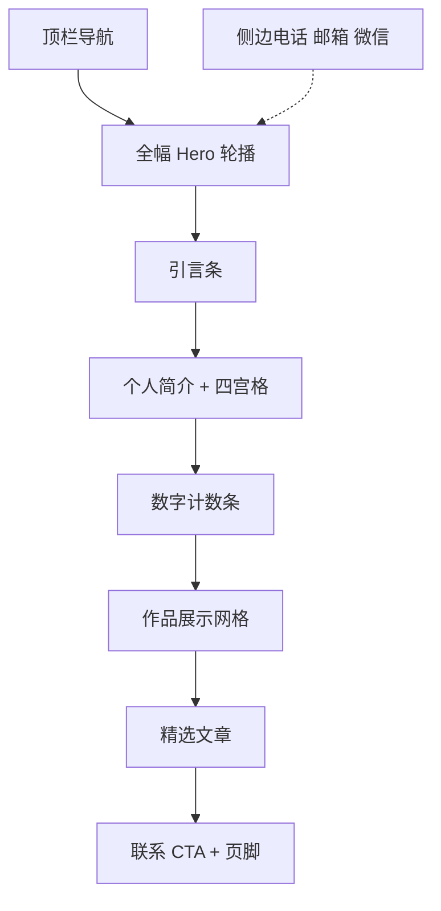

# 个人网站视觉与交互设计

对照模板：腾云 JP-11304 / <https://template.tyjz.com/14525/>  
品牌主体：`nexartc` · 江中央  
作品主角：低延迟云手机（`cloud_phone_p2p`）

---

## 1. 设计原则

1. **保留模板节奏，替换摄影叙事为工程叙事**  
   全幅 Hero → 引言 → 关于 + 四宫格 → 数字条 → 作品网格 → 文章/经历 → 联系。
2. **品牌优先**  
   首屏必须一眼读到「nexartc / 云手机」与可核验延迟指标；去掉空泛 WELCOME 口号。
3. **Hero 预算**  
   仅：品牌、一行 headline、一句支撑、一组 CTA、一张全幅主视觉。不做统计条/卡片叠在 Hero 上。
4. **真实产品锚点**  
   主视觉优先真实控制台/真机画面，装饰渐变只做氛围，不作主视觉。
5. **克制动效**  
   对标模板的 Swiper / count-up / 入场，全站控制在 2–3 类有意动效。

---

## 2. 信息架构

| 模板栏目 | 本站栏目 | 锚点 / 路由 |
|---------|---------|-------------|
| 首页 | 首页单页主流程 | `/` `#top` |
| 个人介绍 | 关于 | `/about` 或 `#about` |
| 作品展示 | 作品 | `/work`、`/work/cloud-phone` |
| 新闻资讯 | 文章 | `/articles` 或 `#articles` |
| 与我联系 | 联系 | `/contact` 或 `#contact` |

详见 [sitemap.md](./sitemap.md)。

---

## 3. 视觉系统

### 3.1 色彩

| Token | 值 | 用途 |
|-------|-----|------|
| `--ink` | `#0B1C24` | 主背景 / 深色区块 |
| `--ink-elevated` | `#122A35` | 卡片/浮层底 |
| `--fog` | `#E8EEF1` | 浅色区块底 |
| `--text` | `#F2F6F8` | 深色底正文 |
| `--text-muted` | `#8AA0AB` | 次级说明 |
| `--text-on-light` | `#1A2B33` | 浅色底正文 |
| `--accent` | `#2BB8A6` | 主强调（链路/实时） |
| `--accent-hot` | `#E8A45C` | 次强调（指标高光、CTA 辅色） |
| `--line` | `rgba(255,255,255,0.12)` | 分割线 |

避免：紫白渐变、奶油衬线+陶土、纯黑+霓虹光晕堆叠。

### 3.2 字体

| 角色 | 建议（开源优先） | 备注 |
|------|------------------|------|
| 中文标题 | Source Han Sans SC / Noto Sans SC Bold | 或「霞鹜文楷」仅用于引言一句 |
| 英文/数字 | Outfit 或 IBM Plex Sans | 延迟数字用 tabular nums |
| 正文 | Noto Sans SC Regular | 行高 1.65 |

禁止默认栈：Inter、Roboto、Arial、system-ui 作为展示字体。

### 3.3 栅格与间距

- 内容最大宽：`1120px`（桌面） / `100% - 32px`（移动）  
- 区块纵向节奏：`80 / 96 / 120px`  
- 作品卡比例：`16:10`  
- 圆角：作品卡 `8px`；按钮 `6px`；Hero 不加卡片圆角遮罩  

### 3.4 背景氛围

深色区：`radial-gradient`（青墨中心微亮）+ 极低对比度点阵/细网格（暗示网络拓扑）。  
浅色区：`#EDF1F5` 系雾灰，与模板的 `#EDF1F5` 接近以便迁移版式，但主品牌色不用模板青绿 `#78d1ad`，改用 `--accent`。

---

## 4. 页面区块规格

### 4.1 顶栏

- 左：字标 `nexartc`（点击回顶）  
- 中：首页 · 关于 · 作品 · 文章 · 联系  
- 右：主按钮「在线体验」→ `https://www.nexartc.com:8444/device/`（新窗口）  
- 滚动后：半透明深底 + 细底边；高度桌面 `64px` / 移动 `56px`  
- 移动：汉堡菜单，全屏抽屉  

### 4.2 Hero（全幅，对标 banner_swiper）

**帧数：3**（可先做 1 帧上线）。

| 帧 | 品牌/标题 | 支撑句 | CTA | 主视觉 |
|----|-----------|--------|-----|--------|
| A | nexartc · 低延迟云手机 | LAN P50&lt;50ms；电信公网 P50&lt;80ms（glass-to-glass） | 立即体验 · 查看架构 | Web 控制台全幅截图 |
| B | RTNlite · 极简 WebRTC | 面向嵌入式 Linux / RTOS；包体与内存远低于行业标杆 | 阅读对比文章 | SDK 示意 / 设备剪影 |
| C | 边缘低延迟交互平台 | 云手机只是首个场景；同一套能力可延伸遥操作与对讲 | 阅读愿景 | 架构一页图 |

版式：

- 主视觉 **edge-to-edge**，文字落在左 40–50% 安全区（或右，视截图构图）。  
- 文字层级：品牌（小）→ headline（大）→ 支撑（一行）→ CTA 组。  
- **禁止**在 Hero 上叠徽章、统计条、浮动标签。  
- 轮播：淡入淡出或轻微推入；指示点靠下；自动播放间隔 6s，悬停暂停。

### 4.3 引言条

单行居中或左右分栏：

> 18 年音视频与网络传输 · 独立完成云手机端到端 · 面向真实弱网与跨 NAT

英文小标可选：`END-TO-END REALTIME SYSTEMS`

### 4.4 关于摘要 + 四宫格（对标个人简介）

- 左：200–280 字简介（见 CONTENT.md）  
- 右：肖像 — 现可用 `reference/20260726-141605.jpg`（竖图裁 4:5）；缺职业照时保留此生活照，勿换无关风光  
- 下方四卡（图标 + 标题 + 40–60 字）：  
  1. 专业技能  
  2. 兴趣与专注  
  3. 论文与专利  
  4. 教育背景  

「了解更多」→ `/about`。

### 4.5 数字条（对标 count-up）

四列，进入视口 count-up：

| 数字 | 标签 | 备注 |
|------|------|------|
| 18 | 年音视频与传输经验 | 与简历一致 |
| 5 | 项音视频授权发明专利 | 需确认是否全部可公开展示题名 |
| 2 | 篇核心期刊论文 | 《软件学报》《计算机学报》 |
| &lt;50ms | 局域网端到端延迟 | P50 glass-to-glass；脚注见 CONTENT §13 |

不展示期望薪资。期望城市「深圳」可放在关于页页脚级信息。

### 4.6 作品网格（对标综合展示）

分类 Tab（可选）：`全部` · `平台` · `SDK` · `网关/落地`

卡片字段：封面 16:10 · 标题 · 一句结果 · 标签（WebRTC / QUIC / 嵌入式）· hover 轻微上浮。

首发三张：

1. nexartc 低延迟云手机（主推）  
2. RTNlite 轻量实时引擎  
3. RTMP ↔ WebRTC 媒体网关（支付宝阶段能力的公开表述，脱敏）

「查看更多」→ `/work`。

### 4.7 精选文章（对标新闻资讯）

三列列表卡：封面（可统一几何底）· 标题 · 日期/来源 · 摘要一行。

1. RTNlite 轻量级实时通信引擎（公众号）  
2. RTNlite vs 声网 RTSA 对比（飞书）  
3. 低延迟远程交互平台愿景（站内摘要页，链到 design 文档对外版）

### 4.8 联系 CTA + 页脚

- 标题：期待交流低延迟系统与边缘交互  
- 电话：`13632650465`  
- 邮箱：`2935616@qq.com`  
- 次按钮：复制邮箱 / 打开体验  
- 页脚：Copyright · 个人作品声明 · 备案号占位 · 「模板结构参考腾云 JP-11304，视觉与内容为独立设计」

### 4.9 侧边浮层（对标模板右侧客服条）

竖条三项：电话 · 邮箱 · 微信（二维码弹层）。  
移动端改为底栏三图标，避免挡内容。

---

## 5. 子页规格

### 5.1 `/about`

- Hero 矮条：姓名 + 角色「语音 / 视频 / 图形 · 实时传输」  
- 长简介 + 右侧肖像（A08 裁切）  
- 时间线（倒序）：虾皮 → 长城/比亚迪（短）→ 字节 → 阿里（支付宝/淘宝）→ TCL → 中兴 → … → 华为  
- 每段：公司 · 角色 · 时间 · 3–5 条可公开成果（见 CONTENT.md）  
- **学术与知识产权**（页中后段，浅色底）：  
  - 左栏「论文」：2 条完整著录（CONTENT §9A）  
  - 右栏「专利」：已核 1 条 + 4 条占位行（灰字「题名待补」）  
  - 不做成证书扫描墙；题名可链 Google Patents / 期刊页（可选）

### 5.2 `/work/cloud-phone`

深度作品页结构（单列，最大宽 800–880px 正文 + 全宽图）：

1. 问题：跨 NAT 边缘真机、触控闭环、多协议传输  
2. 方案：CAE + Hub + TURN Mode A + WebRTC/QUIC  
3. 结果：延迟指标（链 `#latency`）+ 体验链接  
4. **获取**：双 CTA —「在线体验」（实链）+「下载二进制」（**disabled，URL 留空**，见 CONTENT §9.5）  
5. 架构图（素材待补）  
6. `#latency` 延迟测试说明（CONTENT §13 展开版，可折叠 `
`）  
7. 技术栈标签  
8. 免责：个人作品，与任职公司无关  

下载按钮态：

| 状态 | 视觉 |
|------|------|
| URL 空 | 次按钮描边 +「即将提供」；不可点 |
| URL 已填 | 实心次按钮，新窗口下载 |

### 5.3 `/contact`

大号联系方式 + 可选留言表单（可后置；第一期 mailto 即可）。  
可用 A08 低对比度裁切作区块右侧氛围，不抢联系信息。

---

## 6. 交互与动效

| 动效 | 触发 | 规格 |
|------|------|------|
| Hero 文案 fade-up | 载入 / 换帧 | 280–400ms，ease-out |
| 数字 count-up | 进入视口一次 | 1.2s |
| 作品卡 translateY | hover | -4px，阴影轻微 |

减少：整页视差、鼠标跟随光斑、过多粒子。

无障碍：对比度 AA；焦点环可见；轮播提供暂停；动效尊重 `prefers-reduced-motion`。

---

## 7. 响应式

| 断点 | 行为 |
|------|------|
| ≥1120 | 完整桌面版式 |
| 768–1110 | 四宫格 2×2；数字 2×2 |
| &lt;768 | Hero 文案叠在主视觉下部渐变遮罩上；作品单列；浮层改底栏 |

---

## 8. 与模板的差异声明（给实现同学）

- **可用**：栏目顺序、轮播、四宫格、数字条、作品网格、侧浮层的**信息架构**。  
- **不要**：摄影站文案、默认风光图、模板 logo、腾云页脚备案号、紫色/多色标签糖果风。  
- **必须替换**：字体、品牌色、Hero 主视觉、全部文案与联系方式。

---

## 9. 验收清单（设计阶段）

- [x] IA 与模板栏目一一映射  
- [x] 视觉 token 与 Hero 预算写清  
- [x] 各区块字段与 CTA 目标明确  
- [x] 论文 2 篇题名入库；专利 1/5 核验 + 占位  
- [x] 延迟定量说明与二进制下载占位写入  
- [x] 参考相片入库（生活照）  
- [ ] 产品截图 / Logo 到位后出高保真（见 ASSETS.md）  
- [ ] 其余 4 项专利号本人确认后替换占位  

文案见 [CONTENT.md](./CONTENT.md)；素材缺口见 [ASSETS.md](./ASSETS.md)；著录见 [PUBLICATIONS.md](./PUBLICATIONS.md)。
