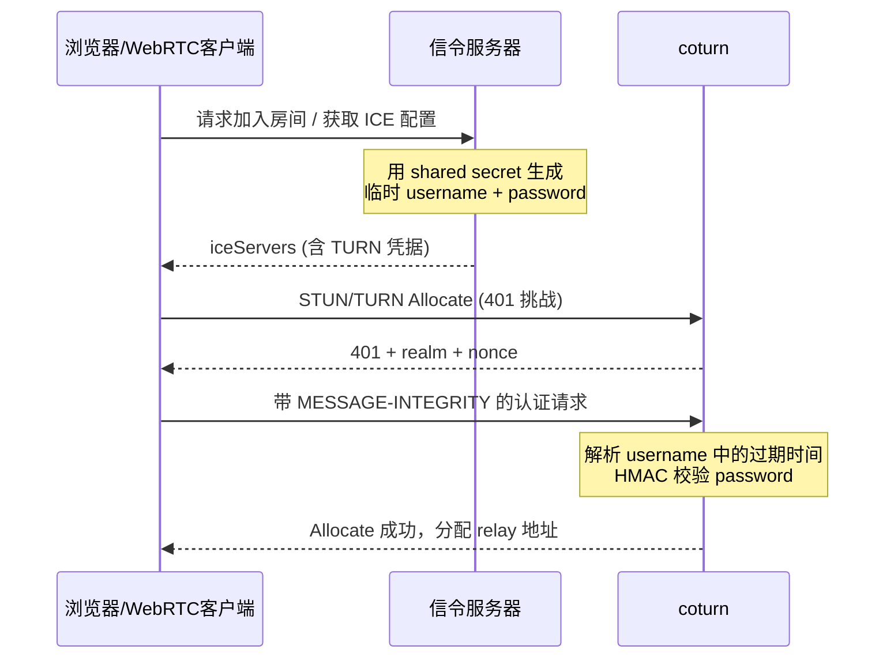

# TURN REST API 与信令服务器集成设计

本文档描述如何用信令服务器动态生成 TURN 凭据，供 WebRTC 客户端向 coturn 发起请求并完成鉴权。该方案对应 coturn 的 **TURN REST API**（也称 secret-based timed authentication）。

## 1. 整体架构



### 角色分工

| 组件 | 职责 |
|------|------|
| 信令服务器 | 持有 **shared secret**（绝不下发给客户端），按需生成临时 `username` / `credential` |
| coturn | 持有相同 secret，校验凭据是否合法、是否过期 |
| 客户端 | 只拿到临时凭据，按 RFC 5389 长期凭据机制完成 STUN/TURN 认证 |

## 2. 凭据生成算法

coturn 配置注释（`docker/coturn/turnserver.conf`）：

```
usercombo -> "timestamp:userid"
turn user -> usercombo
turn password -> base64(hmac(secret key, usercombo))
```

### 2.1 Username 格式

```
temporary_username = "<过期时间戳>" + ":" + "<用户ID>"
```

- **分隔符**默认是 `:`，可用 `rest-api-separator` 修改。
- **用户 ID** 可选；没有业务 ID 时，可以只用时间戳，例如 `"1735689600"`。
- **时间戳含义（重要）**：coturn 实现里这是**过期时间**（`now + TTL`），不是创建时间。

uclient 测试代码（`src/apps/uclient/mainuclient.c`）：

```c
const unsigned long exp_time = 3600 * 24; /* one day */
snprintf(new_uname, sizeof(new_uname), "%lu%c%s",
         (unsigned long)time(NULL) + exp_time, rest_api_separator, (char *)g_uname);
```

### 2.2 Password 生成

```
password = base64( HMAC-SHA1(shared_secret, temporary_username) )
```

- HMAC 算法：**SHA-1**（`SHATYPE_DEFAULT`）。
- 输出做 **Base64** 编码（不是 hex）。

### 2.3 信令服务器示例（Node.js）

```javascript
const crypto = require('crypto');

function generateTurnCredentials(userId, secret, ttlSeconds = 3600) {
  const expiry = Math.floor(Date.now() / 1000) + ttlSeconds;
  const username = userId ? `${expiry}:${userId}` : `${expiry}`;

  const hmac = crypto
    .createHmac('sha1', secret)
    .update(username)
    .digest();

  const credential = hmac.toString('base64');

  return { username, credential, ttl: ttlSeconds, expiry };
}

function getIceServers(turnHost, turnPort = 3478) {
  const { username, credential } = generateTurnCredentials('user-123', 'your-shared-secret', 3600);

  return {
    iceServers: [
      { urls: 'stun:' + turnHost + ':' + turnPort },
      {
        urls: 'turn:' + turnHost + ':' + turnPort,
        username,
        credential,
      },
      {
        urls: 'turns:' + turnHost + ':5349',
        username,
        credential,
      },
    ],
  };
}
```

### 2.4 Python 示例

```python
import hmac
import hashlib
import base64
import time

def generate_turn_credentials(user_id: str, secret: str, ttl: int = 3600) -> dict:
    expiry = int(time.time()) + ttl
    username = f"{expiry}:{user_id}" if user_id else str(expiry)

    digest = hmac.new(
        secret.encode('utf-8'),
        username.encode('utf-8'),
        hashlib.sha1
    ).digest()
    credential = base64.b64encode(digest).decode('utf-8')

    return {"username": username, "credential": credential, "ttl": ttl, "expiry": expiry}
```

## 3. coturn 服务端校验流程

客户端发来带 `USERNAME` 的 STUN/TURN 请求后，核心逻辑在 `src/apps/relay/userdb.c` 的 `get_user_key()`：

1. 从 username 解析时间戳（`get_rest_api_timestamp`）。
2. 判断 `timestamp >= now`（`!turn_time_before(ts, ctime)`），过期则拒绝。
3. 加载所有 shared secret（支持密钥轮换），逐个计算：
   - `HMAC-SHA1(username, secret)` → Base64 → 作为 password。
4. 按 RFC 5389 长期凭据机制校验 `MESSAGE-INTEGRITY`：
   - `key = MD5(username : realm : password)`。
   - 对比请求中的完整性校验值。

时间戳解析（`get_rest_api_timestamp`）支持两种格式：

- `1735689600:userId` — 时间戳在前（推荐）。
- `userId:1735689600` — 若冒号前不全是数字，则时间戳在后。

启用 `--use-auth-secret` 时，coturn 自动设置长期凭据模式（`src/apps/relay/mainrelay.c`）：

```c
turn_params.use_auth_secret_with_timestamp = 1;
turn_params.ct = TURN_CREDENTIALS_LONG_TERM;
use_lt_credentials = 1;
```

## 4. coturn 配置方法

### 4.1 最小配置（静态 secret）

`/etc/turnserver.conf`：

```ini
listening-port=3478
tls-listening-port=5349

lt-cred-mech
use-auth-secret
static-auth-secret=your-very-long-random-secret

realm=yourcompany.com

listening-ip=0.0.0.0
relay-ip=<公网IP或内网IP>

min-port=49152
max-port=65535

fingerprint
no-multicast-peers
no-cli
```

命令行等价写法：

```bash
turnserver \
  --lt-cred-mech \
  --use-auth-secret \
  --static-auth-secret=your-very-long-random-secret \
  --realm=yourcompany.com \
  -L 0.0.0.0 \
  -E <relay-ip> \
  --min-port=49152 --max-port=65535 \
  -f
```

### 4.2 生产配置（数据库管理 secret，支持轮换）

```ini
use-auth-secret
userdb=/var/db/turndb
# 或 PostgreSQL/MySQL/Redis：
# psql-userdb="host=localhost dbname=coturn user=coturn password=xxx"
# redis-userdb="ip=127.0.0.1 dbname=0 password=xxx"
```

数据库表 `turn_secret`：

```sql
CREATE TABLE turn_secret (
    realm varchar(127) default '',
    value varchar(127),
    primary key (realm,value)
);
```

用 `turnadmin` 管理 secret：

```bash
turnadmin -s mysecret -r yourcompany.com -b /var/db/turndb
turnadmin -S -r yourcompany.com -b /var/db/turndb
turnadmin -X -s oldsecret -r yourcompany.com -b /var/db/turndb
```

coturn 支持**多个 secret 并存**，校验时会逐个尝试，便于无缝轮换。

### 4.3 鉴权模式互斥

`use-auth-secret` 与静态 `lt-cred-mech`（`-u user:pass`）不能混用；同时配置时 **shared secret 会覆盖**静态用户密码。

| 方式 | 配置 | 适用场景 |
|------|------|----------|
| **TURN REST API**（推荐） | `use-auth-secret` + secret | WebRTC、凭据需限时、信令服务器签发 |
| 静态 lt-cred-mech | `lt-cred-mech` + `-u user:pass` 或 DB `turnusers_lt` | 测试、固定客户端、内部服务 |

## 5. 有效期设置

有效期由多层机制叠加控制。

### 5.1 凭据有效期（信令服务器控制，最主要）

```
expiry = now + TTL
username = expiry + ":" + userId
```

| TTL 建议 | 场景 |
|----------|------|
| 300–600s | 高安全场景 |
| 3600s（1h） | 常规 WebRTC |
| 86400s（24h） | 长会话（uclient 默认值） |

coturn 校验条件：`timestamp >= now`，过期即拒绝新认证。

### 5.2 TURN Allocation 生命周期（coturn 控制）

```ini
max-allocate-lifetime=3600   # 默认 3600s
max-allocate-timeout=60
channel-lifetime=600
permission-lifetime=300
```

REST API 模式下，coturn **不会**把凭据剩余时间写入 `max_session_time_auth`（该字段主要用于 OAuth）。因此：

- 客户端可能申请 `lifetime=3600`。
- 但凭据 600s 后过期。
- 600s 后 **Refresh** 会鉴权失败，relay 会话无法续期。

**实际会话时长 ≈ min(凭据 TTL, max-allocate-lifetime)**。

建议：`凭据 TTL >= max-allocate-lifetime`，或让客户端在凭据过期前重新向信令服务器申请新凭据。

### 5.3 Nonce 有效期

```ini
stale-nonce=600   # 默认 600s，过期后返回 438
```

### 5.4 配额限制

```ini
user-quota=10
total-quota=1200
max-bps=3000000
```

配额按**真实用户名**统计（`get_real_username` 会去掉时间戳前缀），同一 `userId` 无论时间戳如何变化，都计入同一配额。

## 6. 信令服务器 API 设计建议

### 6.1 接口示例

```
GET /api/v1/turn-credentials?roomId=abc123
Authorization: Bearer <用户登录 token>
```

响应：

```json
{
  "iceServers": [
    { "urls": "stun:turn.example.com:3478" },
    {
      "urls": [
        "turn:turn.example.com:3478?transport=udp",
        "turn:turn.example.com:3478?transport=tcp",
        "turns:turn.example.com:5349?transport=tcp"
      ],
      "username": "1735693200:user-abc",
      "credential": "base64encodedhmac=="
    }
  ],
  "ttl": 3600,
  "expiry": 1735693200
}
```

### 6.2 设计要点

1. **Secret 只存在服务端**：信令服务器和 coturn 各持一份，通过 KMS/环境变量注入，不进代码仓库。
2. **userId 绑定业务身份**：username 里嵌入 `userId` / `roomId`，便于审计和配额。
3. **短 TTL + 按需刷新**：进入房间时签发，离开房间后凭据自然过期。
4. **HTTPS 传输**：凭据经公网下发，接口必须 TLS。
5. **Secret 轮换**：数据库多 secret 并存，信令服务器用新 secret 签发，coturn 新旧都接受。

## 7. 完整认证时序（客户端视角）

REST API 只是替换了 username/password 的生成方式，之后走标准长期凭据流程：

1. 客户端发 Allocate → coturn 回 **401** + `realm` + `nonce`。
2. 客户端计算 `key = MD5(username : realm : password)`，在请求中加入 `USERNAME`、`REALM`、`NONCE`、`MESSAGE-INTEGRITY`。
3. coturn 调用 `get_user_key()` 校验。
4. 成功后分配 relay 地址。

## 8. 验证配置

```bash
# 启动 coturn（REST API 模式）
turnserver --use-auth-secret --static-auth-secret=logen \
  --realm=north.gov -a -f -L 127.0.0.1 -E 127.0.0.1

# 客户端用 -W 传入相同 secret，-u 传入用户 ID
turnutils_uclient -u ninefingers -W logen -e 127.0.0.1 127.0.0.1
```

uclient 的 `-W` 会自动按 REST API 规则生成 username/password（`src/apps/uclient/mainuclient.c`）。

## 9. 常见问题

**凭据生成后认证失败？**

- 检查 secret 是否一致。
- 检查 username 格式（时间戳必须是**未来**时间）。
- 检查 HMAC 是否 SHA-1 + Base64。
- 检查 `rest-api-separator` 是否一致（默认 `:`）。

**时间戳用创建时间还是过期时间？**

coturn 实现要求 **过期时间**（`now + TTL`），校验条件是 `timestamp >= now`。

**需要 `-a` / `lt-cred-mech` 吗？**

需要。`use-auth-secret` 会自动启用，但建议显式写上。

**如何按域名分配不同 realm？**

用 `turn_origin_to_realm` 表，把 Web 页面的 `ORIGIN` 映射到不同 realm，各 realm 可有独立 secret 和配额。

## 10. 相关源码与文档

| 路径 | 说明 |
|------|------|
| `src/apps/relay/userdb.c` | `get_user_key()`、`get_rest_api_timestamp()` |
| `src/apps/uclient/mainuclient.c` | 客户端凭据生成参考实现 |
| `src/apps/relay/mainrelay.c` | `--use-auth-secret` 配置解析 |
| `docker/coturn/turnserver.conf` | 配置注释与示例 |
| `man/man1/turnserver.1` | TURN REST API 官方说明 |
| `examples/scripts/restapi/` | REST API 示例脚本 |
| `turndb/schema.sql` | `turn_secret` 表结构 |

参考规范：

- [draft-uberti-behave-turn-rest-00](https://tools.ietf.org/html/draft-uberti-behave-turn-rest-00)
- [RFC 5389 §10.2 长期凭据机制](https://tools.ietf.org/html/rfc5389#section-10.2)
