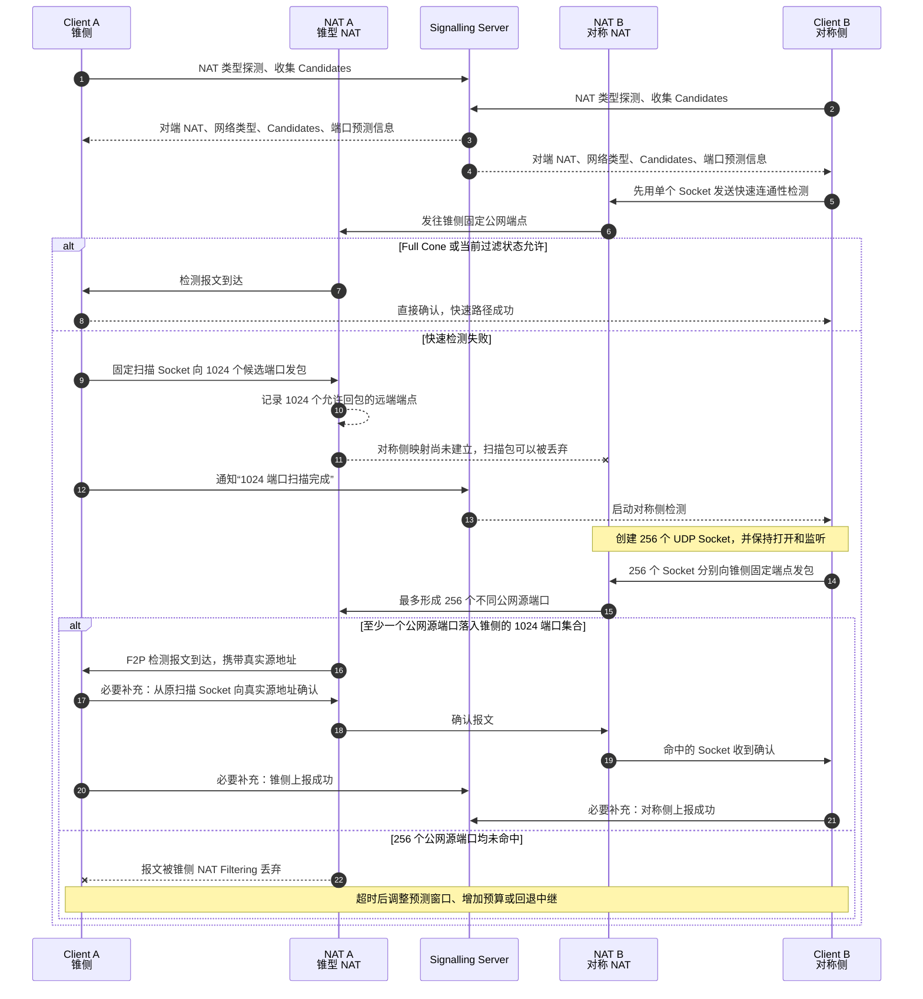

# UDP NAT 穿透策略代码审查

> 日期：2026-07-28  
> 状态：审查定稿（基于本地代码快照；正文尽可能保留完整参考审查稿）  
> 范围目录：父仓 `p2p/{f2p,c-toxcore,nat-birthday-paradox}`（本文件为 design 目录副本）  
> 关联：nexartc / NexaDesk 低延迟建连选型  
> 路径约定：本文件位于 `coturn-4.13.0/docs/design/`；代码链接指向父仓 `p2p/` 研究树（如 `../../../p2p/f2p/...`）。权威正文与 `p2p/docs/udp-nat-traversal-code-review.md` 同步维护。

**声明：** 成功率数字除明确标注为数学概率外，均为基于代码路径、NAT 行为与网络工程经验的**条件性估计**，不是生产环境实测结果。

**相对压缩版的增补说明：** 本文恢复了参考审查稿中的分层流程细节、端口扫描/Well-Known 端口分析、分层端口调度建议，以及 **§4.7 F2P 与 256×1024 设计变体的完整对比**（含 Mermaid 时序、命中率表、风险与改进建议）。并在核对代码后标注：`punchConeToSym` 已实现向真实源地址确认；Cone↔Cone 与「Cone Client + Sym Server」地址时序缺陷仍为 P0。

---

## 1. 审查范围与结论

本文审查当前目录中的三套相关代码：

- `f2p`：完整的 P2P 端口转发程序，包含 libp2p DCUtR、自研 UDP 打洞和 QUIC 数据通道。
- `c-toxcore`：TokTok 持续维护的 c-toxcore，包含基于 DHT 地址观察和端口预测的 UDP 穿透实现。本地代码已更新至 2026-06-20 的上游 `master`。
- `nat-birthday-paradox`：生日悖论穿透概率模型，不是完整的网络实现。

主要结论如下：

1. 对普通 Endpoint-Independent Mapping（下文简称 EIM/Cone）NAT，F2P 的 libp2p DCUtR 覆盖面、建连速度和工程成熟度最好。
2. 对“单边随机对称 NAT、单边 Cone NAT”，F2P 的生日攻击在理想模型中单次碰撞率约为 98.1%～99.5%，但当前实现存在明显的方向性和地址生命周期缺陷。
3. 对双方端口严格递增或递减的简单对称 NAT，F2P 更激进、更快；toxcore 更保守、更慢，但会持续扩大预测范围。
4. 对双方随机端口的 Hard Symmetric NAT，三套方案都没有实际可行的解决办法。
5. F2P 打洞后将业务 UDP 放入可靠有序的 QUIC stream，适合可靠数据，但会改变 UDP 报文语义；toxcore 保持原生 UDP datagram，更适合实时通信。
6. F2P 自研打洞的数学策略强于 toxcore，但当前端到端可靠性明显低于理论概率，特别是 F2P Client 位于 Cone NAT 后时。

成功率数字除明确标注为数学概率外，均为基于代码路径、NAT 行为和网络工程经验的条件性估计，不是生产环境实测结果。

### 1.1 上游仓库来源与版本核实

本地三个 Git 仓库的来源已经与 GitHub 当前上游核实：

| 本地目录 | 当前官方/活跃上游 | 本地状态 |
|---|---|---|
| `f2p` | [Hexrotor/f2p](https://github.com/Hexrotor/f2p) | 原始仓库，GitHub 未标记为 fork；本地 `main` 与远端一致，提交 `534bbd5e` |
| `nat-birthday-paradox` | [danderson/nat-birthday-paradox](https://github.com/danderson/nat-birthday-paradox) | 原作者仓库，GitHub 未标记为 fork；本地 `master` 与远端一致，提交 `862c8cc5` |
| `c-toxcore` | [TokTok/c-toxcore](https://github.com/TokTok/c-toxcore) | 当前持续维护的 c-toxcore 上游；本地 `master` 与远端一致，提交 `1d79022f` |

toxcore 原先配置的 remote 是：

```text
https://github.com/irungentoo/toxcore.git
```

该仓库是 c-toxcore 的历史源头，本地旧代码停留在 2018-10-03 的 `bf69b54f`。GitHub 当前持续维护的仓库是从它延续而来的 `TokTok/c-toxcore`，具有活跃提交、发布、CI、路线图和现代构建配置。

本地 `c-toxcore` 的 `origin` 已更新为：

```text
https://github.com/TokTok/c-toxcore.git
```

更新前验证结果如下：

- `bf69b54f` 是新上游 `master` 的直接历史祖先；
- 本地没有独有提交，也没有未提交修改；
- 本地相对新上游落后 1921 个提交；
- 因此使用纯 fast-forward 更新，没有 reset、rebase 或覆盖本地改动。

更新后：

- c-toxcore HEAD：`1d79022fb4e56dffe0bbd075d47e00f7a0b62ab3`；
- 提交时间：2026-06-20 14:56:05 +0200；
- 提交说明：`fix: handle_gc_mod_list() return values in docs`；
- 上游已发布 v0.2.23，本地 `master` 位于该发布提交之后；
- `third_party/cmp` submodule 已初始化到上游锁定的 `52bfcfa1`。

## 2. F2P 的分层穿透流程

F2P 使用如下分层策略：

```text
DHT 查找 Server
  ↓
公网地址、IPv6 或端口映射直连
  ↓失败
Circuit Relay 建立控制连接
  ↓
等待 libp2p DCUtR 同时拨号
  ↓失败或 15 秒内未完成
STUN 检测 NAT 类型
  ↓
自研 UDP 打洞
  ↓成功
在打通的 UDP socket 上建立 QUIC
  ↓
控制流、TCP 转发和 UDP 转发进入 QUIC stream
```

Client 的连接顺序见
[`../../../p2p/f2p/internal/client/connect.go`](../../../p2p/f2p/internal/client/connect.go)。

Server 启用了：

- AutoNAT v2；
- NAT-PMP/UPnP 端口映射；
- libp2p DCUtR；
- AutoRelay，目标维持 3 个 relay；
- TCP、QUIC、WebRTC Direct 和 WebTransport 等监听地址。

相关配置见
[`../../../p2p/f2p/internal/server/server.go`](../../../p2p/f2p/internal/server/server.go)
和
[`../../../p2p/f2p/internal/client/client.go`](../../../p2p/f2p/internal/client/client.go)。

因此，F2P 的首选方案并不是自研 STUN 打洞，而是：

1. 利用 IPv6、公网地址或显式端口映射直接连接。
2. 通过 relay 交换双方观测到的可拨号地址。
3. DCUtR 根据 relay RTT 协调双方同时拨号。
4. 在 TCP、QUIC、WebRTC 等候选传输中建立直连。

### 2.1 三项 libp2p 能力的职责区别

AutoNAT v2、NAT-PMP/UPnP 和 DCUtR 分别解决不同层次的问题：

| 能力 | 解决的问题 | 是否识别 Cone/Symmetric | 对成功率的作用 |
|---|---|---:|---|
| AutoNAT v2 | 验证某个监听地址能否被公网节点拨入 | 否 | 间接帮助策略决策 |
| NAT-PMP/UPnP | 请求网关显式建立公网端口映射 | 否 | 映射成功时帮助最大 |
| libp2p DCUtR | 通过 relay 协调双方同时拨号 | 否 | 普通 NAT 下帮助很大 |
| F2P 自研 STUN | 粗略判断 Cone/EasySym/HardSym | 是 | 为自研回退选择策略 |

这三项 libp2p 能力都不会直接产生 F2P 定义的 `NATType`。只有 F2P 自研 STUN 检测会生成 `NATCone`、`NATSymmetricEasyInc`、`NATSymmetricEasyDec` 和 `NATSymmetricHard`。

### 2.2 AutoNAT v2 的作用

AutoNAT v2 检测的是公网可达性，而不是传统 NAT 类型。它让外部 Peer 实际尝试拨入某个候选地址，从结果得到类似：

- `ReachabilityPublic`；
- `ReachabilityPrivate`；
- `ReachabilityUnknown`；
- 某个具体地址可达或不可达。

它回答的是“别人能不能从公网连接我的这个地址”，而不是“我是 Full Cone、Port-Restricted 还是 Symmetric NAT”。

AutoNAT v2 本身不打洞，所以不会直接提高 Birthday Attack 的碰撞概率。它通过以下方式间接提高系统成功率：

- 只公布较可信的公网候选地址；
- 可直连时优先直连；
- 不可直连时启用或保留 AutoRelay；
- 减少对无效地址的重复拨号；
- 为 DCUtR 提供更可信的候选地址和可达性状态。

F2P 同时启用了 `EnableAutoNATv2()` 和 `EnableNATService()`。前者启用新版 AutoNAT 能力，后者允许本节点为其他 Peer 提供外部拨入检测服务。两者都不是 F2P 自研 NAT 类型分类的数据来源。

AutoNAT 的优势是真实验证“是否可拨入”，这一结果通常比纯 STUN 分类可靠；局限是信息粒度较低，不能判断端口分配模式或选择 Birthday/端口预测策略。

### 2.3 NAT-PMP/UPnP 的作用

`libp2p.NATPortMap()` 会尝试发现本地网关，并通过 NAT-PMP 或 UPnP 请求显式映射：

```text
公网 IP:外部端口
        ↓ 网关显式转发
本机 IP:libp2p 监听端口
```

映射成功后，其他 Peer 可以像连接公网服务一样拨入该地址，通常不再需要传统 UDP 打洞。它的主要价值是：

- 避免猜测 NAT Mapping 和 Filtering；
- 不要求双方严格同时发包；
- 可同时服务 TCP 和 UDP/QUIC 监听地址；
- 建连速度接近普通公网连接；
- 即使设备原本表现为对称 NAT，显式映射也可能绕过端口预测问题。

这是单项成功时收益最大的能力，但它具有明显的“成功则很有效，失败则没有帮助”特征。以下环境经常不可用：

- 路由器关闭 UPnP/NAT-PMP；
- 企业网络禁止用户创建映射；
- 蜂窝网络或运营商 CGNAT；
- 双重 NAT 只映射了内层网关；
- 网关实现异常；
- 映射成功后仍被上层防火墙阻止。

### 2.4 DCUtR 的工作方式

DCUtR 的前提是双方已经通过 relay 建立连接。双方随后在 relay stream 上交换候选地址，并根据 relay RTT 协调同时拨号：

```text
Client ─────── relay connection ─────── Server
   │                                      │
   │ CONNECT：Client 候选地址             │
   │─────────────────────────────────────>│
   │              CONNECT：Server 候选地址│
   │<─────────────────────────────────────│
   │ SYNC                                 │
   │─────────────────────────────────────>│
   │                                      │
等待约 RTT/2                         收到 SYNC
   │                                      │
   └────────── 双方同时直接拨号 ──────────┘
```

双方同时向外拨号，会分别在自己的 NAT 上创建出站 Mapping 和 Filtering 状态。如果两个方向形成兼容的地址组合，连接即可升级为直连。

DCUtR 不需要提前知道双方属于 Cone 还是 Symmetric。它采用结果驱动策略：

1. 交换已观察到的真实候选地址。
2. 协调双方拨号时间。
3. 对候选地址执行实际连接。
4. 以连接是否建立作为最终判断。

它通常适用于 EIM/Cone、Port-Restricted、单边公网、已有端口映射或 IPv6 可达场景；对 Random Symmetric-to-Random Symmetric、多层 CGNAT 和完全阻断 UDP 的网络效果较差。

### 2.5 DCUtR 的优势

- 候选地址不局限于 IPv4 UDP。
- 使用真实监听 socket 和真实观测地址，不需要用独立 STUN socket 推测未来映射。
- 通过 relay 测量 RTT 并协调同时拨号。
- 支持连接复用、身份认证、资源管理和多种传输协议。
- 普通 EIM/Cone NAT 下只需要少量握手数据包。

### 2.6 DCUtR 的局限

- 必须先建立可用的 relay 控制连接。
- 对随机对称 NAT 没有根本解决能力。
- F2P 只等待 15 秒便开始自研回退。libp2p 内部单次直接拨号可能持续约 10 秒并重试，因此两套打洞可能重叠。
- 重叠的 UDP/QUIC 拨号会生成额外 NAT 映射，污染后续 Easy Symmetric 端口预测。

### 2.7 对成功率的条件性贡献

三项能力处理的网络集合互相重叠，不能把各自成功率直接相加。更合理的评价是：

| 能力 | 条件性贡献 |
|---|---|
| NAT-PMP/UPnP | 网关支持且允许时，通常可直接把节点变成公网可拨入，收益最大；在 CGNAT、企业网和移动网络中常为零 |
| DCUtR | 普通家用 NAT 和双方可通过 relay 协调时收益很大，是 F2P 最主要的打洞来源；双随机对称 NAT 下收益很小 |
| AutoNAT v2 | 不创造新的穿透路径，主要减少错误地址、无效拨号和错误的直连/relay 决策 |
| F2P 自研打洞 | 用于补充 DCUtR 失败场景，其中 Symmetric Client-to-Cone Server 的 Birthday 路径理论价值最大 |

F2P 的实际决策链可以表示为：

```text
NAT-PMP/UPnP 获得显式映射或已有公网/IPv6 地址？
  ├─ 是：公布候选地址并尝试直接连接
  └─ 否或直连失败
      ↓
通过 relay 建立控制连接
      ↓
DCUtR 交换候选地址并同时拨号
  ├─ 成功：使用 libp2p 直连
  └─ 15 秒内未成功
      ↓
双方分别执行 F2P STUN 类型检测
      ↓
通过 relay 交换 NATInfo
      ↓
Server 根据双方 NATType 选择自研策略
      ↓
UDP Punch 成功？
  ├─ 是：在 Punch Socket 上建立 QUIC
  └─ 否：最多重试 3 次，之后进入外层重连
```

## 3. F2P 的 NAT 检测

需要区分 libp2p 的可达性信息与 F2P 的 NAT 类型：

- libp2p 掌握监听地址、其他 Peer 观察到的公网地址、AutoNAT 可达性、NAT-PMP/UPnP 映射地址，以及当前连接是 direct 还是 relay。
- libp2p DCUtR 不会输出 Cone、Easy Symmetric 或 Hard Symmetric。
- F2P 自研 `DetectNAT` 才会生成供策略选择使用的 `NATInfo`。

`DetectNAT` 使用同一个 UDP socket 顺序查询多个 STUN Server：

- 所有 STUN 返回相同公网端口：判为 `NATCone`。
- 公网端口不同：判为 Symmetric。
- 端口跨度不超过 100，且额外 socket 的端口位于原范围上方或下方：判为递增或递减 Easy Symmetric。
- 其他情况判为 Hard Symmetric。

实现见
[`../../../p2p/f2p/internal/holepunch/stun.go`](../../../p2p/f2p/internal/holepunch/stun.go)。

### 3.1 自己和对方的 NAT 类型如何获得

Client 和 Server 分别独立检测自己的 NAT：

```text
Client ──查询多个 STUN Server──> Client NATInfo
Server ──查询多个 STUN Server──> Server NATInfo
```

`NATInfo` 包含：

```go
type NATInfo struct {
    Type       NATType
    PublicIP   string
    PublicPort int
}
```

Server 在启动后执行检测并缓存自己的 `NATInfo`；Client 也在启动后检测并缓存自己的结果。

当 DCUtR 失败后，双方通过现有 relay connection 完成如下交换：

1. Client 打开 F2P Hole Punch 信令 stream。
2. Client 发送自己的 `NATInfo` 和随机 TID。
3. Server 读取 Client 上报的类型，并结合自己缓存的 `NATInfo`。
4. Server 调用 `DeterminePunchMethod(clientType, serverType)` 选择策略。
5. Server 返回自己的 `NATInfo`、策略编号、TID 和 QUIC session token。
6. 双方执行相同的策略编号。

信令代码见
[`../../../p2p/f2p/internal/holepunch/signaling.go`](../../../p2p/f2p/internal/holepunch/signaling.go)。

因此，对方类型不是本机远程推断出来的，而是对方自行检测后通过 relay 主动上报。当前 Server 信任 Client 上报的类型、IP 和端口，这也是后文安全风险的来源之一。

### 3.2 只检测 Mapping，没有检测 Filtering

NAT 行为至少包含两个独立维度：

- Mapping：公网映射是否随目标地址变化。
- Filtering：入站包允许哪些远端 IP 和端口进入。

当前代码把“公网端口相同”等同于 Cone NAT。实际上，这只能证明 Endpoint-Independent Mapping，不能区分 Full Cone、Address-Restricted、Port-Restricted 和额外的防火墙过滤规则。

因此，代码中的 `NATCone` 是一个简化分类，不能直接代表该网络一定容易打洞。

### 3.3 `NATOpen` 实际不会被检测出来

类型定义包含 `NATOpen`，但检测函数没有比较本地地址与 STUN 映射地址。所有稳定映射都会被归类为 `NATCone`。

相关定义见
[`../../../p2p/f2p/internal/holepunch/types.go`](../../../p2p/f2p/internal/holepunch/types.go)。

公网节点通常会在前面的 libp2p 阶段直接连通，所以此问题不一定影响最终连接，但说明 NAT 分类并不完整。

### 3.4 Easy Symmetric 判断容易被背景流量污染

端口递增/递减判断依赖多个 STUN 请求之间的端口差值小于 100。以下情况都可能消耗中间端口：

- libp2p DCUtR 或 QUIC 拨号；
- DHT UDP 流量；
- 机器上的其他网络进程；
- 多用户共享的 CGNAT 端口分配器；
- 移动网络或多级 NAT。

代码还会先对端口排序，再判断额外端口位于最小值以下还是最大值以上，丢失了原始请求的时间顺序。

### 3.5 NAT 信息长期缓存

Client 和 Server 在启动后检测并缓存 NAT 信息。以下变化会令缓存失效：

- Wi-Fi 和蜂窝网络切换；
- 公网 IP 漂移；
- CGNAT 重新分配；
- NAT 映射超时；
- VPN 状态变化。

对 Cone 类型判断而言影响可能有限，但对基于缓存端口的 Easy Symmetric 预测影响很大。

### 3.6 NAT 探测成熟度评价

AutoNAT v2 和 F2P `DetectNAT` 应分别评价：

#### AutoNAT v2

- 对“某个地址是否真的能被公网拨入”的判断较成熟，因为它使用外部 Peer 实际拨号验证。
- 它提供的结论粒度较低，不能判断端口分配模式、Mapping/Filtering 子类型，也不能直接选择 Birthday 或端口预测策略。

#### F2P `DetectNAT`

当前实现可以作为实验性回退的粗分类器，但还不是成熟的生产级 NAT Behavior Discovery：

1. 只检测 Mapping，不检测 Filtering。
2. 不是完整的 RFC 5780 NAT Behavior Discovery。
3. `NATOpen` 当前不会被检测出来。
4. 把相同公网端口统一称为 Cone，分类过度简化。
5. EasyInc/EasyDec 只依赖少量样本和 `<100` 的固定阈值。
6. 排序端口后丢失真实分配顺序。
7. 容易受到 DCUtR、DHT、其他应用和 CGNAT 背景映射污染。
8. 检测结果长期缓存，不能适应网络切换和公网地址变化。
9. 检测 socket 与后续 Punch Socket 不同，检测到的公网端口不能直接代表打洞 socket。
10. 当前没有 NAT 仿真环境和自动化测试验证分类准确率。

综合评价：

- 区分稳定 EIM 与明显随机 Endpoint-Dependent Mapping：基本可用。
- 准确区分 Cone 子类型：做不到。
- 准确判断 EasyInc/EasyDec：可信度有限。
- 作为生产级策略选择器：成熟度不足。
- 作为 DCUtR 失败后的实验性回退：具备一定价值。

## 4. F2P 自研打洞策略

策略矩阵定义于
[`../../../p2p/f2p/internal/holepunch/types.go`](../../../p2p/f2p/internal/holepunch/types.go)：

| Client NAT | Server NAT | 策略 |
|---|---|---|
| Cone | Cone | 双方互发固定公网地址 |
| Symmetric | Cone | 生日攻击 |
| Cone | Symmetric | 反向生日攻击 |
| Easy Symmetric | Easy Symmetric | 端口预测 |
| Hard Symmetric | Hard Symmetric | 不支持 |
| Hard Symmetric | Easy Symmetric | 不支持 |

### 4.1 当前代码实际扫描的端口范围

当前常量见
[`../../../p2p/f2p/internal/holepunch/types.go`](../../../p2p/f2p/internal/holepunch/types.go)，
端口生成和发送逻辑见
[`../../../p2p/f2p/internal/holepunch/punch.go`](../../../p2p/f2p/internal/holepunch/punch.go)。

| 策略/角色 | 远端目标端口范围 | 单次尝试涉及的不同远端端口 | socket 和重复发送 |
|---|---|---:|---|
| Cone-to-Cone | STUN/信令得到的对方精确 `PublicPort` | 1 | 每侧 1 个 socket，约每 100ms 重发，30 秒内约 300 包 |
| Birthday：Symmetric 侧 | Cone 对方精确 `PublicPort` | 1 | 84 个 socket 全部向同一目标发包，约 840 pps，25 秒内最多约 21000 包 |
| Birthday：Cone 侧 | 对方公网 IP 的 `1..65535` 随机端口 | 3000～3995 | 1 个 socket；每轮 600～799 个，5 轮；同一次尝试内不重复 |
| EasySym-to-EasySym | 只发送到 `peer.PublicPort+20` 或 `peer.PublicPort-20` | 1 | 每侧 25 个 socket 全部向同一个预测端口发包，约 250 pps，最长 30 秒 |
| HardSym-to-HardSym | 不扫描 | 0 | `DeterminePunchMethod` 返回 `PunchNone` |
| HardSym-to-EasySym | 不扫描 | 0 | `DeterminePunchMethod` 返回 `PunchNone` |

这里容易产生两个误解：

1. Birthday 策略中只有 Cone 一侧进行大范围端口扫描；Symmetric 一侧的 84 个 socket 全部只发送到 Cone 的一个固定公网端口。
2. EasySym 策略不是扫描 `PublicPort±1..20`，也不是用 25 个 socket 扫描 25 个远端端口。25 个 socket 全部只发送到一个固定的 `PublicPort±20`。

#### Birthday 扫描是否包含常见端口

`generateShuffledPorts()` 明确生成：

```text
1, 2, 3, ..., 65535
```

然后使用 Fisher-Yates 完整洗牌。因此扫描池包括全部非零 UDP 端口：

| 端口区间 | 是否包含 | 说明 |
|---|---:|---|
| `0` | 否 | UDP 保留端口，代码主动排除 |
| `1..1023` | 是 | Well-Known Ports，包括 DNS 53、NTP 123、QUIC 常见服务端口 443 等 |
| `1024..49151` | 是 | Registered Ports |
| `49152..65535` | 是 | 常见动态/临时端口区间 |

扫描低端“常见服务端口”并不是为了探测 SSH、DNS 或其他业务服务，而是因为 NAT 理论上可能把内部 socket 映射到任意非零公网端口。Punch Packet 带有 F2P Magic 和 TID，只有恰好属于本次 NAT 映射的端口才有意义。

现实中很多 NAT 主要从高位临时端口池分配公网端口，因此扫描 `1..1023` 的约 1.56% 探测通常没有收益，还可能更容易触发 IDS/防火墙的端口扫描告警。

#### 重复端口和常用协议端口如何处理

当前代码对不同种类的“相同端口”处理并不一样：

| 情况 | 当前行为 | 影响 |
|---|---|---|
| 同一次 Birthday 尝试的不同轮次 | 不重复 | 5 轮共用同一个洗牌数组和持续递增的 `portIdx`；最多只取 3995 个，达不到 65535 个端口后的回绕点 |
| 三次外层 Birthday 尝试之间 | 可能重复 | 每次重新生成并洗牌完整端口数组，没有保存上一尝试已扫描集合 |
| 84 个本地 UDP socket 的本地端口 | 正常不会重复 | `net.ListenUDP(..., Port: 0)` 让内核为仍处于打开状态的 socket 分配可用端口 |
| 84 个 socket 的 NAT 公网端口 | 代码无法强制或验证唯一 | 同一公网 IP、同一远端目标下，正常 NAT 为避免回包歧义通常会分配不同公网端口；异常 NAT、端口复用或多级 NAT 会使有效不同映射数低于 84 |
| 目标端口是 DNS 53、NTP 123、UDP 443 等常用端口 | 不跳过、不降速 | 与其他端口完全相同地发送 F2P Punch Packet |

对单次扫描而言，Fisher-Yates 洗牌相当于从 `1..65535` 中无放回抽样，因此不存在随机抽样经常重复、浪费同一次扫描预算的问题。

跨尝试则会出现集合重叠。用每次扫描期望值 `M=3497.5` 估算：

```text
两次尝试的期望重叠数 = M² / 65535 ≈ 186.7

三次共发送目标端口数 = 3M = 10492.5
三次期望覆盖的不同端口 ≈ 9942.5
重复覆盖量 ≈ 550，约占发送数的 5.24%
```

这里不能简单认定这 5.24% 都是浪费。每次重试会重新创建 Symmetric 侧的 84 个 socket，其 NAT 公网映射也可能变化：

- 若映射在重试间稳定或高度相关，三次使用互不重叠的扫描分片更有利；
- 若 84 个公网端口每次都重新随机分配，三次独立洗牌符合独立重试模型，重复扫描某些数字端口并不等于重复扫描同一批 NAT 映射。

当前代码没有观测并区分这两种情况。

对于常用协议端口，单次完整执行扫描到某一个指定端口的概率为：

```text
M / 65535 = 4.58%～6.10%
```

以端口 53、123、443 三个端口为例，单次至少扫描到其中一个的概率约为 13.11%～17.20%。对整个 `1..1023` 区间，单次期望发送约 46.8～62.4 个包。

扫描器使用的 UDP socket 可能收到 DNS、NTP、QUIC 或 ICMP 错误等非 F2P 响应。代码只接受 Magic 为 `F2PHP` 且 TID 与本次会话一致的数据包，因此普通服务响应不会被误判为打洞成功；但是这只能防止本地误判，不能消除以下外部影响：

- 对端真实业务服务会收到无法识别的 64 字节 UDP 数据；
- 出口防火墙、运营商或 IDS 可能将大量离散目标端口识别为扫描；
- 某些 UDP 服务可能产生响应，增加无效回包和带宽；
- 当前发送循环忽略 `WriteTo` 返回错误，端口不可达不会触发策略调整。

#### 建议的端口选择策略

不建议简单永久排除所有常用端口。NAT 公网映射理论上也可能恰好落在这些端口，硬排除会使这部分映射永远无法命中。更合理的是分层、无重复、可观测地调度：

| 优先级 | 建议端口集合 | 策略 |
|---:|---|---|
| 1 | 多次 STUN 观测端口附近的候选窗口 | 根据实际端口增量、方向和漂移优先预测；每个候选只发一次 |
| 2 | `49152..65535` | 对常见动态/临时区间做随机无放回扫描 |
| 3 | `1024..49151` | 第一层未命中后扩大到 Registered Ports，仍保持无放回 |
| 4 | `1..1023` | 最后低速扫描，或由配置决定是否启用；对易触发安全设备的端口可设置延后列表 |
| 重试 | 根据 NAT 映射指纹选择 | 映射稳定时让后续尝试继续未覆盖分片；映射明显变化时重新随机化 |

该策略的优势是：

- 在 NAT 偏好高位端口时，提高相同发包预算下的早期命中率；
- 仍保留最终覆盖低端公网映射的能力；
- 降低短时间触达大量知名服务端口所带来的告警风险；
- 可以统计每一层的命中率，用实测数据替代固定 `1..65535` 均匀分布假设。

需要同步调整概率模型：若扫描池缩小为大小 `Q'` 的候选集合，且确认目标 NAT 的 `N` 个映射都落在其中，则未命中率变为：

```text
Pfail = C(Q'-N, M) / C(Q', M)
```

如果不能确认公网映射落在候选集合中，还必须乘入“映射属于该集合”的概率，不能只因为 `Q'` 变小就宣称成功率提高。

#### 端口范围如何确定

当前范围不是从操作系统临时端口配置、STUN 返回区间或 NAT 历史样本推导出来的，而是直接取 UDP 16 位端口字段的全部非零范围：

```text
uint16 最大值 = 65535
有效扫描池 = 1..65535
```

代码先为全部 65535 个端口分配数组并洗牌，然后顺序取前 3000～3995 个。`BirthdayMaxPackets=800` 是上界但不包含 800，因为 `randomInt(600, 800)` 实际返回 `600..799`。

EasySym 的 `±20` 也不是动态估计出的端口步长，而是固定常量 `EasySymPortOffset=20`。代码没有对预测结果进行 `1..65535` 边界检查：当递增端口接近 65535 或递减端口接近 1 时，可能生成越界或负端口并导致发送失败。

### 4.2 各策略未成功概率

概率计算必须先明确假设。下表中的“理论失败率”只描述算法模型，不包含当前实现中的旧地址、误分类、超时不对称、防火墙限速和 QUIC 二次握手失败。

Client 外层在
[`../../../p2p/f2p/internal/client/connect.go`](../../../p2p/f2p/internal/client/connect.go)
中将 `maxHolePunchAttempts` 设为 3。下面同时给出单次和三次结果；三次结果只有在每次尝试可视为独立时才成立。

| 策略 | 理想模型下的未成功概率 | 说明 |
|---|---|---|
| Cone-to-Cone | `1-(1-r^n)^2` | `r` 为单包独立丢失率，`n≈300` 为每侧发送次数；前提是双方公网地址正确且 Mapping/Filtering 兼容 |
| Symmetric-to-Cone Birthday | `C(65535-84,M) / C(65535,M)` | 84 个不同公网映射与 `M=3000..3995` 个无重复随机目标没有交集的概率 |
| EasySym-to-EasySym | 严格顺序、漂移在窗口内时为 0；否则不可由当前代码单独确定 | 它是确定性预测，不是随机扫描 |
| HardSym-to-HardSym | 100% | 当前代码明确不尝试 |
| HardSym-to-EasySym | 100% | 当前代码明确不尝试 |
| Unknown 参与 | 100% | 当前代码无法选择策略 |

#### Cone-to-Cone

若公网地址正确，双方各发送约 300 次，且每个包独立以概率 `r` 丢失，则双方至少各收到一个包的成功率是：

```text
Psuccess = (1-r^300)²
Pfail    = 1-(1-r^300)²
```

即使假设单包丢失率为 50%，纯丢包造成的失败率也只有约 `9.82×10^-91`。所以该策略真正的失败来源不是随机丢包，而是：

- 信令地址不是实际 Punch Socket 的映射；
- NAT Mapping/Filtering 不符合 Cone 假设；
- 公网端口过期；
- 双方执行时序不一致。

当前代码恰好存在 Cone Client 上报旧检测 socket 地址的问题，因此不能把上述接近 100% 的理想成功率当成当前实现的端到端成功率。

#### Symmetric-to-Cone Birthday

代码实际扫描池为 `Q=65535`，Symmetric 侧映射数 `N=84`。若 84 个公网映射互不相同并在端口空间中均匀随机，Cone 侧无重复扫描 `M` 个端口，则：

```text
Pfail    = C(Q-N, M) / C(Q, M)
Psuccess = 1-Pfail
Q        = 65535
N        = 84
M        = 3000..3995
```

精确计算结果：

| Cone 扫描端口数 `M` | 单次成功率 | 单次未成功率 | 三次独立重试成功率 | 三次均未成功率 |
|---:|---:|---:|---:|---:|
| 3000 | 98.052497% | 1.947503% | 99.999261% | 0.000739% |
| 随机总数，`E[M]=3497.5` | 98.989683% | 1.010317% | 99.999897% | 0.000103% |
| 3500 | 99.008191% | 0.991809% | 99.999902% | 0.000098% |
| 3995 | 99.494209% | 0.505791% | 99.999987% | 0.000013% |

“随机总数”一行按 5 个独立的 `600..799` 均匀随机数之和，对全部组合的失败率加权求平均，不是简单地把均值代入公式。三次结果按 `Pfail³` 计算，但“独立”是强假设。现实中的 NAT 类型、端口池、Filtering、防火墙限速和方向性缺陷在三次之间通常保持不变，所以真实三次失败率会高于表格。

#### EasySym-to-EasySym

该策略可以计算“端口漂移窗口”，但不能在没有漂移分布的情况下给出唯一概率。

以递增 NAT 为例，缓存基准端口为 `B`，双方目标固定为 `B+20`。假设实际创建 25 个 socket 前又发生了 `d` 次额外端口分配，则 25 个公网映射约为：

```text
B+d+1, B+d+2, ..., B+d+25
```

目标 `B+20` 落入该集合的条件是：

```text
-5 ≤ d ≤ 19
```

若只考虑正常的非负额外分配，即可容忍 `0..19` 次漂移。双方都必须满足该条件。

如果进一步人为假设双方漂移量分别在 `0..D` 上独立均匀分布，则：

```text
Psuccess = ((min(D,19)+1)/(D+1))²
Pfail    = 1-Psuccess
```

| 最大漂移 `D` | 双方理论成功率 | 未成功率 |
|---:|---:|---:|
| 19 | 100% | 0% |
| 39 | 25% | 75% |
| 99 | 4% | 96% |

该表仍要求 NAT 严格按步长 1 分配。如果步长不为 1、按目标地址使用不同分配器、发生端口 wrap-around，或 NAT 分类方向错误，公式不再成立，成功率可能接近零。

### 4.3 Cone-to-Cone

双方各自创建固定 UDP socket，通过 STUN 得到该 socket 的公网地址，然后每 100ms 向对方发送一个 64 字节 Punch Packet，最长约 30 秒。

实现见
[`../../../p2p/f2p/internal/holepunch/punch.go`](../../../p2p/f2p/internal/holepunch/punch.go)。

算法本身具有以下优点：

- 数据包少；
- 不需要扫描端口；
- Port-Restricted NAT 下双方同时发包即可开放过滤状态；
- 成功后可以直接复用打洞 socket 建立 QUIC。

#### 严重问题：Cone Client 上报的不是实际 Punch Socket 地址

Client 当前执行顺序是：

1. 使用启动阶段缓存的 `natInfo` 与 Server 信令。
2. Server 根据该缓存地址开始打洞。
3. 信令完成后，Client 才创建真正用于打洞的新 UDP socket，并重新查询 STUN。

这意味着 Server 获得的 Client 公网端口属于 NAT 检测 socket，而不是实际 Punch Socket。

Server 虽然可能从 Client 发来的 Punch Packet 中看到真实源地址，但 `punchConeToCone` 收到一个合法包后立即返回，不会向该真实源地址发送确认包。于是可能出现：

- Server 判断打洞成功；
- Client 始终收不到 Punch Packet；
- Client 超时；
- 双方无法进入 QUIC。

除非 NAT 恰好复用旧公网端口，或其过滤行为非常宽松，否则自研 Cone-to-Cone 回退可能接近必然失败。


> **代码核对（2026-07-28）：** Birthday 路径的 `punchConeToSym`（[`../../../p2p/f2p/internal/holepunch/punch.go`](../../../p2p/f2p/internal/holepunch/punch.go)）**已实现** `confirmAndReturn`：收到合法包后在 `PunchConfirmDuration`（1s）内向真实源地址重发确认。上述「收到合法包后立即返回、不发确认」的问题主要适用于 `punchConeToCone`，以及 Cone Client 上报旧检测 socket 地址导致的方向性失败。

普通 Cone NAT 通常已在 libp2p DCUtR 阶段成功，因此这个问题可能被前置策略掩盖。

### 4.4 Symmetric-to-Cone 生日攻击

Symmetric 一侧：

- 创建 84 个 UDP socket；
- 每个 socket 都向 Cone 的固定公网地址发包；
- 每 100ms 重复一次；
- 每个 socket 启动一个持久监听 goroutine。

Cone 一侧：

- 使用一个固定 UDP socket；
- 将 1～65535 端口随机打乱；
- 每轮探测 600～799 个不同端口；
- 最多执行 5 轮。

如果对称 NAT 为 84 个 socket 随机分配公网端口，而 Cone 一侧探测 `M` 个不同端口，理想碰撞概率为：

```text
P = 1 - C(Q - 84, M) / C(Q, M)
```

当前代码的完整非零端口池 `Q=65535`，因此：

| Cone 探测数 | 单次理论碰撞率 | 单次未碰撞率 |
|---:|---:|---:|
| 3000 | 98.052497% | 1.947503% |
| 3500 | 99.008191% | 0.991809% |
| 3995 | 99.494209% | 0.505791% |

若三次重试完全独立，数学概率可超过 99.999%。该原理对应
[`../../../p2p/nat-birthday-paradox/paradox.py`](../../../p2p/nat-birthday-paradox/paradox.py)
中的 Easy Birthday Attack。

这些数字只是理想碰撞概率，并非线上端到端成功率。实际降低因素包括：

- NAT 端口分配不均匀或只使用有限端口池；
- 映射、过滤状态提前超时；
- UDP 丢包；
- 多级 NAT；
- 出口 PPS 限制；
- 防火墙把数千个不同目标端口识别为扫描；
- 多 socket 映射之间并非独立；
- Client 与 Server 执行时间不一致。

#### 方向性缺陷

当 Client 是 Symmetric、Server 是 Cone 时：

- Server 在信令阶段创建并上报真实固定 Punch Socket；
- Client 的 84 个 socket 向该地址发送；
- Server 随机扫描 Client 公网 IP。

这个方向的实现基本符合生日攻击模型。

当 Client 是 Cone、Server 是 Symmetric 时：

- Client 在信令后才创建 Punch Socket；
- Server 的 84 个 socket 向 Client 旧的 NAT 检测端口发送；
- Client 的扫描 socket 与 Server 已知的地址不一致。

因此这个方向的实际成功率可能很低。

#### 超时不对称

Cone 一侧每轮快速发送一批包，再等待 1 秒，5 轮通常约 5 秒就退出；Symmetric 一侧则按 5 个 5 秒窗口运行，约 25 秒才退出。

失败时可能出现 Server 已停止扫描并关闭 socket，而 Client 仍持续发送约 20 秒。三次失败会带来约 75 秒的额外等待。

### 4.5 EasySym-to-EasySym 固定偏移预测

双方各自创建 25 个 socket，假设 NAT 公网端口严格按 `+1` 或 `-1` 分配，并向对方缓存公网端口的 `±20` 发送。

如果以下条件全部成立，第 20 个左右的映射会形成碰撞：

- 双方端口步长严格为 1；
- STUN 检测后没有其他 UDP 映射；
- socket 创建顺序稳定；
- 缓存端口仍代表当前分配基准；
- NAT 的 Mapping 和 Filtering 行为符合假设。

以下情况都会破坏预测：

- 步长不是 1；
- NAT 按目标 IP 维护独立分配器；
- 中间有 DHT、DCUtR、QUIC 或其他应用创建映射；
- CGNAT 多用户共享全局计数器；
- NAT 使用奇偶、分块、hash 或随机增量；
- 检测与打洞间隔过长。

条件性成功率估计：

| 环境 | 估计成功率 |
|---|---:|
| 实验室、严格顺序分配的家用路由器 | 60%～95% |
| 普通复杂网络 | 10%～60% |
| 多用户运营商 CGNAT | 通常更低 |

这些范围是代码行为的工程估计，不是实测统计。

### 4.6 HardSym-to-HardSym

F2P 对 HardSym-to-HardSym 和 HardSym-to-EasySym 直接返回不支持。

双方均为随机对称 NAT 时，需要匹配镜像的 `(公网源端口, 对方目标端口)` 二元组，搜索空间约为：

```text
64511² ≈ 4.16 × 10⁹
```

若双方每轮各探测 48 个组合，碰撞概率近似为：

```text
1 - exp(-48² / 64511²) ≈ 5.5 × 10⁻⁷
```

即每轮约 0.000055%，实际可视为不可用。F2P 放弃这类穿透是合理的工程选择。

### 4.7 设计变体（图片方案）：256 个 Socket × 1024 个目标端口

> 本节为 **F2P 当前 Birthday 实现** 与 **外部设计变体** 的对照分析，是选型时的核心参考；非当前仓库代码。

本节分析外部设计图（本地参考：`p2p.jpg`，「端口预测流程（锥—对称）」）中的方案。
该图**不是**当前 F2P 仓库的代码实现，因此以下内容分为「图中可确认的流程」和「成立所需的实现前提」，不能仅凭时序图认定这些前提已经实现。设计资产未纳入本仓库，完整时序见本节 Mermaid。

#### 图中流程

参与方为：

- Client A：锥型 NAT 一侧；
- Client B：对称 NAT 一侧；
- Signalling Server：交换 NAT 类型、网络类型、Candidates 和端口预测信息。

图中流程可以还原为：

1. 双方执行 NAT 类型探测并收集 Candidates。
2. 通过信令交换 NAT 类型和端口预测信息。
3. 先进行一次直接连通性检测；如果对端是 Full Cone，可能直接成功。
4. 锥侧从一个固定 UDP Socket 向对称侧公网 IP 的 1024 个候选端口发送打洞报文。
5. 锥侧通知对称侧其扫描已经完成。
6. 对称侧创建 256 个 UDP Socket，每个 Socket 向锥侧的固定公网地址发送连通性检测报文。
7. 如果其中某个公网源端口属于锥侧预先探测过的 1024 个远端端口，锥侧 NAT 的过滤状态允许该报文进入，双方再复用命中的 Socket。

对应的完整时序如下。原图没有画出“命中后的确认回包”和“双边成功上报”，图中用“必要补充”标出：



时序图中最重要的资源约束是：锥侧的 1024 次扫描和后续接收必须使用同一个 UDP Socket；对称侧的 256 个 Socket 也必须一直保持到确认完成。只保留端口数字而关闭原 Socket，无法复用已经建立的 NAT Mapping/Filtering 状态。

这并不是普通的“发送 256 次在线检测”。同一个 UDP Socket 向同一个锥侧地址发送 256 个包，通常仍然只产生一个 NAT 公网映射。创建 256 个不同本地源端口的 Socket，是为了让对称 NAT 建立最多 256 个公网映射：

```text
1 个 Socket × 256 个包 ≈ 1 个公网候选端口
256 个 Socket × 每个至少 1 个包 ≈ 最多 256 个公网候选端口
```

所以图中的“连通性检测消息”实际同时承担了制造 NAT 映射和打洞的职责，命名弱化了它的算法作用。

#### 为什么锥侧可以先扫描

图中是锥侧先扫描、对称侧后创建 256 个映射。该时序在 Port-Restricted Cone 等具有端点过滤的 NAT 上可以成立：

1. 锥侧从固定 Socket 向 1024 个 `(对方公网 IP, 目标端口)` 发包；
2. 即使对称侧当时尚未建立对应映射，锥侧 NAT 仍可能记录这 1024 个已发送的远端端点；
3. 对称侧随后创建 256 个映射并向锥侧固定端点发包；
4. 只有某个对称侧公网源端口与锥侧已允许的 1024 个端口相同，入站包才会通过锥侧过滤。

因此它碰撞的不是“已成功送达的 1024 个报文”和 256 个 Socket，而是：

```text
锥侧 NAT 已允许的 1024 个远端端口集合
                    ∩
对称侧新生成的最多 256 个公网源端口集合
```

但实现必须满足：

- 锥侧扫描和后续接收使用完全相同的 UDP Socket；
- 扫描创建的 NAT Filtering 状态在对称侧回发前没有过期；
- 对称侧 256 个 Socket 都向锥侧扫描 Socket 的实际公网 IP 和端口发送；
- 256 个 Socket 保持打开并持续接收；
- 锥侧收到有效检测包后，立即向观察到的真实源地址发送确认包；
- Punch Packet 具有会话 Magic、随机 TID 和来源校验，不能把普通 UDP 服务响应当成成功。

图中没有画出最后的确认报文，也没有说明 Socket 是否复用、超时和重发次数。缺少任意一项，都可能出现锥侧单边认为成功、对称侧仍然超时的情况。

#### 256 与 1024 的理论命中率

若暂时忽略端口预测，按完整非零端口空间计算：

```text
Q = 65535
N = 256   # 对称侧不同公网映射数
M = 1024  # 锥侧不同目标端口数

Pfail    = C(Q-N, M) / C(Q, M)
Psuccess = 1-Pfail
```

精确结果约为：

```text
Psuccess = 98.2395%
Pfail    = 1.7605%
```

近似公式可以说明参数为何选择 256：

```text
Psuccess ≈ 1-exp(-N×M/Q)
         ≈ 1-exp(-256×1024/65535)
         ≈ 98.17%
```

`256×1024` 恰好约为端口空间的 4 倍，使未命中率落在 `e^-4` 量级。256 不是 NAT 或协议规定的固定数字，而是 Socket 资源、扫描流量和目标成功率之间的工程取舍：

| 对称侧有效映射数 | 锥侧扫描 1024 个不同端口时的理论成功率 |
|---:|---:|
| 1 | 1.5625% |
| 64 | 63.5197% |
| 128 | 86.7051% |
| 192 | 95.1596% |
| 256 | 98.2395% |
| 292 | 约 99.00% |

这些概率要求 `N` 个公网映射互不相同并近似均匀分布。代码即使成功创建 256 个本地 Socket，也不代表一定获得 256 个有效公网映射。如果实际只有 `N_eff` 个不同映射，必须将公式中的 256 替换为 `N_eff`。

#### 端口预测对概率模型的影响

图中明确交换“端口预测信息”，所以 1024 个端口更可能是预测窗口，而不是从 `1..65535` 完全随机选择。

如果能确认对称 NAT 的新映射全部落入大小为 `Q'` 的候选区间，公式变为：

```text
Pfail = C(Q'-N, M) / C(Q', M)
```

`Q'` 越小，1024 个探测覆盖的比例越大。在 NAT 严格按 `+1` 或 `-1` 分配且预测窗口正确时，命中甚至接近确定性。

但如果窗口方向、步长或基准端口判断错误，256 个映射可能全部落在窗口之外。此时不能套用缩小后的 `Q'` 宣称高成功率，而应计算：

```text
Psuccess
= P(公网映射落入预测窗口)
  × P(窗口内发生碰撞 | 已落入窗口)
```

CGNAT 全局计数器漂移、按目标地址独立分配、随机增量、端口分块和多级 NAT 都可能显著降低第一项概率。

#### 与当前 F2P Birthday 策略对比

| 指标 | 图片方案 | 当前 F2P |
|---|---:|---:|
| 对称侧 Socket 数 | 256 | 84 |
| 锥侧不同目标端口 | 1024 | 3000～3995，期望 3497.5 |
| 完整端口空间下单次理论成功率 | 98.2395% | 随机轮数加权后 98.9897% |
| 单次理论未命中率 | 1.7605% | 1.0103% |
| 文件描述符/NAT 映射压力 | 较高 | 较低 |
| 目标端口扫描量 | 较低 | 约为图片方案的 2.93～3.90 倍 |
| 对称侧重发 | 图中未说明 | 84 个 Socket 每 100ms 重发，最多约 25 秒 |
| 锥侧扫描方式 | 预测的 1024 个候选端口，具体顺序未说明 | `1..65535` 密码学随机洗牌后无放回抽样 |
| 端口预测依赖 | 明确依赖 | Birthday 策略不依赖预测，EasySym 策略另行使用固定 `±20` |

图片方案以更多 Socket、文件描述符和 NAT 表项换取更少的跨端口扫描流量，较不容易因为 3000～3995 个离散目标端口触发扫描告警。F2P 用更少的 Socket 换取更大的网络扫描量，并通过持续重发提高对丢包和时序偏差的容忍度。

仅按图中每个 Socket 至少发送一次估算：

```text
图片方案：1024 个扫描包 + 256 个检测包 = 至少约 1280 包
F2P：3000～3995 个扫描包 + 对称侧持续重发，最坏可超过 2 万包
```

图片方案的主要风险是：

- 256 个 Socket 会同时占用文件描述符、收包缓冲和 NAT 表项；
- Android、嵌入式设备或高并发会话下容易放大资源压力；
- 图中没有定义部分 Socket 创建失败时如何使用 `N_eff` 调整扫描量；
- 若只发送一次检测包，丢包和调度抖动的影响大于 F2P 的持续重发；
- 若预测窗口错误，减少扫描量的优势会转化为命中率损失；
- 未画出确认和双边成功收敛流程，存在单边成功风险。

#### 评价与改进建议

256 个 Socket 并不是“联通性检测”的必要条件，而是目标约 98% 理论碰撞率时的一组参数。建议实现时：

1. 将 Socket 数和扫描数参数化，根据目标成功率使用
   `N ≈ -ln(1-Ptarget)×Q'/M` 动态计算，而不是固定 256。
2. 创建 Socket 后通过 STUN 或可信观察端统计实际不同公网端口数 `N_eff`，按实际值调整扫描预算。
3. 保留同一扫描 Socket，明确 Ready、Scan、Probe、Confirm、Both-Succeeded 五个状态，避免单边完成。
4. 对 256 个 Socket 分批创建和发送，设置全局文件描述符、PPS 和 NAT 表项上限。
5. 预测置信度高时使用 1024 端口窗口；置信度低时逐层扩大候选池或回退中继。
6. 至少进行少量重发并加入随机抖动，不要把理想碰撞概率等同于端到端成功率。

## 5. toxcore 的穿透策略

本节基于已更新的 [TokTok/c-toxcore](https://github.com/TokTok/c-toxcore) `master@1d79022f`，不再基于原先 2018 年的旧仓库快照。

toxcore 不依赖集中式 STUN，而是使用 DHT 节点作为分布式地址观察者：

1. 多个 DHT 节点记录它们看到的 Friend 公网 IP 和端口。
2. 本地收集最多 8 个观察结果。
3. 至少 4 个节点观察到相同公网 IP 才继续。
4. 双方通过 DHT 中继加密的 NAT Ping 请求和响应，确认在线并协调打洞。
5. 如果所有观察端口相同，只探测该端口。
6. 如果端口不同，围绕观察端口按 `0、+1、-1、+2、-2……` 扩大预测范围。
7. 每次最多探测 48 个端口，每 3 秒一轮。
8. 5 轮后额外从 1024 开始顺序扫描，每轮 48 个，相邻轮重叠 24 个。

核心代码见
[`../c-c-toxcore/toxcore/DHT.c`](../c-c-toxcore/toxcore/DHT.c)
和
[`../c-c-toxcore/toxcore/DHT.h`](../c-c-toxcore/toxcore/DHT.h)。

### 5.1 优势

- 不依赖集中式 STUN 服务。
- 使用真实业务/DHT UDP socket，观察地址与实际传输 socket 一致。
- NAT Ping 使用 Friend 公钥加密和随机 ID。
- 只有确认对方在线后才进入端口探测。
- 探测速率低，不容易触发端口扫描防护。
- 只使用一个主要 UDP socket，资源消耗低。
- 预测范围会持续向外扩展，不局限于固定 `±20`。
- 保留原生 UDP datagram 语义。

### 5.2 局限

- 依赖至少 4 个有效 DHT 地址观察结果，冷启动较慢。
- 每轮间隔 3 秒，每轮只有 48 个目标，收敛速度慢。
- 端口预测算法非常朴素，源码本身也保留了改进 TODO。
- 对随机对称 NAT 几乎无效。
- 观察端口可能在实际打洞前失效。
- 只通过“同 IP、不同端口”间接判断对称 NAT，没有严格区分 Mapping 和 Filtering。

顺序扫描每轮净推进约 24 个端口，扫描 1024～65535 的理论耗时约为：

```text
64511 / 24 × 3 秒 ≈ 2.24 小时
```

### 5.3 条件性成功率估计

| 网络组合 | 估计 |
|---|---:|
| EIM/Cone ↔ EIM/Cone | 70%～95% |
| Cone ↔ 递增型 Symmetric | 20%～70% |
| 递增 Symmetric ↔ 递增 Symmetric | 10%～50% |
| Random Symmetric ↔ Random Symmetric | 接近 0 |
| UDP 完全阻断 | UDP 直连为 0 |

toxcore 的主要优势不是单次穿透概率，而是低资源、持续尝试和与 DHT 网络自然结合。

### 5.4 从 2018 旧代码到当前版本的变化

从旧提交 `bf69b54f` 快进到当前 `1d79022f` 后，toxcore 整体发生了大规模现代化：

- 新增 CMake、Bazel、CI、静态分析、fuzz 和大量场景测试基础设施；
- 网络、内存、随机数、时钟、日志和事件系统被拆分为显式抽象；
- DHT、加密、群组、音视频和错误处理获得了大量修复；
- 新增 `third_party/cmp` 锁定 submodule；
- 当前构建版本的 `SOVERSION` 为 `2.23.0`。

但与本文最相关的 DHT NAT 穿透核心策略基本没有根本变化：

| 项目 | 2018 旧版本 | 当前版本 |
|---|---|---|
| 地址来源 | 最多 8 个 DHT 观察结果 | 相同 |
| 进入条件 | 至少 4 个有效观察结果 | 相同 |
| 协调方式 | 加密 NAT Ping request/response | 相同 |
| 每轮端口数 | 最多 48 | 相同 |
| 尝试间隔 | 3 秒 | 相同 |
| 普通预测 | 围绕观察端口按正负偏移扩张 | 相同，类型和边界处理被现代化 |
| 5 轮后策略 | 从 1024 开始顺序扫描 | 相同 |
| 新增控制 | 无公开开关 | `hole_punching_enabled`，默认启用 |
| 状态恢复 | 没有明确长间隔重置 | 超过 40 秒后重置 tries 和扫描 index |

当前常量和入口位于
[`../c-c-toxcore/toxcore/DHT.c`](../c-c-toxcore/toxcore/DHT.c)：

```text
MAX_PUNCHING_PORTS       = 48
PUNCH_INTERVAL           = 3 秒
PUNCH_RESET_TIME         = 40 秒
MAX_NORMAL_PUNCHING_TRIES = 5
```

因此，升级到最新 toxcore 显著改善了项目维护性、内存安全、构建和测试基础设施，但没有引入 ICE、STUN NAT Behavior Discovery、Birthday Attack 或新的 Hard Symmetric NAT 穿透算法。本文原先对 toxcore 成功率和性能级别的判断仍基本成立。

### 5.5 最新代码构建验证

更新和 submodule 初始化后，使用独立临时构建目录执行：

```text
cmake -S c-toxcore -B <temporary-directory> \
  -DAUTOTEST=OFF \
  -DBUILD_MISC_TESTS=OFF \
  -DBOOTSTRAP_DAEMON=OFF
cmake --build <temporary-directory> --parallel 4
```

验证结果：

- CMake 配置成功；
- `libtoxcore.a` 构建成功；
- `libtoxcore.dylib` 构建成功；
- `DHT_bootstrap` 构建成功；
- support/test utility 静态库构建成功；
- 构建产物位于 `/tmp` 临时目录，没有写入源码工作区，验证完成后已删除；
- 环境缺少 GTest，因此本次没有运行完整上游测试套件。

## 6. `nat-birthday-paradox` 概率模型

该项目只实现概率计算与随机模拟。

### 6.1 Easy 模型

- 一边创建 `N` 个公网映射。
- 另一边扫描 `M` 个端口。
- 在一维端口空间中寻找集合交集。

该模型能够解释 F2P Symmetric-to-Cone 策略的理论成功率。

### 6.2 Hard 模型

- 双方需要匹配 `(公网源端口, 对方目标端口)` 二元组。
- 搜索空间从约 `2¹⁶` 上升到约 `2³²`。

双方各自需要约 65536 个映射/探测组合，才可能获得约 64% 的碰撞概率。该成本对移动设备、家用 NAT 和公共网络都不可接受。

### 6.3 模型未覆盖的现实因素

- NAT 映射超时；
- UDP 丢包；
- 端口保持和非均匀端口池；
- NAT Filtering；
- NAT/防火墙限速；
- 多级 NAT；
- socket 创建失败；
- 时序误差；
- 入侵检测和扫描封禁。

因此，该项目应被视为碰撞概率上界计算器，不能直接用于预测生产环境成功率。

## 7. 穿透阶段性能对比

| 策略 | Socket/Goroutine | 探测速率 | 建连速度 | 主要特征 |
|---|---:|---:|---|---|
| libp2p DCUtR | 少量 | 少量同时拨号 | 通常最快 | 依赖 relay，协议覆盖广 |
| F2P Cone-to-Cone | 每侧 1 个 | 约 10 pps | 理论很快 | 当前有地址时序缺陷 |
| F2P Birthday | Sym 侧 84 个 | 约 840 pps | 理论数秒 | 成功率上界高，扫描明显 |
| F2P EasySym | 每侧 25 个 | 约 250 pps | 命中则快 | 对端口序列极敏感 |
| toxcore | 每侧 1 个 | 平均约 16～32 pps | 较慢 | 资源最低，可持续尝试 |

F2P Birthday 单次最坏情况下，Symmetric 一侧发送量约为：

```text
84 socket × 10 次/秒 × 25 秒 = 21000 个包
```

每个应用层包 64 字节，加入 IPv4 和 UDP 头后约 92 字节，总线速流量约 1.9 MB。带宽并不大，主要压力来自：

- 84 个 socket 和监听 goroutine；
- 大量 NAT 表项；
- 高 PPS；
- 数千个不同目标端口；
- 每次创建并随机打乱 65535 个端口；
- 对低端设备、Android、家用路由器和 CGNAT 的资源压力。

## 8. 打洞后的数据面性能与语义

### 8.1 F2P QUIC 数据通道

F2P 成功打洞后，复用 UDP socket 建立 QUIC，相关代码见
[`../../../p2p/f2p/internal/holepunch/direct.go`](../../../p2p/f2p/internal/holepunch/direct.go)。

优势：

- TLS 加密；
- 多 stream 复用；
- 丢包重传；
- 拥塞控制；
- Keepalive；
- TCP 业务不会形成 TCP-over-TCP；
- 不同业务连接位于不同 QUIC stream。

局限：

- 每个 stream 内仍然可靠有序，丢包会阻塞该业务流。
- 不适合“宁可丢包也不要等待”的实时 UDP。
- QUIC/TLS/ACK/重传的 CPU 和协议开销高于原生 UDP。
- 开启 zstd 后会进一步增加 CPU 和延迟，尤其是高压缩级别。

### 8.2 F2P 没有保留 UDP 报文边界

F2P 将 UDP 伪装成 `io.ReadWriteCloser`，随后使用普通字节流复制：

- Client UDP 接入：
  [`../../../p2p/f2p/internal/client/udp.go`](../../../p2p/f2p/internal/client/udp.go)
- 双向复制：
  [`../../../p2p/f2p/internal/pipe/pipe.go`](../../../p2p/f2p/internal/pipe/pipe.go)
- Server UDP 输出：
  [`../../../p2p/f2p/internal/server/proxy.go`](../../../p2p/f2p/internal/server/proxy.go)

QUIC stream 是字节流，不保存 UDP datagram 边界。Server 每次从 stream 读取到多少字节，就将该字节块作为一个新的 UDP datagram 写入目标服务。

因此可能出现：

- 两个 UDP datagram 被合并；
- 一个 UDP datagram 被拆分；
- 大包的读取边界发生变化；
- DNS、游戏、VoIP 和自定义二进制 UDP 协议异常。

所以，F2P 当前的 UDP 转发不具备严格的 UDP 透明性。应增加长度前缀 framing，或改用 QUIC DATAGRAM。

### 8.3 toxcore 数据面

toxcore 继续使用原生 UDP packet：

- 保留 datagram 边界；
- 不存在可靠重传导致的队头阻塞；
- 更适合语音、视频和实时状态同步；
- 协议加密仍有额外开销，但路径更直接。

对于大文件和可靠数据，F2P QUIC 更合适；对于实时 UDP 语义，toxcore 的方式更合理。

## 9. 安全和资源风险

### 9.1 F2P 信令可能被用于 UDP 扫描

Server 在业务认证之前接受 Hole Punch 信令，并信任 Client 上报的 `PublicIP`。恶意 Peer 可能要求 Server 向指定 IP 的数千个随机端口发送 Punch Packet。

入口见
[`../../../p2p/f2p/internal/server/handlers_holepunch.go`](../../../p2p/f2p/internal/server/handlers_holepunch.go)。

潜在影响：

- 对第三方执行 UDP 端口扫描；
- Server 出口 IP 被封禁；
- 并发 socket 和 goroutine 耗尽；
- NAT 表及出口 PPS 压力。

应验证上报 IP 与 relay/连接观测 IP 一致，并增加按 Peer、按 IP 和全局并发/PPS 限制。

### 9.2 Punch Packet 只有 32 位 TID

打洞包仅校验固定 Magic 和 32 位 TID。后续 QUIC 有 128 位 session token 认证，因此攻击者不能直接劫持完整连接，但仍可能注入假成功包，诱导节点向错误地址发起 QUIC，并消耗打洞资源。

### 9.3 F2P 缺少自动化测试

对 F2P 执行了：

```text
go test ./...
go vet ./...
```

两者均通过，但所有 Go package 均显示 `[no test files]`。这只证明代码能够编译并通过基础静态检查，没有覆盖：

- NAT 类型判断；
- 策略选择矩阵；
- Client/Server 信令时序；
- Birthday 碰撞流程；
- UDP 报文边界；
- QUIC 复用 Punch Socket；
- 超时、goroutine 和 socket 清理。

## 10. 综合评价

### 10.1 成功率

1. F2P 整体覆盖率最高，因为它组合了 IPv6、UPnP/NAT-PMP、多种 libp2p transport、relay、DCUtR 和自研回退。
2. toxcore 对普通 NAT 仍有一定效果，其 DHT 观察地址与实际 socket 一致。
3. F2P Birthday 在单边随机对称 NAT 场景具有最强的理论碰撞概率。
4. 双方 Hard Symmetric NAT 对三套方案都接近不可穿透。
5. F2P 当前自研回退存在方向性缺陷，使 Client 为 Cone NAT 时的实际成功率远低于设计目标。

### 10.2 性能

- 最快建连：libp2p DCUtR。
- 最低资源：toxcore。
- 单边随机对称 NAT 的成功率/探测成本比：F2P Birthday 最好。
- 对防火墙和出口设备最温和：toxcore。
- TCP 和可靠业务吞吐：F2P QUIC 更有优势。
- 原生实时 UDP：toxcore 更合适。
- F2P 当前 UDP 转发透明性不足，需要增加报文 framing 或使用 QUIC DATAGRAM。

## 11. 修复建议与优先级

### P0：正确性

1. Client 在信令前创建实际 Punch Socket，并使用该 socket 的 STUN 映射参与信令。
2. 所有策略收到合法 Punch Packet 后，都向数据包真实源地址发送确认包。
3. UDP 转发增加长度前缀 framing，或改用 QUIC DATAGRAM。

### P1：成功率

4. 不长期缓存公网端口；每个 Punch Session 获取专属实时映射。
5. 将 NAT 分类拆分为 Mapping 和 Filtering 两个维度。
6. Easy Symmetric 不使用固定 `±20`，改为估算端口序列、步长、方向和漂移窗口。
7. 避免 DCUtR 和自研打洞重叠，或显式取消仍在运行的上一层尝试。
8. 统一双方打洞超时，避免一侧已退出而另一侧继续发送。

### P1：安全与资源

9. 验证 Client 上报公网 IP 与连接观测地址一致。
10. 增加按 Peer、按目标 IP 和全局的并发、socket、PPS 与扫描端口数量限制。
11. 避免每次使用加密随机源对完整 65535 端口数组洗牌，可使用低成本无重复抽样或分段排列。

### P2：测试和可观测性

12. 为 NAT 检测、策略选择和信令状态机增加单元测试。
13. 使用 Linux network namespace、iptables/nftables 或 NAT 仿真器建立集成测试。
14. 分别统计“relay 成功、DCUtR 成功、自研 punch 成功、QUIC 成功、业务握手成功”，避免只记录模糊的最终失败。
15. 记录每次尝试的 NAT 类型、方向、探测包数、耗时、确认地址和失败阶段，以便获得真实生产成功率。


---

## 附录 A · 关键代码索引

| 主题 | 路径 |
|------|------|
| Client 连接顺序 / 打洞重试 | [`../../../p2p/f2p/internal/client/connect.go`](../../../p2p/f2p/internal/client/connect.go) |
| Server libp2p 能力装配 | [`../../../p2p/f2p/internal/server/server.go`](../../../p2p/f2p/internal/server/server.go) |
| NAT 检测 | [`../../../p2p/f2p/internal/holepunch/stun.go`](../../../p2p/f2p/internal/holepunch/stun.go) |
| 策略矩阵与常量 | [`../../../p2p/f2p/internal/holepunch/types.go`](../../../p2p/f2p/internal/holepunch/types.go) |
| 打洞实现（含 ConeToSym 确认） | [`../../../p2p/f2p/internal/holepunch/punch.go`](../../../p2p/f2p/internal/holepunch/punch.go) |
| 打洞信令 | [`../../../p2p/f2p/internal/holepunch/signaling.go`](../../../p2p/f2p/internal/holepunch/signaling.go) |
| Punch 上建 QUIC | [`../../../p2p/f2p/internal/holepunch/direct.go`](../../../p2p/f2p/internal/holepunch/direct.go) |
| Hole Punch handler / 扫描风险入口 | [`../../../p2p/f2p/internal/server/handlers_holepunch.go`](../../../p2p/f2p/internal/server/handlers_holepunch.go) |
| UDP 转发（无 framing） | [`../../../p2p/f2p/internal/client/udp.go`](../../../p2p/f2p/internal/client/udp.go)、[`../../../p2p/f2p/internal/pipe/pipe.go`](../../../p2p/f2p/internal/pipe/pipe.go)、[`../../../p2p/f2p/internal/server/proxy.go`](../../../p2p/f2p/internal/server/proxy.go) |
| toxcore DHT 打洞 | [`../../../p2p/c-toxcore/toxcore/DHT.c`](../../../p2p/c-toxcore/toxcore/DHT.c)、[`../../../p2p/c-toxcore/toxcore/DHT.h`](../../../p2p/c-toxcore/toxcore/DHT.h) |
| Birthday 概率模型 | [`../../../p2p/nat-birthday-paradox/paradox.py`](../../../p2p/nat-birthday-paradox/paradox.py) |

## 附录 B · 对 nexartc 选型的启示

1. **主路径**：优先 IPv6 / 显式映射 / 标准 ICE（含可靠 STUN/TURN），而不是一上来自研 Birthday。  
2. **自研回退若采用 Birthday**：必须先修 P0（Punch Socket 生命周期、双向确认、UDP framing）；否则理论 98% 不能写进产品承诺。  
3. **256×1024 设计变体**：在扫描告警敏感、可承受更多 FD/NAT 表项时，可作为 Cone–Symmetric 参数调优方向；须参数化 \(N,M\)、观测 \(N_{eff}\)、分批创建，并实现双边 Confirm 状态机。  
4. **实时媒体**：打洞成功后的数据面应保留 datagram 语义（QUIC DATAGRAM 或长度前缀），避免把云控/音视频 UDP 变成字节流切片。  
5. **Hard Symmetric × Hard Symmetric**：直接中继，不要烧客户端与运营商信誉去扫端口。

## 附录 C · 术语速查

| 术语 | 含义 |
|------|------|
| EIM / Cone | Endpoint-Independent Mapping；代码中的 `NATCone`（未细分 Filtering） |
| Easy Symmetric | 端口近似严格递增/递减的 Endpoint-Dependent Mapping |
| Hard Symmetric | 端口近似随机的 Endpoint-Dependent Mapping |
| DCUtR | libp2p Direct Connection Upgrade through Relay |
| Birthday | 一侧多映射、另一侧扫端口，用集合碰撞打洞 |
| Punch Socket | 实际参与打洞的 UDP socket（应与信令上报的映射一致） |
| 图片方案 / 设计变体 | 锥侧扫 1024 + 对称侧 256 socket 的外部设计；非 F2P 当前代码 |
