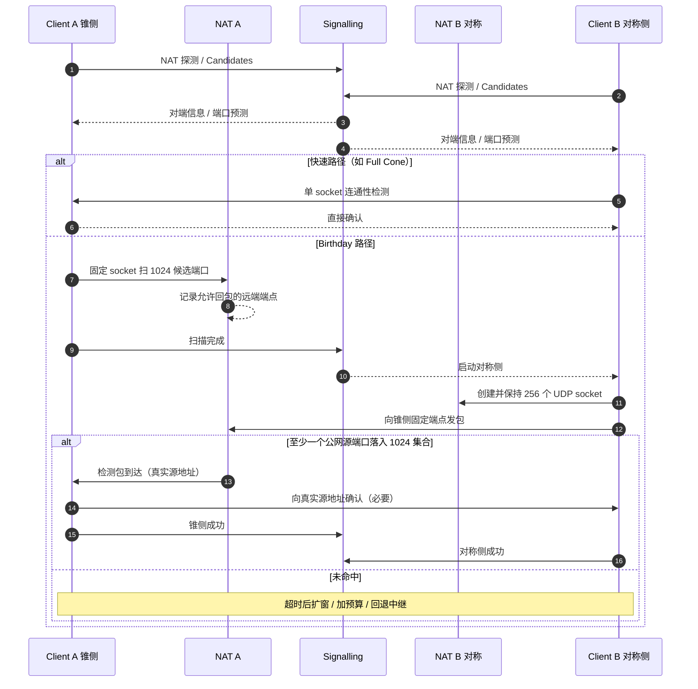

# UDP NAT 穿透策略代码审查

> 日期：2026-07-28  
> 状态：审查定稿（基于本地代码快照）  
> 范围目录：`p2p/{f2p,c-toxcore,nat-birthday-paradox}`  
> 关联：nexartc / NexaDesk 低延迟建连选型

**声明：** 成功率数字除明确标注为数学概率外，均为基于代码路径、NAT 行为与网络工程经验的**条件性估计**，不是生产环境实测结果。

---

## 1. 审查范围与结论

### 1.1 审查对象

| 本地目录 | 角色 | 说明 |
|----------|------|------|
| `f2p/` | 完整实现 | libp2p DCUtR、自研 UDP 打洞、QUIC 数据通道、端口转发 |
| `c-toxcore/` | 完整实现 | TokTok 维护的 c-toxcore；DHT 地址观察 + 端口预测 |
| `nat-birthday-paradox/` | 数学模型 | 生日悖论穿透概率；不是完整网络栈 |

### 1.2 主要结论

1. **普通 Endpoint-Independent Mapping（EIM/Cone）NAT**：F2P 的 libp2p DCUtR 在覆盖面、建连速度与工程成熟度上最好。
2. **单边随机对称 NAT + 单边 Cone**：F2P Birthday 在理想模型中单次碰撞率约 **98.1%～99.5%**，但当前实现存在明显的**方向性**与**地址生命周期**缺陷，端到端成功率显著低于理论值——尤其是 **F2P Client 位于 Cone 后**时。
3. **双方端口严格递增/递减的简单对称 NAT**：F2P EasySym 更激进、更快；toxcore 更保守、更慢，但会持续扩大预测范围。
4. **双方随机端口 Hard Symmetric NAT**：三套方案都没有实际可行解，应走中继。
5. **打洞后的数据面**：F2P 将业务 UDP 放入可靠有序 QUIC stream，适合可靠数据，但会改变 UDP 报文语义；toxcore 保持原生 UDP datagram，更适合实时通信。
6. **数学 vs 工程**：F2P 自研打洞的数学策略强于 toxcore，但当前端到端可靠性明显低于理论概率。

### 1.3 上游仓库与本地版本

| 本地目录 | 上游 | 本地 HEAD（审查时） |
|----------|------|---------------------|
| `f2p` | [Hexrotor/f2p](https://github.com/Hexrotor/f2p) | `534bbd5`（`main` 与远端一致） |
| `nat-birthday-paradox` | [danderson/nat-birthday-paradox](https://github.com/danderson/nat-birthday-paradox) | `862c8cc` |
| `c-toxcore` | [TokTok/c-toxcore](https://github.com/TokTok/c-toxcore) | `1d79022f`（2026-06-20） |

**toxcore 上游迁移说明：**

- 历史源头曾是 `irungentoo/toxcore`（本地旧快照停在 2018-10-03 `bf69b54f`）。
- 当前持续维护上游为 `TokTok/c-toxcore`；本地已 fast-forward 至 `1d79022f`（`bf69b54f` 为其祖先，无独有提交）。
- `third_party/cmp` submodule 锁定于上游指定的 `52bfcfa1`。
- 上游已发布 v0.2.23；本地 `master` 位于该发布之后。

相对路径约定：下文代码链接均相对于本文件所在目录 `p2p/docs/`，例如 `../f2p/...`、`../c-toxcore/...`。

### 1.4 术语速查

| 术语 | 含义 |
|------|------|
| EIM / Cone | Endpoint-Independent Mapping；代码中的 `NATCone`（未细分 Filtering） |
| Easy Symmetric | 端口近似严格递增/递减的 Endpoint-Dependent Mapping |
| Hard Symmetric | 端口近似随机的 Endpoint-Dependent Mapping |
| DCUtR | libp2p Direct Connection Upgrade through Relay |
| Birthday | 一侧多映射、另一侧扫端口，用集合碰撞打洞 |
| Punch Socket | 实际参与打洞的 UDP socket（应与信令上报的映射一致） |

---

## 2. F2P 分层穿透流程

```text
DHT 查找 Server
  ↓
公网地址 / IPv6 / 端口映射直连
  ↓失败
Circuit Relay 建立控制连接
  ↓
libp2p DCUtR 同时拨号
  ↓失败或约 15 秒内未完成
STUN 检测 NAT 类型 + relay 交换 NATInfo
  ↓
自研 UDP 打洞（最多约 3 次外层尝试）
  ↓成功
在打通的 UDP socket 上建立 QUIC
  ↓
控制流、TCP/UDP 转发进入 QUIC stream
```

Client 连接顺序见 [`../f2p/internal/client/connect.go`](../f2p/internal/client/connect.go)。  
Server 侧启用 AutoNAT v2、NAT-PMP/UPnP、DCUtR、AutoRelay（目标约 3 个 relay），以及 TCP / QUIC / WebRTC Direct / WebTransport 等监听，见：

- [`../f2p/internal/server/server.go`](../f2p/internal/server/server.go)
- [`../f2p/internal/client/client.go`](../f2p/internal/client/client.go)

**因此 F2P 的首选并不是自研 STUN 打洞**，而是：直连 → relay → DCUtR →（失败后）自研回退。

### 2.1 libp2p 能力 vs 自研 STUN

| 能力 | 解决的问题 | 识别 Cone/Symmetric？ | 对成功率的作用 |
|------|------------|----------------------:|----------------|
| AutoNAT v2 | 验证某监听地址能否被公网拨入 | 否 | 间接：过滤候选、决策直连/relay |
| NAT-PMP/UPnP | 网关显式端口映射 | 否 | 成功时收益最大；CGNAT/企业网常失败 |
| DCUtR | relay 协调双方同时拨号 | 否 | 普通家用 NAT 下最主要直连来源 |
| F2P `DetectNAT` | 粗分 Cone / EasyInc / EasyDec / HardSym | 是 | 仅为自研回退选策略 |

AutoNAT / DCUtR **不会**产出 F2P 的 `NATType`；只有 [`../f2p/internal/holepunch/stun.go`](../f2p/internal/holepunch/stun.go) 会。

### 2.2 AutoNAT v2

回答的是「别人能不能从公网拨入这个地址」，不是 Full/Restricted/Symmetric 分类。  
优势：真实拨入验证，通常比纯 STUN 标签可靠。  
局限：粒度低，不能指导 Birthday / 端口预测参数。

F2P 同时 `EnableAutoNATv2()` 与 `EnableNATService()`：前者启用探测能力，后者可为其他 Peer 提供拨入检测服务。

### 2.3 NAT-PMP/UPnP

`libp2p.NATPortMap()` 在网关允许时建立：

```text
公网 IP:外部端口  →  本机 IP:监听端口
```

成功后往往无需传统打洞。失败常见于：关闭 UPnP、企业网策略、蜂窝/CGNAT、双重 NAT、网关实现缺陷、上层防火墙。

### 2.4 DCUtR

前提：双方已有 relay 连接。随后交换候选地址，按 relay RTT 协调同时拨号，以**连接是否建立**为结果，无需先验 NAT 类型。

优势：多传输候选、真实监听 socket、身份与资源管理、普通 EIM 下包量少。  
局限：依赖可用 relay；对双随机对称几乎无效；F2P 约 15 秒后开始自研回退，可能与仍在进行的 DCUtR/QUIC 拨号重叠，额外映射会污染 EasySym 预测。

### 2.5 决策链（汇总）

```text
显式映射 / 公网 / IPv6 可直连？
  ├─ 是 → 直接连接
  └─ 否 → Relay → DCUtR
            ├─ 成功 → libp2p 直连
            └─ 超时 → 双方 STUN → 交换 NATInfo
                      → Server 选策略 → UDP Punch
                        ├─ 成功 → Punch Socket 上 QUIC
                        └─ 否 → 外层最多约 3 次，再重连
```

`maxHolePunchAttempts = 3` 定义于 [`../f2p/internal/client/connect.go`](../f2p/internal/client/connect.go)。

---

## 3. F2P NAT 检测

### 3.1 谁检测、如何交换

Client / Server **各自** `DetectNAT`，得到：

```go
type NATInfo struct {
    Type       NATType
    PublicIP   string
    PublicPort int
}
```

DCUtR 失败后经 relay 上的 Hole Punch 信令交换（见 [`../f2p/internal/holepunch/signaling.go`](../f2p/internal/holepunch/signaling.go)）：

1. Client 发送自身 `NATInfo` + TID  
2. Server 结合本地缓存调用 `DeterminePunchMethod(client, server)`  
3. Server 返回自身 `NATInfo`、策略、TID、QUIC session token  
4. 双方执行同一策略编号  

对方类型是**对端自报**，Server 当前信任 Client 上报的 IP/端口（安全风险见 §9）。

### 3.2 检测逻辑摘要

同一 UDP socket 顺序查多个 STUN：

- 公网端口相同 → `NATCone`
- 端口不同且跨度 ≤100，额外 socket 落在区间上/下方 → EasyInc / EasyDec
- 其他 → `NATSymmetricHard`

### 3.3 成熟度问题（生产级不足）

1. **只测 Mapping，不测 Filtering** → `NATCone` ≠ Full Cone。  
2. 非完整 RFC 5780 Behavior Discovery。  
3. `NATOpen` 有定义但未实现「本地地址 == 映射地址」分支。  
4. EasyInc/EasyDec 依赖少量样本与固定阈值 `<100`，易被 DCUtR/DHT/CGNAT 污染。  
5. 排序端口后丢失时间序。  
6. **长期缓存** NATInfo，网络切换后易过期。  
7. **检测 socket ≠ Punch Socket**（见 §4.3）。  
8. 缺少 NAT 仿真与分类准确率自动化测试。

**评价：** 区分「稳定 EIM」与「明显随机 EDM」基本可用；细分 Cone Filtering / Easy 方向可信度有限；适合实验性回退，不适合单独作为生产策略器。

---

## 4. F2P 自研打洞策略

策略矩阵见 [`../f2p/internal/holepunch/types.go`](../f2p/internal/holepunch/types.go)：

| Client | Server | 策略 |
|--------|--------|------|
| Cone | Cone | `PunchConeToCone` |
| Symmetric* | Cone | `PunchSymToCone`（Birthday） |
| Cone | Symmetric* | 同左（角色对调，仍走 SymToCone） |
| EasySym | EasySym | `PunchEasySymToEasySym` |
| HardSym ↔ HardSym / EasySym | — | `PunchNone` |
| Unknown 参与 | — | `PunchNone` |

\*含 EasyInc/EasyDec/Hard。

关键常量（同文件）：

| 常量 | 值 |
|------|-----|
| `SymToConeSocketCount` | 84 |
| `BothEasySymSocketCount` | 25 |
| `EasySymPortOffset` | 20 |
| `BirthdayMinPackets` / `BirthdayMaxPackets` | 600 / 800（`randomInt` 为左闭右开 → 实际 600..799） |
| `PunchTimeout` | 30s |
| `PunchSendInterval` | 100ms |
| `PunchMaxRounds` | 5 |
| `PunchConfirmDuration` | 1s（**仅 Cone→Sym 路径使用**） |

### 4.1 实际扫描范围（易误解点）

| 策略/角色 | 远端目标 | 不同远端端口数 | 发送形态 |
|-----------|----------|---------------:|----------|
| Cone↔Cone | 对方精确 `PublicPort` | 1 | 每侧 1 socket，约 10pps，最长 ~30s |
| Birthday·Sym 侧 | Cone 精确端口 | 1 | **84 socket 全打同一目标**，约 840pps，最长 ~25s |
| Birthday·Cone 侧 | 对方公网 IP 上 `1..65535` 洗牌抽样 | 3000～3995 | 1 socket；5 轮×600..799；**同一次尝试内无放回** |
| EasySym | 仅 `PublicPort±20` **一个**端口 | 1 | 25 socket 全打该预测端口 |
| Hard* | — | 0 | 不尝试 |

**误解澄清：**

1. Birthday 只有 Cone 侧大范围扫端口；Sym 侧 84 个 socket 不扫端口。  
2. EasySym **不是**扫描 `±1..20`，而是 25 个 socket 打同一个 `±20`。  
3. 扫描包含 Well-Known 端口（53/123/443 等）是因为 NAT 映射理论上可落在任意非零端口；代码靠 Magic+`TID` 防误判，但**不能消除**对真实业务/IDS 的外部影响。

`generateShuffledPorts()` 生成 `1..65535` 后 Fisher-Yates 洗牌（见 [`../f2p/internal/holepunch/punch.go`](../f2p/internal/holepunch/punch.go)）。跨外层 3 次尝试会重新洗牌，期望重叠约 5% 量级；是否「浪费」取决于 NAT 映射在重试间是否重随化。

### 4.2 理想模型失败率（不含实现缺陷）

#### Cone↔Cone（纯丢包）

每侧约 300 包、独立丢包率 \(r\)：

\[
P_{fail}=1-(1-r^{300})^2
\]

即便 \(r=0.5\)，纯丢包失败率亦可忽略。真实失败来自**错误地址 / Filtering / 过期映射 / 时序**——而当前代码恰好有 Cone Client 上报旧地址问题。

#### Birthday（Symmetric↔Cone）

\[
P_{fail}=\frac{C(Q-N,M)}{C(Q,M)},\quad Q=65535,\ N=84,\ M\in[3000,3995]
\]

| \(M\) | 单次成功率 | 单次失败率 | 三次独立时失败率 \(P^3\) |
|------:|----------:|----------:|-------------------------:|
| 3000 | 98.052497% | 1.947503% | 0.000739% |
| \(E[M]=3497.5\) | 98.989683% | 1.010317% | 0.000103% |
| 3500 | 99.008191% | 0.991809% | 0.000098% |
| 3995 | 99.494209% | 0.505791% | 0.000013% |

「独立三次」是强假设；类型误判、Filtering、限速在重试间通常不变，真实三次失败率会更高。

#### EasySym

确定性预测，无唯一概率。若步长严格为 1、基准 \(B\)、额外漂移 \(d\)，目标 \(B+20\) 落入 25 个映射当且仅当 \(-5\le d\le 19\)。漂移增大时成功率可骤降到接近 0。

#### Hard*

当前代码明确不尝试 → 失败率 100%（就实现而言）。

### 4.3 Cone↔Cone：地址时序缺陷（P0）

Client 路径（[`connect.go`](../f2p/internal/client/connect.go)）：

1. 用**启动缓存**的 `natInfo` 做信令；  
2. Server 按该地址开打；  
3. 信令完成后 Client 才 `CreatePunchSocket`（新 socket + 新 STUN）。

于是 Server 持有的是**检测 socket** 映射，不是 Punch Socket。

`punchConeToCone` 收到合法包后立即成功返回，**不会**像 Birthday 的 Cone 侧那样向真实源地址发 `PunchConfirmDuration` 确认。可能出现 Server 成功、Client 永远收不到包、无法进 QUIC。

> 注：Birthday 路径的 `punchConeToSym` **已实现** `confirmAndReturn`（向真实源地址确认约 1s）。缺陷主要在 Cone↔Cone 与「Cone Client + Sym Server」的信令地址时序。

普通 Cone 往往已在 DCUtR 成功，故该回退缺陷可能被掩盖。

### 4.4 Birthday：方向性缺陷（P0）

| 方向 | 行为 | 与模型符合度 |
|------|------|--------------|
| Client=Sym, Server=Cone | Server 信令阶段创建真实 Punch Socket 并上报；Client 84 socket 打该地址；Server 扫 Client IP | **符合** Birthday 模型 |
| Client=Cone, Server=Sym | Client 信令后才建 Punch Socket；Server 84 socket 打 Client **旧**检测端口；Client 用新 socket 扫 Server IP | **严重偏离**；成功率可能很低 |

另：Cone 侧约 5 轮×(发送+1s等待) 很快退出；Sym 侧可持续约 25s → 失败时一侧已关 socket，另一侧仍狂发（三次失败额外等待可观）。

### 4.5 EasySym 固定 ±20

条件苛刻（步长 1、无背景映射、缓存仍有效）。实验室或许可达较高成功率；复杂/CGNAT 环境往往显著更低。`±20` 无边界检查，近 1/65535 时可能产生非法端口。

### 4.6 HardSym

双方随机对称时搜索空间约 \(64511^2\approx 4.16\times10^9\)。若每轮各探 48 组合：

\[
1-\exp(-48^2/64511^2)\approx 5.5\times10^{-7}
\]

放弃穿透是合理工程选择。

### 4.7 设计变体：256 sockets × 1024 端口（非当前代码）

以下分析来自外部设计时序（锥侧先扫 1024 候选 → 对称侧开 256 socket 回打），**不是**当前 F2P 仓库实现。

在完整端口空间、\(N=256\) 有效互异映射、\(M=1024\) 时：

\[
P_{success}\approx 98.24\%\quad(P_{fail}\approx 1.76\%)
\]

与当前 F2P（84 × 3000..3995，加权约 98.99%）接近；图片方案用更多 FD/NAT 表项换更少跨端口扫描（更不易触发扫描告警）。实现必须保证：同一扫描 socket、Filtering 未过期、256 socket 保持监听、命中后确认、双边成功收敛，并按实际 \(N_{eff}\) 调整预算。

若引入端口预测窗口 \(Q'\)，仅当映射**确认落入**窗口时才能用缩小后的公式；窗口错误时须乘「落入窗口」概率。

---

## 5. toxcore（c-toxcore）穿透策略

基于 [`../c-toxcore`](../c-toxcore) `master@1d79022f`。

不依赖集中式 STUN，而用 DHT 节点作分布式观察者：

1. 最多收集 8 个观察结果；  
2. ≥4 个节点看到相同公网 IP 才继续；  
3. 加密 NAT Ping 确认在线并协调；  
4. 端口相同则只探该端口；不同则按 `0,+1,-1,+2,-2…` 扩张；  
5. 每轮最多 48 端口、间隔 3s；  
6. 5 轮后从 1024 起顺序扫描（每轮 48、相邻重叠 24）。

核心：[`../c-toxcore/toxcore/DHT.c`](../c-toxcore/toxcore/DHT.c)、[`../c-toxcore/toxcore/DHT.h`](../c-toxcore/toxcore/DHT.h)。

常量：

```text
MAX_PUNCHING_PORTS        = 48
PUNCH_INTERVAL            = 3s
PUNCH_RESET_TIME          = 40s
MAX_NORMAL_PUNCHING_TRIES = 5
```

另有 `hole_punching_enabled`（默认启用）；超过约 40s 重置 tries / 扫描 index。

### 5.1 优势 / 局限

**优势：** 无中心 STUN；观察地址与业务/DHT socket 一致；加密 Ping；低 PPS、不易触发扫描防护；单 socket；预测范围可持续扩张；保留原生 UDP。

**局限：** 冷启动慢；收敛慢；预测算法朴素；对随机对称几乎无效；观察端口可能过期；不严格区分 Mapping/Filtering。顺序扫完高位端口理论耗时约 \(64511/24\times3s\approx2.24h\)。

### 5.2 条件性成功率估计

| 组合 | 估计 |
|------|-----:|
| EIM↔EIM | 70%～95% |
| Cone↔递增 Sym | 20%～70% |
| 递增 Sym↔递增 Sym | 10%～50% |
| Random Sym↔Random Sym | ≈0 |
| UDP 阻断 | 直连 0 |

toxcore 的价值在**低资源、持续尝试、与 DHT 共生**，不在单次最高碰撞率。

### 5.3 相对 2018 快照

维护性、抽象、测试与安全修复大幅现代化；**DHT NAT 穿透核心策略基本未变**（无 ICE/RFC5780/Birthday/HardSym 新算法）。本文对 toxcore 成功率量级的判断仍成立。

本地曾用独立临时目录完成 `libtoxcore` 构建验证（未跑全量 GTest）。

---

## 6. `nat-birthday-paradox` 模型

见 [`../nat-birthday-paradox/paradox.py`](../nat-birthday-paradox/paradox.py)。

- **Easy：** 一维端口集合相交 → 解释 F2P Sym↔Cone 理论上界。  
- **Hard：** 匹配 `(公网源端口, 对方目标端口)`，空间升至 \(\sim2^{32}\)；双方约需 \(2^{16}\) 量级组合才有可观概率——成本不可接受。

未覆盖：映射超时、丢包、非均匀端口池、Filtering、限速、多级 NAT、socket 失败、时序、IDS。  
⇒ 视为**碰撞概率上界计算器**，不可直接当生产成功率。

---

## 7. 穿透阶段性能对比

| 策略 | Socket/负载 | 探测速率 | 建连速度 | 特征 |
|------|------------:|---------:|----------|------|
| DCUtR | 少 | 少量同时拨号 | 通常最快 | 依赖 relay |
| F2P Cone↔Cone | 1/侧 | ~10 pps | 理论快 | 地址时序缺陷 |
| F2P Birthday | Sym 侧 84 | ~840 pps | 理论数秒 | 扫描明显 |
| F2P EasySym | 25/侧 | ~250 pps | 命中则快 | 对序列极敏感 |
| toxcore | 1/侧 | ~16–32 pps | 较慢 | 最省资源 |

Birthday Sym 侧最坏约：\(84\times10\times25=21000\) 包；应用层 64B + 头 ≈92B → 约 1.9MB。压力主要在 FD、NAT 表、PPS、离散目标端口与每次洗牌 65535 端口数组。

---

## 8. 打洞后数据面

### 8.1 F2P QUIC

见 [`../f2p/internal/holepunch/direct.go`](../f2p/internal/holepunch/direct.go)。

**适合：** TLS、多 stream、可靠重传、拥塞控制、TCP 业务避免 TCP-over-TCP。  
**不适合：** 宁可丢包也不要等的实时 UDP；QUIC/重传有队头阻塞与 CPU 开销；高 zstd 级别加重延迟。

### 8.2 UDP 边界丢失（P0）

F2P 将 UDP 当作字节流 `ReadWriteCloser` 复制（[`../f2p/internal/pipe/pipe.go`](../f2p/internal/pipe/pipe.go) 等）：QUIC stream **不保留 datagram 边界**，可能合并/拆分包 → DNS/游戏/VoIP/自定义二进制 UDP 异常。

**修复方向：** 长度前缀 framing，或 QUIC DATAGRAM。

### 8.3 toxcore

原生 UDP packet：保边界、无可靠重传 HoL，更贴合实时音视频/状态同步。

---

## 9. 安全与资源风险

1. **信令可被滥用于 UDP 扫描**：业务认证前接受 Hole Punch，并信任 Client `PublicIP`（见 server holepunch handler）→ 可驱动 Server 向第三方扫端口。应校验与观测 IP 一致，并限流。  
2. **Punch 仅 32-bit TID**：后续 QUIC 有更强 token，但假成功包仍可诱导错误 QUIC 尝试、消耗资源。  
3. **测试缺口：** `go test ./...` / `go vet` 可通过但大量 package 无测试文件；缺 NAT 仿真与策略/时序覆盖。

---

## 10. 综合评价

| 维度 | 结论 |
|------|------|
| 整体覆盖 | F2P 最高（IPv6/映射/多 transport/relay/DCUtR/自研回退） |
| 普通 NAT | DCUtR 首选；toxcore 仍可用 |
| 单边随机 Sym | F2P Birthday 理论最强，实现有方向性缺陷 |
| 双 Hard Sym | 皆近 0 → 中继 |
| 建连速度 | DCUtR > F2P 命中路径 > toxcore |
| 资源/温和度 | toxcore 最优 |
| 可靠吞吐 | F2P QUIC |
| 实时 UDP 语义 | toxcore；F2P 需 framing/DATAGRAM |

---

## 11. 修复建议与优先级

### P0 正确性

1. Client **在信令前**创建实际 Punch Socket，并用该 socket 的 STUN 映射参与信令（Cone↔Cone 与 Cone+Sym 均适用）。  
2. 所有策略在收到合法 Punch 后，均向**数据包真实源地址**发送确认（对齐 `punchConeToSym` 的 `confirmAndReturn`）。  
3. UDP 转发增加长度前缀 framing，或改用 QUIC DATAGRAM。

### P1 成功率

4. 每个 Punch Session 使用专属实时映射，不长期复用缓存公网端口。  
5. Mapping / Filtering 分维检测（至少区分 EIM + 过滤强度）。  
6. EasySym：估计步长/方向/漂移窗口，替代固定 `±20`；增加端口边界检查。  
7. 避免 DCUtR 与自研打洞重叠，或显式取消上一层尝试。  
8. 统一双方打洞超时，避免单边早退。

### P1 安全与资源

9. 校验 Client 上报公网 IP 与连接观测地址一致。  
10. 按 Peer / 目标 IP / 全局限制并发 socket、PPS、扫描端口数。  
11. 避免每次对完整 65535 数组做加密随机洗牌；改用低成本无放回抽样或分层端口池（动态端口优先，Well-Known 最后低速）。

### P2 测试与可观测性

12. NAT 检测、策略矩阵、信令状态机单元测试。  
13. netns / nftables / NAT 仿真集成测试。  
14. 分层计数：relay / DCUtR / punch / QUIC / 业务握手成功。  
15. 记录 NAT 类型、方向、包数、耗时、确认地址、失败阶段。

---

## 附录 A · 关键代码索引

| 主题 | 路径 |
|------|------|
| Client 连接与外层重试 | `../f2p/internal/client/connect.go` |
| NAT 检测 | `../f2p/internal/holepunch/stun.go` |
| 类型与策略矩阵 | `../f2p/internal/holepunch/types.go` |
| 打洞实现 | `../f2p/internal/holepunch/punch.go` |
| 信令 | `../f2p/internal/holepunch/signaling.go` |
| QUIC 复用 | `../f2p/internal/holepunch/direct.go` |
| 字节流复制 | `../f2p/internal/pipe/pipe.go` |
| toxcore DHT 打洞 | `../c-toxcore/toxcore/DHT.c` |
| 生日模型 | `../nat-birthday-paradox/paradox.py` |

## 附录 B · 对 nexartc 选型的启示

1. **主路径**应继续以「可观测地址 + 协调同时拨号 + 必要时中继」为主（与 ICE/DCUtR 同类），不要把 Birthday 当默认。  
2. Birthday / 端口预测仅作 **Hard 场景实验性增强**，上线前必须先修 P0 地址时序与确认包。  
3. 若业务是实时音视频/控制面 UDP，打洞成功后应保留 datagram 语义（DATAGRAM 或自建帧），避免静默破坏报文边界。  
4. HardSym↔HardSym 直接预算中继（TURN/relay），不要承诺「纯 P2P」。


## 附录 C · 256×1024 设计时序（参考）

下列 Mermaid 描述锥侧先扫、对称侧后开多 socket 的设计意图（非当前 F2P 代码）。原设计图为本地参考资产，未纳入本仓库。



实现约束：锥侧扫描与接收必须同一 socket；对称侧 256 个 socket 须保持到确认完成；必须有双边成功收敛，不能只保留端口数字而关闭原 socket。

---

## 附录 D · 建议的端口调度（Birthday Cone 侧）

不建议永久排除全部 Well-Known 端口（映射理论上可能落在其上）。更稳妥的是分层、无放回、可观测：

| 优先级 | 集合 | 策略 |
|---:|------|------|
| 1 | STUN/历史观测附近窗口 | 按增量/方向/漂移优先；每候选只发一次 |
| 2 | `49152..65535` | 常见动态端口区随机无放回 |
| 3 | `1024..49151` | 扩大到 Registered Ports |
| 4 | `1..1023` | 最后低速或可配置关闭 |
| 重试 | 依映射指纹 | 映射稳定则续扫未覆盖分片；明显重随化则重新随机 |

若扫描池缩小为 \(Q'\) 且确认 \(N\) 个映射都在池内：

\[
P_{fail}=C(Q'-N,M)/C(Q',M)
\]

不能确认时，还必须乘「映射属于该集合」的概率。
